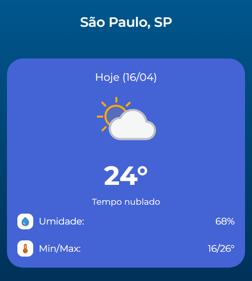
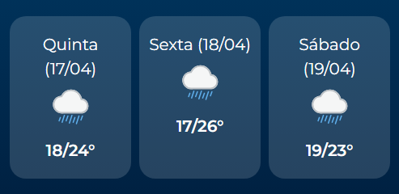
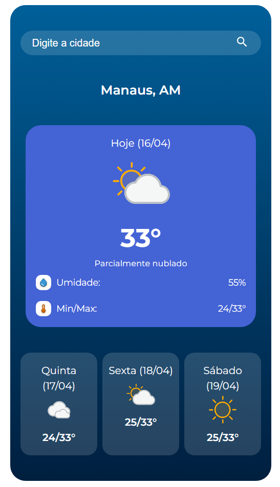

# Curso Alura - React praticando o consumo de APIs

## Aula 1 - Consumo de API's no React

### Aula 1 - Apresentação - Vídeo 1

Transcrição  
Olá! Boas-vindas a mais este curso de React, no qual vamos praticar extensivamente o consumo de APIs em aplicações React.

Meu nome é Neilton, sou instrutor na Escola de FrontEnd.

Audiodescrição: Neilton é um homem de pele negra, com olhos e cabelos escuros. Ele usa óculos com armação retangular e está vestindo uma camisa amarela.

Objetivo do Curso  
O objetivo principal deste curso é que pratiquemos o consumo de APIs no ambiente do React. O React possui uma abordagem distinta para trabalharmos com APIs e consumirmos serviços externos. Queremos que vocês tenham contato com essa abordagem, revisem o que será apresentado e apliquem nos exercícios práticos.

Projeto ClimaApp  
O projeto que vamos desenvolver é a aplicação ClimaApp.

Esta é uma aplicação que consome um serviço de API de clima e exibe algumas informações, como o nome da cidade, a data atual, um ícone baseado na previsão do tempo para aquele dia e hora, além de mostrar a temperatura, mínimas e máximas, entre outras informações. A API que utilizaremos é a API brasileira chamada HG Brasil, que está no mercado há mais de 15 anos, fornecendo dados sólidos e seguros sobre o clima no Brasil.

Pré-requisitos e Estrutura do Curso  
Para seguir neste curso, é recomendável ter uma boa base de React, compreender o funcionamento de componentes, props, states e conhecer alguns hooks, principalmente useState e useEffect. Isso é o necessário.

Este curso é voltado para a prática, e disponibilizaremos alguns exercícios. No próximo vídeo, faremos uma breve revisão sobre como consumir APIs no React. Nos vemos lá!

### Aula 1 - Preparando o ambiente: comece por aqui

Antes de mergulharmos no código, vamos alinhar as expectativas!

O que significa um curso prático?

Já se pegou pensando: Será que consigo aplicar o que aprendi na prática? Este curso é a resposta! Aqui, neste novo formato de curso, o foco é colocar a mão no código, resolver problemas e testar seu conhecimento de forma ativa.

Você terá:

- Vídeo de apresentação do conteúdo
- Material de apoio
- Desafios de código
- Pré-requisitos:

É fundamental que você tenha concluído o curso [React: desenvolvendo com JavaScript](https://cursos.alura.com.br/course/react-desenvolvendo-javascript), pois ele aborda os conceitos essenciais que serão praticados e reforçados aqui. Isso permitirá que você se concentre apenas nos exercícios e os realize com mais tranquilidade.

Neste curso você receberá um projeto base pronto, com as principais telas e componentes que iremos trabalhar. Para me acompanhar enquanto explico o conteúdo do curso, [acesse o projeto base no Github clicando aqui](https://github.com/alura-cursos/4663-praticando-react-apis/tree/fb20e3482d1898915cd3ce0d2b54d515b039028e) ou baixe o [projeto inicial neste link](https://github.com/alura-cursos/4663-praticando-react-apis/archive/fb20e3482d1898915cd3ce0d2b54d515b039028e.zip).

Mas se você quiser criar o projeto do zero, deixarei o [link do Figma do projeto aqui](https://www.figma.com/community/file/1491129858344649743).

Dicas para potencializar seu aprendizado:

- Assista ao vídeo com atenção. Pause, anote e revise sempre que necessário.
- Leia o material complementar para facilitar suas atividades.
- Compartilhe suas descobertas no fórum, pois sua abordagem pode inspirar outras pessoas!

Estou animado! E aí, vamos começar?

### Aula 1 - Conectando seu app a uma API de clima - Vídeo 2

Transcrição  
Vamos começar a trabalhar na nossa aplicação ClimaApp, onde consumiremos uma API para obter informações climáticas. Primeiro, precisamos proteger nossa chave de API no front-end. Para isso, criaremos um arquivo chamado .env.local na pasta raiz do projeto.

```JavaScript
// [05:39]
.env.local
```

Configuração da Chave de API
Dentro desse arquivo, definimos uma variável de ambiente para armazenar nossa chave de API. Usamos o prefixo VITE_ porque o Vite expõe variáveis de ambiente que começam com VITE_ no front-end.

```JavaScript
// [06:26]
VITE_WEATHER_API_KEY=
```

Agora, atribuímos nossa chave de API a essa variável. Lembre-se de substituir <SUA_CHAVE_DE_API> pela sua chave real.

```JavaScript
// [06:42]
VITE_WEATHER_API_KEY=<SUA_CHAVE_DE_API>
```

Importação e Uso da Chave de API

No arquivo app.jsx, fora do componente App, importamos a variável de ambiente para utilizá-la no nosso código.

```JavaScript
// [07:29]
const API_KEY = import.meta.env.VITE_WEATHER_API_KEY;
```

Configuração do Estado e Uso do useEffect

Para consumir serviços externos no React, utilizamos o hook useEffect. Antes disso, precisamos criar um estado para armazenar os dados do clima. Vamos criar um estado chamado weather e a função setWeather.

```JavaScript
// [08:33]
const [weather, setWeather] = useState(null)
```

Certifique-se de importar o useState do React.

```JavaScript
// [08:50]
import { useState } from "react";
```

Agora, vamos utilizar o useEffect, que será executado quando a aplicação for renderizada. Importamos também o useEffect.

```JavaScript
// [08:56]
import { useState, useEffect } from "react";
```

Escrevemos o useEffect e passamos uma função de callback e uma lista de dependências vazia, para que ele seja executado apenas uma vez.

```JavaScript
// [09:00]
useEffect(() => {

}, [])
```

Função Assíncrona para Buscar Dados da API

Dentro do useEffect, criaremos uma função assíncrona chamada fetchWeather para buscar os dados da API. Utilizaremos try-catch para lidar com possíveis erros.

```JavaScript
// [09:22]
useEffect(() => {
    async function fetchWeather(){
        try {

        } catch (erro) {
            console.error("Erro ao buscar dados da API", erro);
        }
    }
}, [])
```

Requisição à API e Atualização do Estado

No bloco try, faremos a requisição à API utilizando fetch. Passamos a URL da API como uma template string e interpolamos a chave da API.

```JavaScript
// [10:13]
    const response = await fetch(
        `https://api.hgbrasil.com/weather?format=json-cors&${API_KEY}&city_name=São Luis, MA`
    );
```

Convertendo a resposta para JSON, armazenamos os dados em uma constante data.

```JavaScript
// [10:17]
    const data = await response.json();
```

Verificamos se data.results existe e, se sim, atualizamos o estado weather.

```JavaScript
// [10:29]
    if(data.results){
        setWeather(data.results)
    }
```

Chamamos a função fetchWeather dentro do useEffect para iniciar a busca dos dados.

```JavaScript
// [10:56]
    fetchWeather();
```

Renderização das Informações Climáticas
Agora, vamos renderizar as informações na tela. Utilizamos uma renderização condicional para exibir os dados apenas se weather existir.

```JavaScript
// [11:18]
{weather && (
    <>
        <h1>{weather.city}</h1>
        <WeatherCard weather={weather}/>
    </>
)}
```

Componente WeatherCard

No componente WeatherCard, recebemos a prop weather e exibimos as informações climáticas.

```JavaScript
// [11:36]
const WeatherCard = ({ weather }) => {
```

Exibimos a data de hoje, a imagem do clima, a temperatura, a descrição, a umidade e as temperaturas mínimas e máximas.

```JavaScript
// [11:49]
    <p>Hoje ({weather.forecast[0].date})</p>
```

```JavaScript
// [12:07]
    
```

```JavaScript
// [12:14]
    <h2 className="temperature">{weather.temp}°</h2>
```

```JavaScript
// [12:37]
    <p className="condition">{weather.description}</p>
```

```JavaScript
// [12:49]
    <span>{weather.humidity}%</span>
```

```JavaScript
// [13:10]
    <span>{weather.forecast[0].min}/{weather.forecast[0].max}°</span>
```

Teste e Correção de Erros

Após essas alterações, salvamos a aplicação e recarregamos a página no navegador. Se as informações de São Luís aparecerem corretamente, a API está funcionando. Caso contrário, verificamos o código para corrigir possíveis erros, como a falta de key= na URL da API.

```JavaScript
// [18:19]
    const response = await fetch(
        `https://api.hgbrasil.com/weather?format=json-cors&key=${API_KEY}&city_name=São Luis, MA`
    );
```

Conclusão e Prática

Dessa forma, fazemos requisições para APIs e serviços externos utilizando React. Agora, é hora de praticar com os exercícios para consolidar os conhecimentos. Até mais!

### Aula 1 - Mão na massa: buscando clima fixo ao carregar a página

Imagine que você está desenvolvendo uma aplicação meteorológica que mostra o clima de uma cidade específica assim que a pessoa usuária abre o site. Essa funcionalidade é útil, por exemplo, em um painel de TV ou totem de informações de uma cidade.

Seu desafio é fazer com que o React consuma a API do HG Brasil ao carregar a aplicação e mostre as informações climáticas da cidade de São Paulo, como a temperatura e a descrição do tempo.



A seguir está o gabarito da minha solução, mas lembre-se que, cumprindo os objetivos, pode haver diversas soluções possíveis.

Opinião do instrutor

Essa atividade tem o objetivo de te colocar em contato com a estrutura da API e o uso do useEffect para chamadas automáticas ao carregar a página. Perceba que você não precisa usar inputs, nem buscar por outras cidades. O foco está em montar a lógica de requisição via fetch, usar useState para armazenar os dados e fazer o tratamento com async/await.

Você pode começar com um estado para armazenar o clima (weather). Dentro do useEffect, criamos uma função assíncrona que faz a requisição com fetch, converte a resposta com .json() e armazena os dados no estado. Finalizamos com a renderização das informações básicas na tela.

```JavaScript
import React, { useState, useEffect } from "react";
import SearchBar from "./components/SearchBar";
import WeatherCard from "./components/WeatherCard";
import ForecastList from "./components/Forecast/ForecastList";
import "./App.css";

const API_KEY = import.meta.env.VITE_WEATHER_API_KEY;

function App() {
  const [weather, setWeather] = useState(null);

  useEffect(() => {
    async function fetchWeather() {
      try {
        const response = await fetch(
          `https://api.hgbrasil.com/weather?format=json-cors&key=${API_KEY}&city_name=São Paulo, SP`
        );
        const data = await response.json();

        if (data.results) {
          setWeather(data.results);
        }
      } catch (error) {
        console.error("Erro ao buscar dados da API", error);
      }
    }

    fetchWeather();
  }, []);

  return (
    <div className="app-container">
      <SearchBar />
      {weather &&
        <>
          <h1>{weather.city}</h1>
          <WeatherCard weather={weather} />
        </>
     </div>
  );
}

export default App;
```

O sucesso em se comunicar com a API aqui está ligado ao quão bem você a configurou no seu projeto. Então, se você tiver dúvidas sobre o uso de variáveis de ambiente no Vite, volta lá no vídeo de revisão e aprenda como proteger direitinho sua chave de API. Beleza?

Agora no componente Weather ficamos assim:

```JavaScript
import "./styles.css";

const WeatherCard = ({ weather }) => {
  return (
    <section className="weather-card">
      <p>Hoje ({weather.forecast[0].date})</p>
      
      <h2 className="temperature">{weather.temp}°</h2>
      <p className="condition">{weather.description}</p>
      <div className="humidity">
        <div>
          
          <p>Umidade: </p>
        </div>
        <span>{weather.humidity}%</span>
      </div>
      <div className="min-max">
        <div>
          
          <p>Min/Max:</p>
        </div>
        <span>
          {weather.forecast[0].min}/{weather.forecast[0].max}°
        </span>
      </div>
    </section>
  );
};

export default WeatherCard;
```

Lembrando que o ícone correspondente ao clima é obtido com o condition_slug, que é uma informação que, não por acaso, tem o mesmo nome do arquivo de ícone aqui no nosso projeto. Isso facilita na hora de renderizar o ícone correto.

Tranquilo? Agora que nos aquecemos vamos para um desafio mais interessante.

### Aula 1 - Mão na massa: previsão para os próximos 3 dias

Imagine que sua aplicação cresceu e agora você quer mostrar também a previsão para os próximos 3 dias junto com o clima atual. Essa funcionalidade é muito útil para quem quer planejar a semana.

Altere sua aplicação para exibir as informações de previsão, como: dia da semana, temperatura mínima e máxima, e descrição do tempo dos próximos três dias. A imagem abaixo mostra como deve se parecer a sua solução:



Boa sorte!

Opinião do instrutor

Aqui usamos o componente ForecastList e um estado que é um array forecast retornado dentro de results para exibir os próximos dias. O desafio está em acessar corretamente esse array e fazer um slice para pegar apenas os três primeiros dias (pule o primeiro item, que é o dia atual).

Então em App.jsx fazemos:

```JavaScript
const [forecast, setForecast] = useState([]);
  
useEffect(() => {
    async function fetchWeather() {
      try {
        const response = await fetch(
          `https://api.hgbrasil.com/weather?format=json-cors&key=${API_KEY}&city_name=São Paulo, SP`
        );
        const data = await response.json();

        if (data.results) {
          setWeather(data.results);
          setForecast(data.results.forecast.slice(1, 4)); //Aqui usamos o slice para pegar os próximos 3 items
        }
      } catch (error) {
        console.error("Erro ao buscar dados da API", error);
      }    
  }

    fetchWeather();
  }, []);
```

E aí a gente precisa retornar o seguinte:

```JavaScript
return (
    <div className="app-container">
      <SearchBar />
      {weather &&
        <>
          <h1>{weather.city}</h1>
          <WeatherCard weather={weather} />
          <ForecastList forecasts={forecast} />
        </>
     </div>
  );
```

Aqui passamos para o componente de ForecastList o array de forecast. Vamos dar uma olhada no componente de ForecastList:

```JavaScript
import ForecastItem from "../ForecastItem";
import "../styles.css";

const ForecastList = ({ forecasts }) => {
  return (
    <div className="forecast-list">
      {forecasts.map((forecast, index) => (
        <ForecastItem key={index} {...forecast} />
      ))}
    </div>
  );
};

export default ForecastList;
```

Basicamente ele usa map() para iterar sobre os itens e exibir o conteúdo. Agora o componente de ForecastItem:

```JavaScript
import "../styles.css";

const ForecastItem = ({ date, min, max, condition, description }) => {
  return (
    <div className="forecast-item">
      <p className="forecast-day">
         ({date})
      </p>
      
      <p className="forecast-temp">
        {min}/{max}°
      </p>
    </div>
  );
};

export default ForecastItem;
```

E com isso, você consegue chegar a algo próximo ao que foi pedido, com um detalhe de que ficou faltando pegar exatamente o nome do dia da semana, como segunda, terça, quarta, etc. Isso ficará para um próximo desafio.

Tranquilo? Gostaria de lembrar que se ficar alguma dúvida ou se você teve uma solução diferente, não se esqueça de postar no fórum. Iremos ficar animados em ver suas soluções e te ajudar no seu progresso.

Bons estudos!

### Aula 1 - Mão na massa: formatando os dias da semana

Agora que já conseguimos exibir a previsão para os próximos três dias a partir da data que acessamos o app, podemos melhorar um pouco a experiência do usuário em nossa aplicação, o chamado UX.

Seu desafio é criar uma função que a partir da data retornada pela api, encontre o dia da semana (Ex: segunda-feira, terça-feira, quarta-feira, etc.) e retorne apenas a primeira parte do nome começando com letra maiúscula.

Exemplo:

- Segunda-feira --> Segunda
- Terça-feira --> Terça
- Quarta-feira --> Quarta
- Quinta-feira --> Quinta
- Sexta-feira --> Sexta
- Sábado --> Sábado
- Domingo --> Domingo

Manda ver!

Opinião do instrutor

Precisamos criar uma função que recebe uma data no formato dd/mm (por exemplo, "16/04") e retorna o dia da semana por extenso em português, com a primeira letra maiúscula. Então, vamos ver uma possível solução:

```JavaScript
const getWeekday = (dateString) => {
  const [day, month] = dateString.split("/");
  const dateObj = new Date(new Date().getFullYear(), month - 1, day);
  const weekday = Intl.DateTimeFormat("pt-BR", { weekday: "long" }).format(
    dateObj
  );

  return weekday.charAt(0).toUpperCase() + weekday.split("-")[0].slice(1);
};
```

Essa função faz o seguinte:

- Recebe uma data no formato "dd/mm" (ex: "16/04").
- Extrai o dia e o mês usando split("/").
- Cria um objeto Date com o ano atual, mês (ajustado, já que começa do zero em JS), e o dia.
- Formata o dia da semana por extenso em português brasileiro, usando Intl.DateTimeFormat.
- Remove o sufixo -feira de dias como "terça-feira", "quinta-feira", etc.
- Capitaliza a primeira letra do resultado.
- Retorna algo como "Segunda", "Terça", "Domingo" etc.

O resultado final do código do componente ForecastItem é mostrado abaixo:

```JavaScript
import "../styles.css";

const getWeekday = (dateString) => {
  const [day, month] = dateString.split("/");
  const dateObj = new Date(new Date().getFullYear(), month - 1, day);
  const weekday = Intl.DateTimeFormat("pt-BR", { weekday: "long" }).format(
    dateObj
  );

  return weekday.charAt(0).toUpperCase() + weekday.split("-")[0].slice(1);
};

const ForecastItem = ({ date, min, max, condition, description }) => {
  return (
    <div className="forecast-item">
      <p className="forecast-day">
        {getWeekday(date)} ({date})
      </p>
      
      <p className="forecast-temp">
        {min}/{max}°
      </p>
    </div>
  );
};
export default ForecastItem;
```

Note que fizemos: {getWeekday(date)} ({date}) para exibir tanto o dia da semana abreviado quanto a data atual.

Tranquilo até aqui? Eu espero que sim, pois agora vamos focar em funcionalidades que exigirão um pouco mais de sua atenção e raciocínio. Então pega um café para se manter atento e vamos ao próximo exercício.

### Aula 1 - Mão na massa: exibindo o componente de Loading

Em uma aplicação que oferece uma boa experiência de usuário, ao buscar o clima, em vez de mostrar apenas um texto simples, vamos exibir um componente visual de loading, que pode conter animações, mensagens ou ícones apropriados.

Seu desafio é criar um componente Loading.jsx para exibir na aplicação enquanto ela faz a requisição para a API e mostra os resultados. Esse componente deve ter uma animação de loading, como a imagem abaixo:

Círculo de carregamento animado sobre um fundo azul.

Manda ver!

Opinião do instrutor

Separar o "Loading" em um componente próprio é útil por vários motivos: podemos adicionar estilos, ícones, e futuramente reutilizar em outras partes da aplicação. Criamos o Loading.jsx com uma animação simples, e usamos ele no App.jsx.

Você pode criar o componente assim:

```JavaScript
Loading.jsx:
import "./styles.css";

const Loading = () => {
  return <div className="loading-spinner"></div>;
};

export default Loading;
```

```CSS
style.css
.loading-spinner {
  width: 40px;
  height: 40px;
  border: 4px solid rgba(255, 255, 255, 0.3);
  border-top-color: white;
  border-radius: 50%;
  animation: spin 1s linear infinite;
  margin: 20px auto;
}

@keyframes spin {
  to {
    transform: rotate(360deg);
  }
}
```

Agora no App.jsx precisamos fazer uns ajustes. Primeiro, a criação de um estado de loading. Depois, dentro do useEffect iremos chamar o setLoading(true) antes do try/catch. E após a requisição ser processada, chamamos novamente dentro do finally.

```JavaScript
const [loading, setLoading] = useState(false);

  useEffect(() => {
    async function fetchWeather() {
      setLoading(true);
      try {
        const response = await fetch(
          `https://api.hgbrasil.com/weather?format=json-cors&key=${API_KEY}&city_name=São Paulo, SP`
        );
        const data = await response.json();

        if (data.results) {
          setWeather(data.results);
          setForecast(data.results.forecast.slice(1, 4));
        }
      } catch (error) {
        console.error("Erro ao buscar dados da API", error);
      } finally {
        setLoading(false);
      }
    }

    fetchWeather();
  }, []);
```

E agora precisamos retornar o componente Loading.jsx com base no estado de loading.

```JavaScript
  return (
    <div className="app-container">
      <SearchBar onSearch={setCity} />
      {loading ? (
        <Loading />
      ) : weather ? (
        <>
          <h1>{weather.city}</h1>
          <WeatherCard weather={weather} />
          <ForecastList forecasts={forecast} />
        </>
      ) : (
        <p>Digite uma cidade para buscar o clima.</p>
      )}
    </div>
  );
```

Em resumo, se o loading estiver como true, a requisição está acontecendo, então exibimos a animação de spinner, que é o componente Loading.jsx. Quando o estado de loading muda para false, a gente não exibe mais o componente Loading, mas sim a tela com as informações do clima para a data de hoje e para os próximos três dias.

Legal, né? Além de deixar nossa requisição mais segura com o uso do finally depois do try/catch, melhoramos a experiência do usuário da nossa aplicação e adotamos boas práticas ao ter um estado de loading.

E falando em boas práticas, vamos focar mais nisso no próximo desafio. Até lá!

### Aula 1 - Mão na massa: pesquisando o clima em uma cidade específica

Agora imagine que você está desenvolvendo uma aplicação onde a pessoa usuária pode digitar o nome da cidade para saber como está o clima naquele local. Isso é comum em apps de celular ou dashboards interativos.

Implemente uma funcionalidade que permita à pessoa usuária digitar o nome da cidade. Após digitar, a aplicação busca na API as informações climáticas da cidade. Mostre na tela essas informações.



Boa sorte!

Opinião do instrutor

Nesse exercício, adicionamos a interação com o usuário, o que significa usar useState para armazenar o valor do input e onSubmit para acionar a busca.

Precisamos criar um estado para a cidade. E eu fiz isso da seguinte forma:

```JavaScript
const [city, setCity] = useState("");
```

Agora precisamos fazer uns ajustes no useEffect e na url da api que estamos usando. Precisamos interpolar o valor armazenado em city para buscar por uma cidade específica.

```JavaScript
useEffect(() => {
    async function fetchWeather() {
      setLoading(true);
      try {
        const response = await fetch(
          `https://api.hgbrasil.com/weather?format=json-cors&key=${API_KEY}&city_name=${city}`
        );
        const data = await response.json();

        if (data.results) {
          setWeather(data.results);
          setForecast(data.results.forecast.slice(1, 4));
        }
      } catch (error) {
        console.error("Erro ao buscar dados da API", error);
      } finally {
        setLoading(false);
      }
    }

    fetchWeather();
  }, [city]);
```

E claro, não esquecer de passar o city para o array de dependências do useEffect, pois quando a cidade digitada mudar, o useEffect roda novamente e faz a requisição, trazendo dados novos e fresquinhos sobre a cidade pesquisada.

E agora lembra do componente SearchBar? Vamos passar uma prop onSearch pra ele com o setCity. E agora vamos ver como é este componente de SearchBar.

```JavaScript
import "./styles.css";

const SearchBar = ({ onSearch }) => {
  const [inputValue, setInputValue] = useState("");

  const handleSearch = (e) => {
    e.preventDefault();
    const trimmedValue = inputValue.trim();
    if (trimmedValue !== "") {
      onSearch(trimmedValue);
      setInputValue("");
    }
  };

  return (
    <form className="form-search" onSubmit={handleSearch}>
      <label className="search-bar">
        <input
          type="text"
          placeholder="Digite a cidade"
          value={inputValue}
          onChange={(e) => setInputValue(e.target.value)}
        />
        <button type="submit">
          
        </button>
      </label>
    </form>
  );
};

export default SearchBar;
```

Componente de SearchBar é basicamente um form com um campo de input e um botão de submit. Então criamos um estado chamado de inputValue, que servirá para guardar o que for digitado no campo, no caso o nome da cidade.

E criamos uma função handleSearch, que será chamada no onSubmit do form. Essa função só aceita valores diferentes de strings vazias. Então se o usuário não digitar nada e tentar submeter o form, não iremos chamar a função onSearch.

E falando na função onSearch, chamamos ela com o valor digitado pelo usuário e tratado pela função trim(), isto é, sem espaços vazios antes e depois do que foi digitado e sem valores de string vazios.

Agora é só testar sua aplicação. Esta lógica garante que ao digitar o nome de uma cidade e submeter os dados no formulário, você chamará a função handleSubmit, que por sua vez chama a função onSearch que é uma prop vinda do componente App.jsx.

Essa função onSearch salva o valor digitado, que deve ser uma cidade válida do nosso país, e com esse estado do nome da cidade a gente faz uma requisição passando essa cidade no corpo da url da api que estamos trabalhando.

Se tudo correr bem, você será capaz de ver o nome da cidade e as informações de clima dela para o dia em questão e para os próximos três dias seguintes.

Maneiro demais, né?

Se você teve alguma dificuldade em fazer este desafio, pode comentar no fórum o que achou. Se você conseguiu fazer ou fez de forma diferente, compartilha também. É muito positiva essa troca de conhecimento analisando e observando soluções diferentes para o mesmo problema. Beleza?

### Aula 1 -  - Vídeo 7
### Aula 1 -  - Vídeo 7
### Aula 1 -  - Vídeo 7
### Aula 1 -  - Vídeo 7
### Aula 1 -  - Vídeo 7
