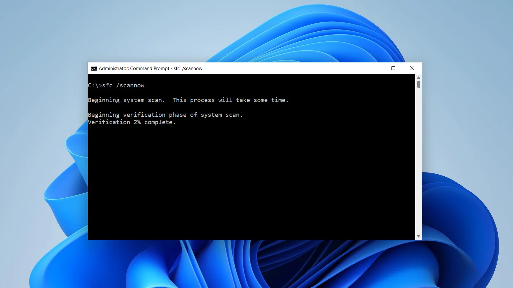
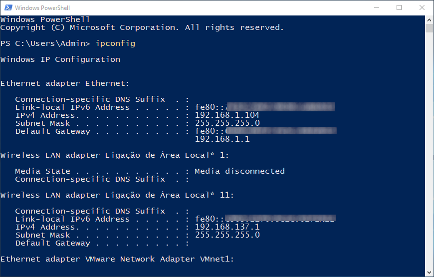
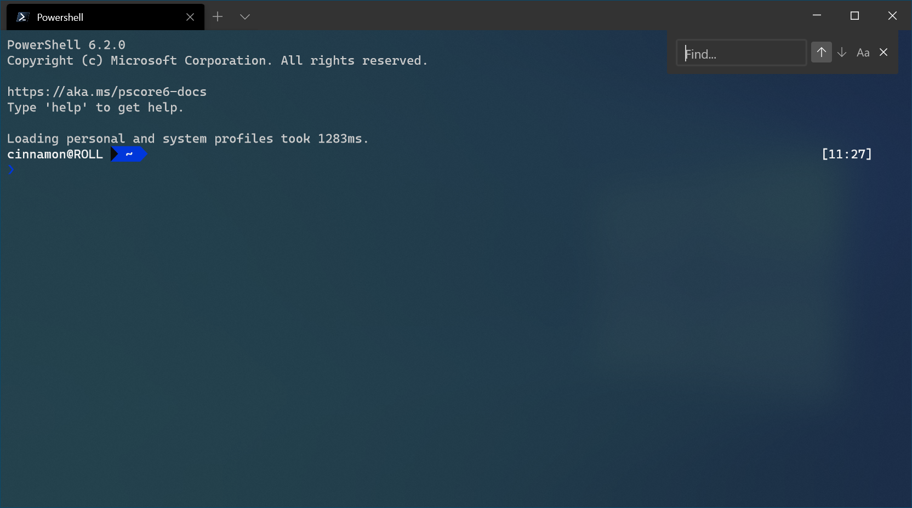
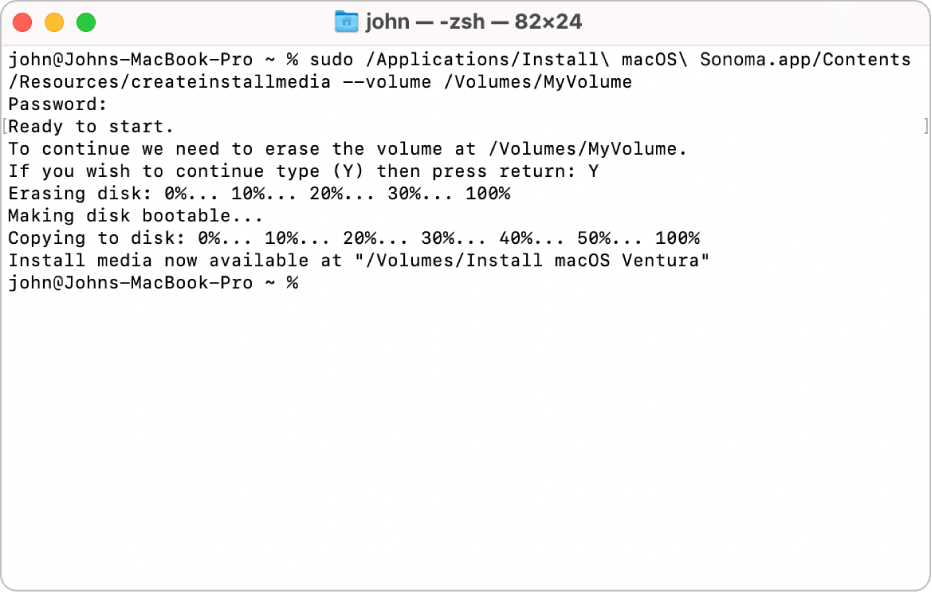

# Curso Alura - React 19 JSX, componentes, form action e useState

## Aula 1 - React, JSX e Componentes

### Aula 1 - Apresentação - Vídeo 1

Transcrição  
Olá! Sejam muito bem-vindos a mais um curso do Universo do Front End, desta vez focado no React 19. Meu nome é Vinícius Neves, conhecido como o "Dev careca barbudo da Alura", e estou aqui para acompanhar vocês nesta jornada de desbravar e iniciar o primeiro contato com essa biblioteca tão famosa do Front End.

Objetivo do Curso  
Vamos começar com o que estou mostrando agora: um Figma e um sonho. Ou seja, precisamos transformar esse Figma estático em um aplicativo React funcional. Para isso, é necessário que já tenhamos uma bagagem de Front End com a trindade fundamental: HTML, CSS e JavaScript.

Pré-requisitos e Metodologia  
Se já possuímos conhecimento sobre como o JavaScript funciona dentro do navegador, estamos aptos a dar esse primeiro mergulho juntos. Vamos começar do zero, sem nada, criando toda a aplicação. No final, ao trocar de aba, veremos nossa aplicação funcionando, publicada, e poderemos compartilhar o link com outras pessoas para que elas utilizem, seja o tech board ou qualquer aplicação que desejarmos desenvolver em paralelo.

Próximos Passos  
Há muito a ser feito para alcançarmos esse resultado. Estamos animados e aguardamos no próximo vídeo para criar o projeto e começar a desenvolver os primeiros componentes React necessários para alcançar esse resultado incrível no final, que é o tech board. Vamos lá? Estamos esperando!

### Aula 1 - ATENÇÃO: pré-requisitos da Carreira React

Antes de começar a Carreira, é fundamental ter domínio dos fundamentos da web, HTML, CSS, JavaScript e Git. Esses conhecimentos são a base do que você vai aprender aqui na Carreira de React.

Aqui na Alura, temos cursos livres para garantir esses pré-requisitos para que você possa potencializar o aproveitamento da Careira React.

## !IMPORTANTE OS LINKS NÃO ESTÃO FUNCIONANOD AINDA, HOJE 11/09/2025 A CARREIRA FICOU DISPONIVEL RECENTEMENTE, 09/09/2025!

#### Fundamentos da Web

- Internet: entendendo os fundamentos da web (novo)

#### HTML e CSS

- HTML e CSS: ambientes de desenvolvimento, estrutura de arquivos e tags
- HTML e CSS: Classes, posicionamento e Flexbox
- HTML e CSS: cabeçalho, footer e variáveis CSS
- HTML e CSS: responsividade e publicação de projetos
- HTML e CSS: responsividade com mobile-first

#### JavaScript

- JavaScript: aprendendo a programar
- Praticando JavaScript: condicionais
- Praticando JavaScript: laços de repetição
- Praticando JavaScript: funções
- Praticando JavaScript: arrays
- Praticando JavaScript: objetos
- JavaScript: manipulando elementos no DOM
- JavaScript: explorando a manipulação de elementos e da LocalStorage
- JavaScript: implementando CRUD com requisições HTTP

#### Ambiente de Desenvolvimento

- Node.js e terminal: dominando o ambiente de desenvolvimento front-end

Se você já domina esses conteúdos, pode seguir direto para o primeiro curso técnico da Carreira React. Isso vai fazer toda a diferença na sua evolução.

Bons estudos e vamos lá!

### Aula 1 - Preparando o ambiente

Introdução ao ambiente React: primeiros passos

E aí pessoa! Se você já domina HTML, CSS e JavaScript e está pronto para dar um passo além, chegou a hora de entrar no mundo do React!

Mas antes de mergulharmos de cabeça, temos dois passos importantes para preparar nosso ambiente:

1. Se acostumar com o terminal do nosso sistema operacional.
2. Instalar o Node.js.

E claro, eu, o careca barbudo mais bacana que você conhece, vou te ajudar nessa missão!

Criei uma sessão "Preparando o Ambiente" especialmente para cada sistema operacional, dando dicas práticas sobre como usar o terminal e também ensinando como instalar o Node.js. Você só precisa focar na sessão referente ao seu sistema. Por exemplo, se você usa Windows, pode tranquilamente saltar as sessões sobre Linux e macOS.

Então, bora começar?

Vida longa e próspera!

#### Windows

Se você já tá acostumado com o Windows Explorer, bora ver como fazer o mesmo pelo terminal!

Terminais no Windows

No Windows, temos três principais ferramentas pra interagir com comandos de texto:

- CMD (Prompt de Comando): Clássico e simples. Pra abrir, pressione Win + R, digite cmd e dê Enter.


- PowerShell: Mais moderno e poderoso. Abra com Win + R, digite powershell.


Windows Terminal: Mais recente e bacana, permite abrir várias abas. Vem pré-instalado no Windows 11 ou disponível na Microsoft Store pro Windows 10.


Explorando pastas: Explorer vs. Terminal

Entrar em uma pasta

- Explorer: Você dá dois cliques numa pasta.
- Terminal: Você usa o comando cd nome_da_pasta

Exemplo:

> cd Documentos

Voltar para a pasta anterior

- Explorer: Botão voltar ou clicar no nível acima.
- Terminal: Você usa o comando:

> cd ..

Ver o que tem na pasta atual

- Explorer: Olha visualmente os arquivos.
- Terminal: Comando dir no CMD ou ls no PowerShell:

> ls

Criar uma nova pasta

- Explorer: Botão direito → Nova Pasta.
- Terminal: Comando mkdir nome_da_pasta:

> mkdir meu-projeto-react

Saber em que pasta você está

- Explorer: Barra superior mostra o caminho.
- Terminal: Comando cd sem argumentos ou pwd no PowerShell:

> pwd

Limpar a tela do terminal

Se o terminal ficar muito cheio:

CMD:

> cls

PowerShell:

> clear

Exemplo prático de navegação

Vamos simular a criação e navegação até uma pasta para um projeto React:

> cd Documentos
> mkdir meu-app-react
> cd meu-app-react

Agora você já está pronto para começar seu projeto React dentro da pasta criada!

Dominar o terminal é meio caminho andado pra virar dev fera!

Próximo passo é instalar o Node.js e rodar o React.

#### macOS

Se você tá acostumado com o Finder, vai ser moleza!

Terminais no macOS

No macOS, temos algumas opções legais pra trabalhar com comandos de texto:

- Terminal (padrão): Abra usando o Spotlight (Cmd + Espaço), digite Terminal e dê Enter.

O terminal padrão no macOS utiliza o Zsh, que é bem amigável e prático.



Explorando pastas: Finder vs. Terminal

Entrar em uma pasta

- Finder: Você dá dois cliques na pasta.
- Terminal: Use o comando cd nome_da_pasta

Exemplo:

> cd Documents

Voltar para a pasta anterior

- Finder: Clique no botão voltar ou vá ao nível superior.
- Terminal: Use o comando:

> cd ..

Ver o conteúdo da pasta atual

- Finder: Veja visualmente.
- Terminal: Use o comando ls:

> ls

Criar uma nova pasta

- Finder: Botão direito → Nova Pasta.
- Terminal: Comando mkdir nome_da_pasta:

> mkdir meu-projeto-react

Saber em qual pasta você está

- Finder: Barra superior mostra o caminho.
- Terminal: Comando pwd:

> pwd

Limpar a tela do terminal

Se precisar limpar o terminal:

> clear

Exemplo prático de navegação

Bora criar uma pasta pra nosso projeto React usando o terminal:

> cd Documents
> mkdir meu-app-react
> cd meu-app-react

Agora você tá prontinho pra começar seu projeto React dentro da pasta criada!

Dominar o terminal facilita muito a vida de quem quer ser dev!

Próximo passo: instalar Node.js e iniciar com React

#### Linux

Se você já está acostumado com o gerenciador de arquivos, vai perceber que o terminal é bem prático!

Terminais no Linux

No Linux, temos várias opções para trabalhar com comandos de texto:

- Bash: Padrão em quase todas as distribuições.
- Zsh: Alternativa popular com recursos avançados.
- Fish: Shell amigável com excelente auto-completar.

Geralmente, você pode abrir o terminal usando o atalho Ctrl + Alt + T ou pesquisando por "Terminal" no menu da sua distribuição.

Explorando pastas: Gerenciador de arquivos vs. Terminal

Entrar em uma pasta

- Gerenciador de arquivos: Dois cliques na pasta.
- Terminal: Use o comando cd nome_da_pasta
Exemplo:

> cd Documentos

Voltar para a pasta anterior

- Gerenciador de arquivos: Clique na seta para cima ou botão voltar.
- Terminal: Comando:

> cd ..

Ver o conteúdo da pasta atual

- Gerenciador de arquivos: Veja visualmente.
- Terminal: Use o comando ls:

> ls

Criar uma nova pasta

- Gerenciador de arquivos: Clique com botão direito → Nova Pasta.
- Terminal: Comando mkdir nome_da_pasta:

> mkdir meu-projeto-react

Saber em qual pasta você está

- Gerenciador de arquivos: Barra superior mostra o caminho.
- Terminal: Comando pwd:

> pwd

Limpar a tela do terminal

Se precisar limpar o terminal:

> clear

Exemplo prático de navegação

Vamos criar uma pasta para nosso projeto React usando o terminal:

> cd Documentos
> mkdir meu-app-react
> cd meu-app-react

Agora você está pronto para começar seu projeto React dentro da pasta criada!

Dominar o terminal facilita bastante a vida de quem quer ser desenvolvedor.

Próximo passo: instalar Node.js e iniciar com React.

#### Node.js

Instalando o Node.js

Antes de tudo, vale entender o que é o Node.js.

Node é uma ferramenta que permite rodar JavaScript fora do navegador. Isso significa que dá pra usar JavaScript no terminal, criar servidores, manipular arquivos, conectar com banco de dados e muito mais — tudo com a mesma linguagem que você já usava no navegador. É como se o Node pegasse o cérebro do navegador (o motor JavaScript) e colocasse ele pra rodar direto no seu sistema.

E esse "cérebro" é o V8.

O V8 é o motor JavaScript criado pela galera do Google. Ele é o responsável por transformar o código JS em algo que o computador realmente entende e consegue executar rapidinho. O Chrome usa o V8, e o Node também. Então, quando a gente fala que o Node roda JavaScript fora do navegador, é porque ele leva o V8 junto com ele pra fazer esse trabalho.

Beleza, agora que você sabe o que é o Node e o V8, bora instalar.

Um dos caminhos mais simples pra isso é acessar o site oficial:

https://nodejs.org/en/download

Lá, você escolhe o instalador compatível com o seu sistema operacional (Windows, macOS ou Linux), baixa o arquivo e segue os passos indicados pelo instalador.

Se quiser se aprofundar mais nos detalhes da instalação, recomendo este artigo:

[Como instalar o Node.js no Windows, Linux e macOS](https://www.alura.com.br/artigos/como-instalar-node-js-windows-linux-macos)

Testando se a instalação deu certo

Depois de instalar, é importante verificar se o Node.js está funcionando corretamente. Abra o terminal e digite:

> node --version
> npm --version

Se aparecerem as versões do Node e do npm, tá tudo certo.

Importante: se o terminal já estava aberto antes da instalação, feche e abra de novo pra garantir que tudo funcione como esperado.

#### Figma

O layout da aplicação que vamos utilizar está disponível [aqui no Figma](https://www.figma.com/community/file/1490097519019624965).

As imagens pra download são:

  


Agora sim, tudo no lugar. Bora começar?

### Aula 1 - Criando o projeto - Vídeo 2

Transcrição  
Estamos prontos para dar nosso primeiro passo na direção do ecossistema do React. Decidimos aprender essa biblioteca, que é amplamente utilizada atualmente, e agora vamos começar a transferir nosso conhecimento de HTML, CSS e JavaScript para o mundo do React. O primeiro passo é criar um projeto novo do zero.

Criando um Projeto Tradicional com HTML, CSS e JavaScript

Para criar um projeto novo do zero, vamos abrir o VSCode. Fechamos tudo que está aberto, incluindo qualquer pasta, para começar com o VSCode limpo. Podemos criar um novo projeto na área de trabalho. O nome do projeto, conforme definido no Figma, é tech-tech-board. Criamos uma pasta chamada tech-board na área de trabalho, arrastamos essa pasta para o VSCode e podemos começar a criar arquivos como index.html, script.js e estilos.css. No index.html, utilizamos o atalho do VSCode para criar a estrutura do documento HTML, que é uma exclamação. Podemos importar o CSS com uma tag link e adicionar um script apontando para script.js, utilizando defer para garantir que o script carregue apenas quando o DOM estiver completamente carregado.

Podemos começar a codificar nossa aplicação tech-board. Utilizamos uma extensão do VSCode, como o Live Server, que nos fornece um botão "Go Live". Ao clicar nele, nossa aplicação é carregada com um H1, e podemos começar a estilizar e adicionar JavaScript. Essa é uma aplicação web tradicional, usando apenas arquivos estáticos: HTML, CSS e JavaScript. No entanto, para o React, esse não é o caminho para construir uma nova aplicação.

Preparação do Ambiente para um Projeto React

Para começar um projeto React, precisamos do Node.js. Vamos utilizar o terminal, que pode variar de acordo com o sistema operacional: Bash, Git Bash, PowerShell, CMD, terminal do Windows, Zsh no Linux, entre outros. Não importa qual terminal escolhemos, podemos nos acostumar com qualquer um. No exemplo, estamos usando o terminal Warp. Com o terminal aberto, garantimos que o Node.js está instalado localmente. Embora o Node.js seja frequentemente associado ao back-end, no nosso caso, ele será uma ferramenta de desenvolvimento. O React requer mais passos para ser transformado em algo que o navegador entenda, e o Node.js facilita esse processo.

Para verificar a instalação do Node.js, utilizamos o comando node -v no terminal, que retorna a versão exata do Node.js em uso, como 22.12.0. Recomendamos instalar a versão 22.x na máquina. No material de preparação do ambiente, há dicas e truques para ajudar nesse processo. O mais importante é garantir que o Node.js esteja instalado neste momento.

Se ainda não fizemos isso, é importante pausar o vídeo, voltar ao preparo do ambiente e seguir os passos para instalar o Node.js. Com o Node.js instalado, podemos iniciar o projeto e começar nosso aprendizado com o React.

Iniciando um Projeto React com Vite

É importante destacar que o React, por si só, não faz nada. Ele precisa de uma ferramenta ou estrutura para funcionar. Existem várias maneiras de criar uma aplicação React do zero, e uma delas é utilizando uma ferramenta chamada Vite. O Node.js é o ambiente de execução JavaScript, enquanto o Vite é um pacote JavaScript que utilizaremos. O Vite cuidará do nosso ambiente de desenvolvimento e, quando a aplicação estiver pronta, transformará o código em algo que o navegador possa entender.

No site do Vite, na seção "vite.dev-guide", encontramos informações sobre como criar nosso primeiro projeto com Vite. Para isso, precisamos executar o comando npm create vite@latest. Vamos copiar esse comando e colá-lo no terminal. No terminal, estamos acessando a área de trabalho. O local onde executarmos esse comando será onde o projeto será criado.

Após colar o comando npm create vite@latest e pressionar Enter, o terminal perguntará qual será o nome do projeto. Conforme visto no Figma, o nome é "techboard". Após inserir o nome, o terminal solicitará a seleção de um framework. Temos várias opções, e a terceira é o React. Vamos focar no React.

A próxima pergunta é sobre o uso de TypeScript ou JavaScript. Se já soubermos TypeScript, podemos optar por ele, mas usaremos JavaScript puro, que é a terceira opção. Após isso, a estrutura do projeto estará criada. Precisamos entrar no projeto, instalar as dependências necessárias e executar o comando npm run dev para iniciar o ambiente de desenvolvimento.

Configuração Final e Execução do Projeto

Os passos são: cd techboard, npm install para instalar as dependências, e npm run dev para iniciar o servidor de desenvolvimento. O Node.js será utilizado pelo Vite para levantar o servidor. Após executar npm run dev, o terminal indicará que a versão do Vite é 6.2.6 e que está disponível localmente na porta 5173. Podemos acessar a aplicação clicando no link fornecido.

Este é o processo para iniciar um projeto React do zero. Embora existam outras maneiras, neste curso, utilizaremos o Vite para aprender os fundamentos do React. Este foi o preparo do ambiente, e muito código ainda está por vir. Nos vemos no próximo vídeo. Até mais!

### Aula 1 - Desvendando o JSX - Vídeo 3

Transcrição  
O projeto está criado e funcionando. Conseguimos integrar o Vite com o React. Vamos abrir o VS Code. Ainda não estamos com a pasta aberta, ela está na área de trabalho. Vamos arrastá-la para abrir diretamente no VS Code. Nosso projeto está iniciado. No Chrome, na localhost:5173, podemos ver que ele exibe "Vite + React".

Testando o Hot Module Replacement (HMR)

Devemos editar o arquivo dentro da pasta src, chamado app.jsx, e salvá-lo para testar o HMR (Hot Module Replacement). Basicamente, o HMR permite que as alterações no código sejam refletidas imediatamente no navegador sem a necessidade de recarregar a página. Vamos demonstrar isso na prática. Vamos ajustar o tamanho do navegador e do VS Code para que fiquem lado a lado. No arquivo src/app.jsx, há um trecho de código entre as linhas 10 e 31 que nos interessa. Esse trecho parece HTML, mas não é exatamente isso, como veremos em breve. Ele contém tags e uma imagem, incluindo a indicação de "Vite + React".

Se editarmos esse arquivo, a tela será atualizada automaticamente. Vamos deletar tudo, exceto o import app.css e o return entre parênteses. Assim, a função app ficará com return e parênteses vazios. Agora, vamos criar uma tag main, que será o conteúdo da nossa página, e começar a organizar o HTML.

Preparação de Imagens no Projeto

No Figma, vamos começar pelo cabeçalho e pelo banner. Precisaremos de duas imagens. Vamos criar uma tag header e, dentro dela, uma imagem. Ainda não sabemos onde está essa imagem. Em seguida, criaremos uma section para o banner, que também conterá uma imagem. Já fizemos o download dessas imagens, que estão disponíveis no link "Para Saber Mais", caso ainda não tenham sido baixadas. Na pasta de downloads, temos banner.png e logo.png.

O React depende do Vite para funcionar. Para disponibilizar essas imagens no projeto, vamos movê-las para a pasta "public", na raiz do projeto. Essa pasta já contém o Vite.svg, que é o logo do Vite. Agora, também terá logo.png, que é o logo do Techboard, e banner.png, que é a imagem de uma pessoa com óculos de realidade aumentada.

Acessando Imagens no Navegador

Para acessar essas imagens, podemos usar o endereço localhost:5173 seguido do nome da imagem. Por exemplo, ao acessar localhost:5173/banner.png, a imagem será carregada no navegador. O Vite está funcionando como um servidor web, semelhante ao que a extensão Live Server do VS Code faz. Podemos também carregar o logo, que será exibido como "Techboard".

Implementação de Imagens no Código

No projeto, vamos focar no app.jsx. Como estamos acessando diretamente da raiz, podemos usar /logo.png para a imagem no header e, na section do banner, usar /banner.png. O VS Code indica que ainda não salvamos as alterações. Após salvar, ao voltar para a aba localhost:5173, a imagem do banner será exibida em tamanho grande.

Estilização do Layout

Precisamos agora trazer um pouco de estilo para o nosso layout, especialmente para o header. O logo do Tech Board não está aparecendo, pois é branco e o fundo também está branco. Vamos corrigir isso.

Na linha 1 do nosso app.jsx, estamos importando o app.css. Ao clicar com command ou control, podemos abrir esse arquivo. Dentro dele, há muito CSS da aplicação que foi criada com o Vite. Vamos deletar tudo. Após selecionar e apagar, restará apenas o hub aberto, a imagem do Tech Hub, o seu hub de eventos. Precisamos estilizar isso.

Voltando ao app.jsx, temos uma tag header e uma section com uma imagem dentro. Vamos usar esses seletores. Primeiro, vamos definir a cor de fundo do header. No Figma, selecionamos o pedaço correspondente ao header e copiamos o código hexadecimal da cor. Este é o CSS que já conhecemos. Agora, ao verificar no Vite, o fundo está correto. No entanto, ainda há alguns estilos aplicados, como a margem interna padrão do body.

Ajustes Finais de Estilo

No Vite, existe um arquivo global chamado index.css, que contém estilos globais da aplicação. Vamos deletar o conteúdo desse arquivo. Após isso, o espaçamento padrão do body será removido. Podemos voltar ao app.css e remover essa margem, definindo margin: 0 para o body.

Agora, precisamos adicionar espaçamento interno e centralizar a imagem. No Figma, verificamos que o espaçamento interno é de 32 pixels para cima e para baixo, e a imagem está centralizada. No header, vamos adicionar padding: 32px e centralizar a imagem usando display: flex e justify-content: center. Ao verificar no Vite, tudo está conforme o esperado.

Vamos continuar estilizando a section. Ela possui um fundo degradê, que podemos copiar do Figma. Após selecionar o elemento, copiamos o estilo de degradê linear e colamos no VS Code. O resultado no Vite já se assemelha ao desejado. Precisamos centralizar e evitar que a imagem vaze. Para centralizar, usamos display: flex e justify-content: center. Para evitar que a imagem vaze, definimos um tamanho máximo de 90% da largura total para a imagem dentro da section. Assim, se a tela for menor, a imagem se ajustará.

Próximos Passos com React

Até agora, editamos o app.jsx e o app.css, utilizando HTML e CSS. Esses conceitos são familiares para quem trabalha com web, HTML, CSS e JavaScript. Contudo, o React oferece muito mais do que apenas essa configuração com Vite e Node. No próximo vídeo, começaremos a criar componentes, dando os primeiros passos com o React de verdade.

### Aula 1 - Primeiro componente - Vídeo 4

Transcrição  
Já temos uma ideia do nosso projeto, que é o nosso alvo, o Tech Board. Vamos voltar ao Figma. O próximo passo natural seria criar o formulário, que é uma caixa centralizada com os dados do formulário. Precisamos seguir e criar essa parte. Até agora, estamos editando o arquivo app.jsx, que contém uma função chamada App, com "A" maiúsculo. Estamos fazendo isso porque, no React, o que monta nossa tela são pequenos blocos de código chamados de componentes.

Criação do Componente App

De onde surgiu o componente App? Quando criamos a aplicação usando o Vite, ele já traz esse componente por padrão, o App. Tanto que ele tinha o logo do Vite com o React e aquele botão que incrementava conforme clicávamos.

Criando um Novo Componente React

Agora, queremos criar nosso próprio componente. Não vamos ficar apenas no app.jsx. Vamos criar nosso próprio componente. Para criar um componente no React, vamos usar o mesmo arquivo. Colocaremos um comentário, que é "//", e escreveremos em maiúsculas. No React, componentes são funções. Portanto, se componentes são funções, vamos criar uma função JavaScript pura. Um detalhe importante: quando criamos um componente React, que é uma função, começamos com letra maiúscula. Normalmente, no JavaScript, uma função começa com letra minúscula, mas no React, começamos com letra maiúscula para identificar que é um componente.

Estrutura do Componente FormulárioDeEvento

Nosso próximo bloco de código pode ser o formulário que vamos criar para eventos. Com "F" maiúsculo, chamaremos de FormulárioDeEvento. É um formulário específico para criar novos eventos. Abrimos e fechamos parênteses e chaves, como uma função JavaScript.

Outra característica de um componente React é que ele retorna algo, e esse algo é aquele bloco de código que parece HTML, mas não é. O nome disso é JSX. Vamos explorar mais sobre isso em breve. Para retornar múltiplas linhas, usamos parênteses. Isso nos permite quebrar a linha e organizar o código de forma adequada.

Implementação do Formulário em JSX

Dentro do JSX, vamos inserir o HTML que já conhecemos. Chamaremos um formulário e, dentro dele, um h2 com o texto "Preencha para criar um evento", que copiamos do Figma para evitar digitar novamente. Removeremos o espaço em branco que estava vazio.

Na linha 10, logo abaixo do h2, criaremos um fieldset para agrupar uma label e um input. Colocaremos uma label e copiaremos o texto "Qual é o nome do evento?". Vamos quebrar a linha da label e adicionar um input do tipo texto, com um id de "nome". A label terá um atributo htmlFor apontando para o id "nome", seguindo a regra do HTML.

Diferenças entre HTML e JSX

Observe que o HTMLFor possui um "F" maiúsculo ao invés de um hífen. Por enquanto, vamos aceitar isso. Temos nosso componente como ele é. O que podemos fazer? Podemos, por exemplo, adicionar uma classe, e aqui começam as diferenças. No HTML normal, usamos class, certo? Colocamos, por exemplo, form-evento. Isso é HTML. No entanto, no nosso caso, parece HTML, mas não é. Portanto, não usamos a palavra class, pois estamos lidando com JavaScript, onde class é uma palavra reservada para criar uma classe em orientação a objetos. Não precisamos nos aprofundar nesse assunto agora; o importante é que é uma palavra reservada. Assim, ao invés de usar class, utilizamos className, como em form-evento.

Renderização e Estilização do Formulário

Primeiro, podemos renderizar na tela. Como renderizamos esse formulário para verificar se está funcionando? O nome dele é "formulário de evento". Então, abaixo da section, abrimos um sinal como se fôssemos colocar uma tag. O VS Code já sugere: "Por acaso, é o formulário de evento que você quer?" Sim, é o formulário de evento. Fechamos como se fosse uma tag órfã, usando barra e o sinal de maior. Se olharmos agora no localhost na porta 5173, veremos que o HTML está cheio de elementos desnecessários, mas já está renderizando. Ele já está um pouco no cenário que precisamos.

Vamos adicionar alguns estilos agora. Temos nosso form-evento. Podemos aplicar o estilo rapidamente. Não precisamos mais pegar pela tag. Vamos pegar o form-evento e buscar no Figma. No Figma, selecionamos o box do form e aplicamos um background-color com o valor hexadecimal #212121. O padding é de 32 pixels para cima e para baixo, e 28 pixels para os lados. Então, aplicamos o padding: primeiro para cima e para baixo, que é 32 pixels, e depois para os lados, que é 28 pixels. De onde pegamos isso? No Figma, há opções de padding. O border-radius, para deixar as bordas arredondadas, é de 16 pixels. Então, aplicamos border-radius: 16px. Qual é o tamanho máximo dele? 384 pixels de largura fixa. Vamos definir width: 384px. Podemos aplicar uma abordagem defensiva também, definindo a largura máxima como 90% para ter uma margem. Se alguém diminuir, ele também diminuirá.

Ajustes Finais e Conclusão

Vamos verificar se funcionou. Voltamos ao width. Ele já está lá. Como tem uma largura fixa, podemos centralizá-lo usando margem. Margem para cima e para baixo: zero. Automático. Está centralizado. No entanto, para cima e para baixo, ele tem uma margem de 64 pixels. Vamos ajustar isso. No width, margem para cima e para baixo: 64 pixels. Agora sim. Está lá. Preenche para criar um evento e está com alguma cor. Já está mais ou menos correto.

Já temos nosso primeiro componente React funcionando. Já escrevemos bastante código e estamos customizando. Começamos apenas com o app, deletando elementos e criando blocos de código que parecem HTML, mas não são. Aprendemos que é JSX. Agora, criamos nosso primeiro componente dentro do mesmo arquivo. Nosso projeto está tomando forma. As coisas estão se encaixando, e estamos montando. Há bastante familiaridade com o HTML que conhecemos. O CSS não apresenta diferenças. Agora é hora de fazermos um mergulho mais profundo para entender o que de fato é o React e o significado desse monte de código que acabamos de escrever. Estaremos esperando no próximo vídeo para discutirmos isso.

### Aula 1 - O que é ReactJS? - Vídeo 5

Transcrição  
Parece que não há snippets de código fornecidos para complementar a transcrição. No entanto, posso ajudar a estruturar a transcrição de forma didática, destacando os conceitos importantes e explicando como eles se relacionam com o desenvolvimento em React.

História e Propósito do React

Vamos agora nos aprofundar mais no React. Trouxemos uma imagem de uma pessoa com um escafandro, que é a roupa de mergulho, para ilustrar essa imersão. Vamos entender o que realmente é o React. Já aprendemos que escrevemos JSX, que componentes são funções, e que precisamos do Node e do Vite para desenvolver um projeto React. Mas agora é o momento de parar, respirar e compreender o que estamos fazendo até agora.

O React se define como uma biblioteca para construir interfaces de usuário. Isso porque podemos usar React tanto para a web quanto para aplicações móveis com React Native. O React foi criado pelo Facebook, atualmente Meta, em 2013. Na época, eles enfrentavam um problema específico com a página do Facebook, que exigia atualizações constantes. Com as tecnologias que usavam, era extremamente difícil realizar essas atualizações. Assim, criaram o React, inicialmente apenas para uso interno no Facebook, e posteriormente o tornaram open source (código aberto) para o mundo. O React resolveu o problema de interagir e escrever código para telas que mudam dinamicamente.

Esse mecanismo facilitou tanto o desenvolvimento que se tornou um padrão de mercado. Por isso, há um aumento nas oportunidades de trabalho e vagas que pedem conhecimento em React, além de mais pessoas estudando essa tecnologia. Hoje, a maioria das aplicações utiliza ou interage com React de alguma forma, tornando-se rapidamente um padrão de mercado.

Diferença entre Front-end Imperativo e React

Lembrando que a ideia do React era resolver o problema do time do Facebook em atualizar partes da tela. O que chamamos de front-end imperativo é quando precisamos, linha por linha, instruir o navegador sobre o que fazer com cada elemento e onde posicioná-los. Nesse caso, interagimos diretamente com o DOM do HTML, manipulando eventos, criando elementos, adicionando e removendo classes. Nosso código fica muito próximo do comportamento do DOM.

A proposta do React é diferente. Não queremos gerenciar tudo linha por linha. Queremos declarar a ideia de um componente, como queremos que ele seja. Embora pareça HTML, não é. O React transforma isso em código que o navegador entende, e então o navegador renderiza.

Em um exemplo de front-end imperativo, tínhamos uma função chamada criarElementoTarefa, que realizava várias ações. Criávamos um elemento HTML dentro do JavaScript, adicionávamos uma classe, criávamos um elemento SVG, definíamos o índice HTML desse elemento, criávamos um parágrafo, alterávamos o conteúdo de texto desse parágrafo e, no final, colocávamos o SVG e o parágrafo dentro de um Li, retornando isso para ser inserido no DOM. Isso é front-end imperativo, onde instruímos o navegador linha por linha.

A proposta do React é o oposto. No exemplo do nosso formulário, não criamos elementos linha por linha. Declaramos como ele deveria ser, e o React cuidou disso. Não manipulamos cada classe ou atributo; o React faz isso por nós.

JSX e Suas Regras

Agora que sabemos que o JSX parece HTML, mas não é, precisamos entender as limitações e regras para montar um componente React que funcione corretamente. Vamos à definição do JSX: é uma extensão de sintaxe do JavaScript que permite escrever marcação semelhante ao HTML dentro de um arquivo JavaScript. Criamos um bloco de código que parecia HTML dentro de um arquivo JavaScript, mas que não era HTML, apenas parecia.

O JSX é uma sintaxe que o React sabe lidar, pois é uma biblioteca que gerencia a interface de usuário. O React transforma nosso exemplo de formulário em algo que se assemelha a um código onde cada tag é convertida em uma chamada para a função createElement do próprio React, e não a do DOM, como no exemplo imperativo. Para cada elemento dentro do JSX, o React chama essa função createElement. O elemento mais alto é o form, que possui um className, seguido por um h2, um fieldset, uma label e um input, que possui type, id e placeholder. O React transforma o JSX nesse código por debaixo dos panos.

Para que isso funcione, precisamos seguir algumas regras. Caso contrário, o React não consegue transformar o JSX nas funções que chamam o createElement. Vamos abordar essas regras, que são apenas três.

A primeira regra é que elementos adjacentes no JSX precisam estar dentro de uma única tag. Não podemos retornar múltiplos elementos, como no exemplo do toDoList, onde retornamos três elementos: h1, img e ul. Todos devem estar dentro de um elemento maior. Corrigindo isso, colocamos todo o bloco de código dentro de uma única div para o componente toDoList. Isso muda a mensagem de erro para indicar que um código JSX não foi terminado, ou seja, uma tag foi aberta e não fechada.

A segunda regra é fechar todas as tags. No exemplo, a tag img na linha 5 não foi fechada. Mesmo as tags que chamamos de orphan (órfãs) precisam ter uma barra no final antes do sinal de maior. Isso foi resolvido na linha 9.

A terceira regra é usar camelCase na maioria das coisas. No caso de className, usamos camelCase. Isso resolve o problema. Quando usamos atributos do SVG, que são separados por hífen, devemos remover o hífen e aplicar camelCase.

Ao seguir essas regras, o componente renderiza sem erros. Durante o processo de aprendizagem, encontraremos muitos erros desse tipo. A maioria das mensagens de erro indica o que ocorreu, como não fechar um elemento ou retornar mais de um elemento. Parte do nosso aprendizado e trabalho com React é entender e corrigir esses erros.

Ferramentas Necessárias para Desenvolvimento em React

Para ter um projeto React rodando, precisamos do Node, que transforma o código que o React entende em código que o navegador entende, com a ajuda do Vite e outras ferramentas. O Node e o Vite cuidam do ambiente de desenvolvimento para rodar uma aplicação React.

Conclusão e Próximos Passos

Vamos agora codificar, pois além de aprender React, precisamos desenvolver nosso tech board. Nos encontramos no próximo vídeo.

Se você tiver snippets de código específicos ou exemplos que gostaria de incluir, por favor, forneça-os para que eu possa integrá-los adequadamente à transcrição.

### Aula 1 - Para saber mais: regras do JSX

Escrevendo com JSX

Se você já mexeu com HTML antes, ao olhar o código de um componente React, a primeira reação costuma ser: "Opa, isso aqui é HTML!"

Parece mesmo. Mas não é.

JSX é uma forma de escrever marcação dentro do JavaScript. É um atalho que o React oferece pra você misturar lógica de renderização e estrutura visual num lugar só. E ele tem regras próprias, que a gente precisa respeitar pra tudo funcionar direitinho.

Por que JSX existe?

No início da web, a galera separava tudo: HTML num arquivo, JS em outro, CSS em outro. Fazia sentido na época. Mas à medida que os sites ficaram mais interativos, o JavaScript passou a controlar tudo: quando mostra, quando esconde, o que aparece pra quem, etc.

Foi aí que o React propôs algo diferente: já que o JS tá mandando em tudo, por que não escrever também a estrutura visual (markup) dentro dele? Daí nasceu o JSX.

Parece HTML, mas não é HTML  
Essa é a parte importante. Embora o JSX se pareça com HTML, ele é JavaScript. E por isso tem umas regras diferentes:

1. Tudo precisa estar dentro de um único elemento pai

Você não pode retornar dois elementos "irmãos" direto. Se quiser retornar várias tags, precisa embrulhar tudo com uma tag só. Pode ser uma <div>, ou um fragmento <>...</>:

```JSX
return (
<>
<h1>Exemplo</h1>
<p>Isso funciona</p>
</>
)
```

"O React.Fragment (ou sua forma abreviada, <>...</>) é uma solução criada pelo React pra quando você quer retornar múltiplos elementos sem adicionar uma tag extra no HTML gerado. Ele serve pra agrupar elementos no JSX sem interferir no layout final da página."

2. Feche todas as tags

No HTML, algumas tags podem ficar abertas (tipo `<br>` ou ``). No JSX, não pode. Tudo precisa ser fechado:

```JSX

```

E as tags que envolvem outros conteúdos também precisam de abertura e fechamento:

```JSX
<li>Item</li>
```

3. Use camelCase nos atributos

Como o JSX vira JavaScript, os atributos precisam seguir a sintaxe do JS. Nada de class, for ou stroke-width. Você vai usar:

- className no lugar de class
- htmlFor no lugar de for
- strokeWidth no lugar de stroke-width

Exemplo:

```JSX
<label htmlFor="nome">Nome:</label>
<input id="nome" className="campo" />
```

4. Cuidado com valores dinâmicos

Quando quiser exibir uma variável ou resultado de alguma função dentro do JSX, use chaves:

const nome = 'João'

```JSX
return <p>Olá, {nome}!</p>
```

Isso vale pra qualquer expressão JavaScript: chamadas de função, operadores ternários, etc.

5. JSX é opcional, mas todo mundo usa

Dá pra usar React sem JSX, escrevendo os elementos usando React.createElement, mas é muito mais verboso. A comunidade inteira usa JSX, então vale a pena aprender logo de cara.

No fim das contas ele é uma forma prática e legível de descrever como a interface deve parecer (declarativamente), diretamente dentro do código JavaScript. Mas ele exige que a gente siga algumas regrinhas, justamente porque ele não é HTML. Parece, mas é JavaScript disfarçado.

Se você respeitar essas regras, o JSX vai te ajudar a escrever componentes mais legíveis e conectados com a lógica da sua aplicação.

### Aula 1 - Para saber mais: o que o vite faz por debaixo dos panos?

Chegando aqui, é super normal sentir que tem coisa demais acontecendo. Primeiro o terminal, depois o Node, depois JSX... e agora vem esse tal de Vite.

Calma. Respira. Essa sensação de "ué, mas não dava só pra jogar o React numa tag script e sair codando?" é muito comum. Acontece com todo mundo que tá começando.

Até daria. Mas aí você teria que fazer tudo na mão: converter o JSX, configurar o ambiente, garantir que o código funcione em navegadores diferentes, importar bibliotecas, recarregar a página toda vez que fizer uma mudança... e por aí vai. Só dor de cabeça.

É aí que o Vite entra.

O Vite é uma ferramenta que cuida disso tudo por você. Ele prepara o ambiente de desenvolvimento, transforma o JSX em JavaScript, recarrega a página automaticamente quando você salva um arquivo, mostra erros no navegador de forma amigável e ainda deixa tudo pronto pra produção com um comando só.

Eu gosto de pensar no Vite como aquele amigo que chega antes na festa, monta o som, testa as luzes e deixa tudo no esquema pra quando você chegar, só ligar o microfone e mandar ver.

E sim, dá pra usar React sem Vite. Mas ele deixa o processo tão mais simples que não tem por que complicar agora. Com o tempo você vai entendendo o que acontece por baixo dos panos — por enquanto, só precisa saber que ele tá ali pra te ajudar.

Ah, e vale comentar: o Vite não é a única ferramenta que faz isso. Antes dele, a galera usava o Webpack, que ainda existe e é bem poderoso (mas dá mais trabalho de configurar). Também tem o Parcel, que tem uma proposta parecida com o Vite. No fundo, todas essas ferramentas servem pra mesma coisa — automatizar tarefas e deixar seu ambiente pronto pra você focar no código.

Foca no essencial: terminal, Node, Vite. O resto a gente vê depois.

Um passo de cada vez. Tá tudo certo.

### Aula 1 - JSX em React - Exercício

Qual das seguintes afirmações melhor justifica o uso de JSX em um projeto React, considerando suas vantagens e desvantagens?

Alternativa correta  
Usar JSX é vantajoso porque ele permite escrever HTML diretamente no JavaScript, o que melhora a legibilidade do código e facilita a manutenção.

> JSX melhora a legibilidade e manutenção do código ao permitir que HTML e JavaScript coexistam de forma mais intuitiva.

### Aula 1 - Faça como eu fiz: Iniciar React com Vite

Nesta aula, aprendemos a configurar o ambiente, criar um projeto React com Vite e estruturar componentes com JSX de acordo com o design do Figma.

Agora é a sua chance de fixar os conteúdos aplicados na aula, se ainda não os colocou em prática. Para isso:

- Instale o Node (versão 22 ou superior) para servir como ferramenta de desenvolvimento.
- Utilize o comando 'npm create vite@latest' para criar o projeto, escolhendo React e JavaScript sem SWC.
- Acesse a pasta criada, execute 'npm install' e depois 'npm run dev' para iniciar o servidor de desenvolvimento.
- Mova as imagens (banner.png e logo.png) para a pasta public e ajuste os caminhos no código.
- Edite os arquivos app.jsx e app.css para estruturar e estilizar o layout conforme o Figma.
- Crie e integre um componente 'Formulário de Evento' utilizando JSX, definindo sua estrutura e estilos.

Para acessar o guia detalhado, consulte as transcrições da aula.

Opinião do instrutor

- Criando o projeto com Vite e preparando o ambiente:
- Abra o terminal no diretório onde você quer criar seu projeto.
- Execute o comando npm create vite@latest.
- Dê o nome do seu projeto como techboard.
- Escolha a opção React e depois selecione JavaScript.
- Entre na pasta do projeto com cd techboard.
- Instale as dependências com npm install.
- Rode o servidor de desenvolvimento com npm run dev e acesse o link fornecido (normalmente http://localhost:5173).

Adicionando as imagens de logo e banner:

- Crie uma pasta chamada public na raiz do projeto.
- Mova os arquivos logo.png e banner.png para dentro da pasta public.
- No arquivo src/App.jsx, adicione as tags `<header>` e `<section>`, com as imagens:

```JSX
<header>
  
</header>

<section>
  
</section>
```

Estilizando com CSS:

No arquivo src/App.css, remova todos os estilos existentes.
Adicione os estilos para body, header e section, com base no que vimos no Figma:

```JSX
body {
  margin: 0;
}

header {
  background-color: #121212;
  padding: 32px;
  display: flex;
  justify-content: center;
}

section {
  background: linear-gradient(180deg, #212121 0%, #121212 100%);
  display: flex;
  justify-content: center;
}

section img {
  max-width: 90%;
}
```

Criando o componente FormularioDeEvento:

No final do App.jsx, crie o componente:

```JSX
function FormularioDeEvento() {
  return (
    <form className="form-evento">
      <h2>Preencha para criar um evento</h2>
      <fieldset>
        <label htmlFor="nome">Qual o nome do evento?</label>
        <input id="nome" type="text" />
      </fieldset>
    </form>
  );
}
```

Estilizando o componente do formulário:

No App.css, adicione os seguintes estilos:

```JSX
.form-evento {
  background-color: #212121;
  padding: 32px 28px;
  border-radius: 16px;
  width: 384px;
  max-width: 90%;
  margin: 64px auto;
}
```

Volte no App.jsx e chame o componente após a `<section>`:

```JSX
<FormularioDeEvento />
```

### Aula 1 - O que aprendemos?

Nesta aula, aprendemos:

- A importância de inicializar corretamente um projeto React usando o Vite.
- O papel do Node.js como ferramenta para desenvolvimento frontend em React.
- Como estruturar e gerenciar componentes React com JSX.
- A utilização de HMR para atualizações em tempo real no navegador.
- Técnicas para aplicar CSS em projetos React, incluindo Flexbox e estilos responsivos.
- Como inserir e manipular imagens estáticas dentro de um projeto React.
- Diferença entre abordagens declarativas do React e programação imperativa.
- Regras e boas práticas para escrever JSX corretamente.

## Aula 2 - Compondo com Componentes

### Aula 2 - Passagem de parâmetros - Vídeo 1

Transcrição  
Agora que já iniciamos o projeto, começamos a criar os componentes e entendemos o que é o React e como ele funciona, é hora de evoluir e criar mais componentes. Na última vez que codificamos, esquecemos de adicionar o placeholder no input. O placeholder é "SummerDevHeats", um nome bastante sugestivo para o evento.

Análise do Formulário de Evento  
Precisamos começar a tratar e criar mais componentes. Vamos analisar o bloco de código do formulário de evento. Faz sentido que ele cuide dos campos que um evento deve ter para que possamos cadastrá-lo na nossa lista. No entanto, não faz sentido reaproveitar o formulário inteiro. Por exemplo, o conjunto de fieldset, label e input provavelmente será reaproveitado. Não queremos que o tipo do input seja sempre "text", nem que o id seja sempre "nome", ou que o placeholder seja sempre "SummerDevHeats". No Figma, temos um componente do tipo "text" e outro do tipo "date", mostrando pequenas diferenças.

Criando Componentes Reaproveitáveis  
Vamos começar a criar componentes reaproveitáveis no React. A primeira coisa a fazer é criar uma nova função acima do formulário de evento. No React, componentes são funções. Vamos criar uma função chamada tituloFormulario, que será o título do formulário. Essa função não terá parâmetros e retornará o JSX. Podemos omitir os parênteses se for uma linha só, mas prefiro retornar entre parênteses para ter mais liberdade na estrutura, podendo quebrar linhas e tudo mais. Queremos retornar um H2. Vamos cortar o H2 da linha 15 e colá-lo dentro do return, chamando o nosso tituloFormulario.

Tornando o Componente Reaproveitável  
Se fizermos isso e olharmos no navegador, veremos que está funcionando, mas não está reaproveitável. O título está sempre fixo. Queremos que ele receba um parâmetro, como titulo ou texto, para preencher o valor dentro do H2. Vamos pensar na forma de uso. Em vez de fechar o componente diretamente, podemos usá-lo assim: `<TituloFormulario>`Texto`</TituloFormulario>`. Queremos passar esse texto para dentro do componente.

Utilizando Props no React  
O VSCode não indica nenhum erro, pois a sintaxe está correta. Precisamos capturar esse texto no tituloFormulario. Se olharmos no Chrome, o texto está travado. Podemos colocar lado a lado para ver. Os componentes React são funções e podemos passar parâmetros para essas funções, como em uma função normal.

Nós utilizamos a soma que recebe o número 1 e o número 2 e retornamos o número 1 mais o número 2. É o mesmo conceito de uma função JavaScript pura. O React faz isso de forma automática, sem precisarmos nos preocupar. Quando colocamos algo no meio, estamos inserindo um elemento filho, ou seja, esse texto é um filho direto do título do formulário. Esse tipo de parâmetro é injetado automaticamente pelo React e o recebemos como primeiro argumento.

Trabalhando com Propriedades e Elementos Filhos  
Quando passamos um parâmetro para um componente, dizemos que estamos passando propriedades, chamadas de props (propriedades) para simplificar. Podemos nomear essa variável como quisermos, mas o nome comum é props. Quando falamos do componente e do elemento filho, estamos lidando com um objeto. Podemos acessar as propriedades desse objeto, por exemplo, usando props.algumaCoisa. Se quisermos acessar os filhos, utilizamos props.children, pois o React foi codificado em inglês.

Renderização Dinâmica com Props  
O React faz isso automaticamente. Podemos pegar o children e renderizá-lo. Se props é um objeto, fazemos props.children. Quando alteramos, o Vite ativa um hot reload e coloca props.children. No entanto, queremos o valor dinâmico. Para acessar um valor dinâmico dentro do JSX, colocamos entre chaves. Sem as chaves, o VS Code nos avisa que estamos declarando props sem usar. Com as chaves, o erro desaparece, e o conteúdo da variável é renderizado no DOM, na tela.

Conclusão e Próximos Passos  
Ao salvar, tudo volta a funcionar como desejado. Recebemos o props e o preenchemos para criar um evento. Qualquer alteração que fizermos funcionará. Aprendemos a passar elementos, texto e outros elementos HTML. Podemos, por exemplo, usar uma tag strong, se quisermos. Se não passarmos nada, nada será renderizado.

Aprendemos a passar parâmetros para nossos componentes usando props. Podemos nomear a variável como quisermos, pois o React injeta para nós. É comum chamarmos de props, mas podemos usar qualquer nome. Além dos filhos, podemos passar outras coisas. Vamos evoluir essa passagem de props no próximo vídeo.

Nota sobre Snippets de Código  
Infelizmente, não foram fornecidos snippets de código para complementar a transcrição. Se você tiver algum código específico que gostaria de incluir ou discutir, por favor, forneça-o para que possamos integrá-lo adequadamente ao conteúdo.

### Aula 2 - Props e suas sintaxes - Vídeo 2

Transcrição  
Vamos começar a organizar a transcrição didática com base nas explicações fornecidas. Como não há snippets de código específicos fornecidos, vamos estruturar o conteúdo de forma a refletir o desenvolvimento progressivo do código conforme descrito na transcrição.

Criando Componentes com Parâmetros  
Já começamos a dar nossos primeiros passos, passando parâmetros próprios para nossos componentes. Iniciamos pelo children. Não nomeamos isso nem fizemos nada específico, mas agora vamos evoluir, continuando a separar pequenos blocos do nosso código em componentes.

Implementação do Componente CampoDeFormulario  
No arquivo app.jsx, seguindo a mesma linha de raciocínio, vamos criar uma função chamada CampoDeFormulario. Estamos codificando em português para facilitar a sintaxe. Podemos fazer um return, entre parênteses, de um fieldset. Agora sim, vamos renderizar o children. Já aprendemos sobre o children e sabemos como utilizá-lo.

```JSX
function CampoDeFormulario({ children }) {
  return (
    <fieldset>
      {children}
    </fieldset>
  );
}
```

Desconstrução de Parâmetros em JavaScript  
Agora, vamos aprender algo novo. Deixaremos conteúdo no "Para Saber Mais" para aprofundamento, mas isso é do JavaScript, não do React. Para evitar ficar usando props.children, queremos usar diretamente, destruindo esse parâmetro que estamos recebendo, e pegar apenas o children. Como fazemos isso? Em vez de receber diretamente props, colocamos um objeto JavaScript, abrimos e fechamos chaves, e pegamos o children. Estamos desconstruindo o objeto que chegou, pegando a propriedade children e guardando em uma variável chamada children. Isso se chama destructuring (desconstrução), e é uma forma diferente de manipular parâmetros que uma função recebe dentro do JavaScript.

Criando o Componente Label  
Podemos pegar esse CampoDeFormulario e trocar o fieldset por CampoDeFormulario, que continuará funcionando. Podemos criar uma terceira função, Label. Não chamaremos de "etiqueta", pois "etiqueta" soa estranho. Vamos chamá-la de Label. Faremos um return de uma tag label. Já sabemos como lidar com o children, então vamos copiar do fieldset até o parâmetro que recebemos. O fieldset recebe children, então podemos trocar agora o label por esse componente.

```JSX
function Label({ children, htmlFor }) {
  return (
    <label htmlFor={htmlFor}>
      {children}
    </label>
  );
}
```

Considerações sobre o htmlFor e Consistência de Código  
Agora, temos mais um detalhe para considerar: o htmlFor. Vamos inspecionar o elemento, aumentar o zoom e fechar o console, que não precisamos. Repare que não estamos capturando o htmlFor. Como fazemos para pegar outros parâmetros? Podemos chamar nosso htmlFor e passá-lo para baixo. Recebemos por parâmetro.

Repare que estamos desconstruindo. Se tivéssemos props, teríamos que fazer props.htmlFor, props.children. A sintaxe não influencia o resultado final; podemos desconstruir ou chamar props.algumaCoisa, conforme acharmos mais elegante. A única sugestão é seguir sempre o mesmo padrão. Se usamos sempre props, continuemos com props. Se desconstruímos, façamos isso sempre, para manter o código homogêneo. No meu caso, prefiro o outro jeito, então vou remover o props.

Ajustes e Testes de Parâmetros  
Vamos deixar o código desconstruído. Vou ajustar o título do formulário para manter a consistência. Desconstruindo tudo, nada quebrou e tudo continua funcionando. Se passarmos qualquer valor, como "hello", e definirmos o valor como "terezinha", podemos receber essa variável e imprimi-la ao invés do children. No HTML, ao dar um zoom, vemos que o valor foi alterado para "terezinha". Essa é a forma de passarmos parâmetros, independentemente de qual seja.

Implementação do Componente CampoDeEntrada  
Para elementos HTML, como o input, estamos passando várias propriedades. Vou aumentar o tamanho no VSCode para melhor visualização. Estamos passando type, id, placeholder, e o fechamento do input é separado, totalizando três parâmetros. Vamos continuar separando componentes menores.

Criamos uma função chamada campoDeEntrada, pois é um input, que pode ser um texto ou uma data. Como estamos retornando apenas o input, podemos usar um retorno de linha única. Precisamos abrir e adicionar type, id, placeholder, entre outros atributos que podemos passar para um input. Temos todos os atributos de área e várias outras propriedades, como name, que ainda não utilizamos.

```JSX
function CampoDeEntrada(props) {
  return <input {...props} />;
}
```

Utilizando o Spread Operator  
Em vez de pegar cada propriedade individualmente, como este é um componente React que envolve um componente HTML, podemos pegar todas as propriedades. Vamos usar o spread operator do JavaScript, que não é específico do React. Utilizando ...props, ele espalha todas as propriedades recebidas como atributos do input. Se colarmos isso no campoDeEntrada, veremos que no HTML continuam todos os valores: id, placeholder, type e name. O spread operator renderiza todas as propriedades, inclusive aquelas que não funcionam. Por exemplo, se adicionarmos musica="rock", isso será impresso no HTML. Assim, não precisamos nos preocupar em pegar cada propriedade individualmente.

Reflexão sobre a Estrutura do Código  
Essas são formas diferentes de trabalhar com passagem de props em componentes React. Algo para começarmos a prestar atenção, pois será o assunto da próxima aula, é o crescimento do arquivo. Já estamos com 74 linhas e ainda não chegamos à metade. Temos um arquivo grande com todos os componentes. Será que isso é uma boa prática? Vamos refletir sobre isso, pois responderemos essa pergunta na sequência.

### Aula 2 - Boas práticas e estruturas do projeto - Vídeo 3

Transcrição  
Vamos começar a organizar a transcrição didática com base nas explicações fornecidas. Como não há snippets de código específicos fornecidos, vamos estruturar o conteúdo de forma a refletir o desenvolvimento progressivo do código conforme descrito na transcrição.

Criando Componentes com Parâmetros  
Já começamos a dar nossos primeiros passos, passando parâmetros próprios para nossos componentes. Iniciamos pelo children. Não nomeamos isso nem fizemos nada específico, mas agora vamos evoluir, continuando a separar pequenos blocos do nosso código em componentes.

Implementação do Componente CampoDeFormulario  
No arquivo app.jsx, seguindo a mesma linha de raciocínio, vamos criar uma função chamada CampoDeFormulario. Estamos codificando em português para facilitar a sintaxe. Podemos fazer um return, entre parênteses, de um fieldset. Agora sim, vamos renderizar o children. Já aprendemos sobre o children e sabemos como utilizá-lo.

```JSX
function CampoDeFormulario({ children }) {
  return (
    <fieldset>
      {children}
    </fieldset>
  );
}
```

Desconstrução de Parâmetros em JavaScript  
Agora, vamos aprender algo novo. Deixaremos conteúdo no "Para Saber Mais" para aprofundamento, mas isso é do JavaScript, não do React. Para evitar ficar usando props.children, queremos usar diretamente, destruindo esse parâmetro que estamos recebendo, e pegar apenas o children. Como fazemos isso? Em vez de receber diretamente props, colocamos um objeto JavaScript, abrimos e fechamos chaves, e pegamos o children. Estamos desconstruindo o objeto que chegou, pegando a propriedade children e guardando em uma variável chamada children. Isso se chama destructuring (desconstrução), e é uma forma diferente de manipular parâmetros que uma função recebe dentro do JavaScript.

Criando o Componente Label  
Podemos pegar esse CampoDeFormulario e trocar o fieldset por CampoDeFormulario, que continuará funcionando. Podemos criar uma terceira função, Label. Não chamaremos de "etiqueta", pois "etiqueta" soa estranho. Vamos chamá-la de Label. Faremos um return de uma tag label. Já sabemos como lidar com o children, então vamos copiar do fieldset até o parâmetro que recebemos. O fieldset recebe children, então podemos trocar agora o label por esse componente.

```JSX
function Label({ children, htmlFor }) {
  return (
    <label htmlFor={htmlFor}>
      {children}
    </label>
  );
}
```

Considerações sobre o htmlFor e Consistência de Código  
Agora, temos mais um detalhe para considerar: o htmlFor. Vamos inspecionar o elemento, aumentar o zoom e fechar o console, que não precisamos. Repare que não estamos capturando o htmlFor. Como fazemos para pegar outros parâmetros? Podemos chamar nosso htmlFor e passá-lo para baixo. Recebemos por parâmetro.

Repare que estamos desconstruindo. Se tivéssemos props, teríamos que fazer props.htmlFor, props.children. A sintaxe não influencia o resultado final; podemos desconstruir ou chamar props.algumaCoisa, conforme acharmos mais elegante. A única sugestão é seguir sempre o mesmo padrão. Se usamos sempre props, continuemos com props. Se desconstruímos, façamos isso sempre, para manter o código homogêneo. No meu caso, prefiro o outro jeito, então vou remover o props.

Ajustes e Testes de Parâmetros  
Vamos deixar o código desconstruído. Vou ajustar o título do formulário para manter a consistência. Desconstruindo tudo, nada quebrou e tudo continua funcionando. Se passarmos qualquer valor, como "hello", e definirmos o valor como "terezinha", podemos receber essa variável e imprimi-la ao invés do children. No HTML, ao dar um zoom, vemos que o valor foi alterado para "terezinha". Essa é a forma de passarmos parâmetros, independentemente de qual seja.

Implementação do Componente CampoDeEntrada  
Para elementos HTML, como o input, estamos passando várias propriedades. Vou aumentar o tamanho no VSCode para melhor visualização. Estamos passando type, id, placeholder, e o fechamento do input é separado, totalizando três parâmetros. Vamos continuar separando componentes menores.

Criamos uma função chamada campoDeEntrada, pois é um input, que pode ser um texto ou uma data. Como estamos retornando apenas o input, podemos usar um retorno de linha única. Precisamos abrir e adicionar type, id, placeholder, entre outros atributos que podemos passar para um input. Temos todos os atributos de área e várias outras propriedades, como name, que ainda não utilizamos.

```JSX
function CampoDeEntrada(props) {
  return <input {...props} />;
}
```

Utilizando o Spread Operator  
Em vez de pegar cada propriedade individualmente, como este é um componente React que envolve um componente HTML, podemos pegar todas as propriedades. Vamos usar o spread operator do JavaScript, que não é específico do React. Utilizando ...props, ele espalha todas as propriedades recebidas como atributos do input. Se colarmos isso no campoDeEntrada, veremos que no HTML continuam todos os valores: id, placeholder, type e name. O spread operator renderiza todas as propriedades, inclusive aquelas que não funcionam. Por exemplo, se adicionarmos musica="rock", isso será impresso no HTML. Assim, não precisamos nos preocupar em pegar cada propriedade individualmente.

Reflexão sobre a Estrutura do Código  
Essas são formas diferentes de trabalhar com passagem de props em componentes React. Algo para começarmos a prestar atenção, pois será o assunto da próxima aula, é o crescimento do arquivo. Já estamos com 74 linhas e ainda não chegamos à metade. Temos um arquivo grande com todos os componentes. Será que isso é uma boa prática? Vamos refletir sobre isso, pois responderemos essa pergunta na sequência.

### Aula 2 - Estilizando componetes - Vídeo 4

Transcrição  
Vamos agora ajustar o projeto para que ele fique mais parecido com o que está no Figma, observando nossa aplicação. O título e o label input não estão adequados, então vamos trabalhar no CSS. Já aprendemos boas práticas e vamos aplicá-las corretamente.

Importação de Fontes do Google Fonts  
Primeiramente, todos os headings que não são títulos, como o que separa o front-end e até mesmo o título do banner, utilizarão a fonte WORKSANS, disponível no Google Fonts. Acessando o Google Fonts, encontramos a opção "Get Fonts" e "Get Embedded Code". Precisamos do link que traz três links: dois pré-conexões e um da própria fonte. Vamos copiar esse código diretamente do Google Fonts. Se já tivermos usado antes e outras fontes estiverem marcadas, elas podem aparecer no menu lateral esquerdo. No nosso caso, apenas a WORKSANS está selecionada, então o código está correto.

Configuração do VS Code e Aplicação da Fonte  
No VS Code, vamos maximizar e abrir o arquivo index.html, que está na raiz do projeto. Como essa importação é global, colaremos abaixo do title, onde está "vítimas React". Podemos aproveitar para ajustar para "Tech Board". Vamos formatar o documento no VS Code para que fique bem identado. Com isso, a fonte já está disponível.

No Chrome, é indicado como aplicar o font-family. Vamos copiar o código font-family: WORKSANS, sans-serif e inserir no nosso código. Vamos colocá-lo no index.css, que é global para toda a aplicação. No arquivo main.jsx, na linha 3, o index.css está sendo importado. Agora, podemos usar a fonte. No Chrome, a fonte já mudou, ficando mais próxima do que precisamos.

Estilização do Título e Label  
Vamos agora codificar tudo isso. Deixaremos o Figma e o VS Code lado a lado para trazer os estilos. Vamos começar pelos detalhes do título. Criamos um novo arquivo titulo-formulario.estilos.css e já o importamos no index.jsx. Na linha 1, fazemos o import do formulário estilos CSS. Temos um h2 e podemos usar um className chamado titulo-form.

No CSS, criamos .titulo-form. No Figma, ao selecionar a tipografia e clicar em copiar, obtemos todos os estilos necessários. Vamos colar e formatar o documento no VS Code. Podemos remover vertical-align, letter-spacing e font-family, pois já definimos globalmente. O weight 400 é padrão, mas podemos deixar explícito. O font-size e line-height foram trazidos. Precisamos adicionar a cor do texto, que é branco (#FFFFFF).

Agora, vamos organizar mais estilos. Criamos label.estilos.css e importamos no index. Vamos trazer os estilos da label. Selecionamos a label no Figma, copiamos a tipografia e criamos uma classe label. Removemos font-family, letter-spacing e vertical-align. Adicionamos a cor branca (#FFFFFF). Formatamos o documento e adicionamos o className label.

Estilização do Campo de Formulário  
Vamos agora para o input. Estamos codificando sem mistérios. Criamos campo-formulario.estilos.css dentro da pasta do componente. No index, fazemos o import. O campo de formulário é o fieldset, que envolve o conteúdo. Adicionamos className campo-form para manter o padrão. Corrigimos um erro de digitação no fechamento da chave.

Nos estilos, definimos .campo-form com display: flex, flex-direction: column e gap: 8. Verificamos no Tech Board e está mais parecido com o que precisamos. A borda no fieldset não existe, então ajustaremos isso.

Ajustes Finais no Formulário  
Vamos aplicar algumas alterações no estilo do nosso formulário. Primeiro, vamos remover a borda, o padding e a margem, definindo-os como zero. Isso já deixa o formulário mais próximo do que precisamos. Agora, vamos estilizar o campo de entrada.

No arquivo campo-entrada.estilos.css, vamos importar o estilo no index na linha 1, para não esquecermos. Utilizaremos o className como campo-entrada-form, pois já temos um campo-form no CSS, que é global por padrão.

No Figma, selecionamos o campo de entrada e ajustamos o border-radius e a cor de fundo para transparente. A borda será de 1 pixel, sólida, com a cor #4A4949. Também ajustaremos a cor do placeholder usando um pseudo-seletor no CSS, definindo-a como cinza médio.

Para a tipografia, vamos ajustar a cor do texto digitado para branco (#FFFFFF), igual à cor da label. O padding será de 8 pixels para cima e para baixo, e 16 pixels para os lados. Isso garante que o campo de entrada esteja bem estilizado.

Adição de Novos Campos e Preparação para Componentes  
Ao testar, percebemos que a borda fica branca quando o campo está selecionado, o que é importante para acessibilidade. Agora, vamos adicionar um segundo campo no formulário, abaixo do primeiro. No Figma, verificamos que o label será "Data do Evento", e o tipo do campo será date.

No HTML, padronizamos o id e o name para "nome do evento". Assim, tudo fica consistente. No CSS, vamos garantir que os campos tenham um espaçamento de 16 pixels entre si. Para isso, colocamos todos os campos dentro de uma div com a classe campos, definindo o display como flex, flex-direction como column, e o gap como 16 pixels.

Com isso, o formulário já está bem mais próximo do que precisamos. No próximo passo, vamos criar um componente de lista suspensa (select) e um botão reaproveitável. Antes de assistir ao próximo vídeo, recomendamos que tentem criar esses componentes por conta própria, utilizando os conceitos que discutimos até agora.

Para isso, vamos criar novas pastas dentro de "componentes": uma para o botão e outra para a lista suspensa. Esses componentes serão criados e estilizados no próximo vídeo, mas já lançamos o desafio para que pratiquem e desenvolvam suas habilidades.

### Aula 2 - Lista suspensa e botões - Vídeo 5

Transcrição  
Vamos prosseguir com a criação dos nossos componentes em React. Começaremos pelo componente de botão e, em seguida, passaremos para a lista suspensa.

Criando o Componente de Botão  
Primeiro, dentro da pasta "botão", vamos criar dois arquivos: index.jsx e botão.estilos.css. No arquivo index.jsx, começaremos importando o arquivo de estilos:

```JSX
import './botão.estilos.css';
```

Agora, vamos criar o componente de botão. Sabemos que componentes em React são funções, então vamos definir a função Botão e exportá-la:

```JSX
export function Botão({ children }) {
  return (
    <button className="botão">
      {children}
    </button>
  );
}
```

Neste código, utilizamos o destructuring para acessar children, que será o conteúdo passado para o botão. O className "botão" será usado para aplicar estilos específicos que definiremos em botão.estilos.css.

Estilizando o Botão  
No arquivo botão.estilos.css, vamos definir os estilos para o botão e o efeito de hover:

```css
.botão {
  padding: 8px 16px;
  background-color: #212121;
  border: none;
  border-radius: 8px;
  color: white;
  cursor: pointer;
}

.botão:hover {
  opacity: 0.8;
}
```

Aqui, aplicamos um padding de 8 pixels verticalmente e 16 pixels horizontalmente, definimos a cor de fundo como grafite (#212121), removemos a borda padrão e adicionamos um border-radius de 8 pixels. O efeito de hover reduz a opacidade para 0.8 e o cursor: pointer faz com que o cursor mude para uma mãozinha ao passar sobre o botão.

Integrando o Botão no Formulário  
No arquivo index.jsx do formulário, vamos adicionar o botão dentro de uma div com o className "ações":

```JSX
import Botão from './Botão';

function Formulario() {
  return (
    <div className="ações">
      <Botão>Criar evento</Botão>
    </div>
  );
}
```

Para centralizar o botão e ajustar o espaçamento, no CSS do formulário, adicionamos:

```CSS
.ações {
  margin-top: 32px;
  text-align: center;
}
```

Criando o Componente de Lista Suspensa  
Agora, vamos criar o componente de lista suspensa. Crie os arquivos index.jsx e lista-suspensa.styles.css. No index.jsx, começamos importando o CSS:

```JSX
import './lista-suspensa.styles.css';
```

Definimos a função ListaSuspensa que retornará um select com options:

```JSX
export function ListaSuspensa() {
  return (
    <select className="lista-suspensa">
      <option value="opcao1">Opção 1</option>
      <option value="opcao2">Opção 2</option>
    </select>
  );
}
```

Estilizando a Lista Suspensa  
No arquivo lista-suspensa.styles.css, copiamos e ajustamos os estilos do campo de entrada:

```CSS
.lista-suspensa {
  padding: 8px;
  border-radius: 8px;
  border: 1px solid #ccc;
  width: 100%;
}
```

Conclusão  
Com isso, temos nossos componentes de botão e lista suspensa criados e estilizados. No próximo passo, vamos abordar componentes mais complexos, como os cards. Nos vemos na próxima sessão!

### Aula 2 - Para saber mais: mergulho profundo - destructuring no JS

Mergulho profundo: destructuring no JS  
Chega uma hora, enquanto você estuda React, que começa a aparecer uns códigos assim:

```JSX
const { nome } = props
```

Ou então:

```JSX
function MeuComponente({ titulo, descricao }) {
// ...
}
```

E aí bate a dúvida: o que é isso? De onde vem?

Isso é uma feature do próprio JavaScript chamada destructuring — e não algo exclusivo do React. A gente só usa muito por aqui porque o React trabalha bastante com objetos e props.

O que é destructuring?  
O destructuring (ou "desestruturação") é uma forma mais rápida de extrair dados de objetos ou arrays. Ao invés de acessar cada propriedade individualmente, você pode extrair várias de uma vez só.

Exemplo com objeto:

```JSX
const pessoa = {
nome: 'joana',
idade: 28,
cidade: 'lisboa'
}

// sem destructuring:
const nome = pessoa.nome
const idade = pessoa.idade

// com destructuring:
const { nome, idade } = pessoa
```

Isso cria duas variáveis chamadas nome e idade, com os valores correspondentes do objeto. O nome da variável precisa ser igual ao nome da chave.

Destructuring em parâmetros de função  
Quando um componente recebe props, na real ele tá recebendo um objeto. Por isso dá pra aplicar destructuring direto nos parâmetros da função:

```JSX
function Cartao({ titulo, subtitulo }) {
// uso direto das variáveis
return (
<>
<h2>{titulo}</h2>
<p>{subtitulo}</p>
</>
)
}
```

Isso é equivalente a:

```JSX
function Cartao(props) {
const { titulo, subtitulo } = props
// ...
}
```

#### Destructuring em arrays

O destructuring também funciona com arrays, só que a sintaxe muda um pouco:

```JSX
const numeros = [1, 2, 3]
const [a, b, c] = numeros
```

Isso cria as variáveis a, b e c com os valores 1, 2 e 3.

A ordem importa, e nesse caso você pode até ignorar valores:

```JSX
const [primeiro, , terceiro] = numeros
```

Por que isso aparece tanto em React?  
Porque quase tudo que você vai trabalhar em React é objeto: props, event.target, e vários dados que chegam nas funções como argumentos. Então você acaba usando destructuring o tempo inteiro pra deixar o código mais limpo e direto.

Mas lembra: isso é JavaScript puro. Uma vez que você entende como funciona, dá pra usar em qualquer lugar, com ou sem React.

Um passo de cada vez, e a gente vai destrinchando tudo isso.

### Aula 2 - Para saber mais: relembrando operadores spread e rest

Relembrando operadores spread e rest  
Sabe aquele momento em que você vê três pontinhos no meio do código (...) e pensa "Ué, isso é o quê?"? Pois é, isso aí pode ser duas coisas diferentes, dependendo de onde aparece: o operador spread ou o operador rest.

Calma que é simples. Os dois usam a mesma sintaxe, mas fazem coisas opostas:

- O spread espalha
- O rest junta

Operador spread: espalha o conteúdo de algo

O spread é usado pra pegar os itens de um array ou as propriedades de um objeto e espalhar dentro de outro lugar. Por exemplo:

```JavaScript
const frutas = ['banana', 'maçã']
const maisFrutas = [...frutas, 'uva']

console.log(maisFrutas)
// ['banana', 'maçã', 'uva']
```

No exemplo acima, os três pontinhos estão dizendo: "Espalha tudo que tem dentro de frutas aqui dentro".

Também funciona com objetos:

```JavaScript
const usuario = { nome: 'ana', idade: 30 }
const usuarioAtualizado = { ...usuario, cidade: 'porto' }

console.log(usuarioAtualizado)
// { nome: 'ana', idade: 30, cidade: 'porto' }
```

Nessa lógica, se você sobrescrever alguma propriedade depois do spread, ela assume o novo valor.

Operador rest: junta o que sobrou

O rest é o oposto. Ele junta tudo que sobrou em uma variável. Funciona muito em parâmetros de função ou no destructuring:

```JavaScript
const [primeiro, ...resto] = [1, 2, 3, 4]
console.log(primeiro) // 1
console.log(resto) // [2, 3, 4]
```

Com objetos:

```JavaScript
const { nome, ...resto } = {
nome: 'joana',
idade: 25,
cidade: 'lisboa'
}

console.log(nome) // 'joana'
console.log(resto) // { idade: 25, cidade: 'lisboa' }
```

Em funções:

```JavaScript
function somar(...numeros) {
return numeros.reduce((total, atual) => total + atual, 0)
}

console.log(somar(1, 2, 3)) // 6
```

Por que isso aparece tanto em React?  
Porque o tempo todo você tá lidando com objetos, arrays e props. Às vezes você quer passar todas as props pra outro componente (<Botao {...props} />) ou quer extrair só o que importa e ignorar o resto. O spread e o rest ajudam demais nesse tipo de situação.

Mas lembra: isso aqui é tudo do próprio JavaScript. Dá pra usar em qualquer projeto, com ou sem React.

Fica de olho nesses três pontinhos, porque eles aparecem muito — e entender o que eles estão fazendo ajuda a ler (e escrever) melhor qualquer código.

Um passo de cada vez, e vamo que vamo.

### Aula 2 - JSX e destructuring - Exercício

Você foi contratado para desenvolver uma aplicação de fãs de celebridades usando React. A aplicação deve exibir informações sobre diferentes celebridades, como nome, idade e profissão. Para isso, você decidiu usar componentes React e passar dados através de props. Além disso, você quer usar destructuring para tornar o código mais limpo e legível.

Dado o componente CelebrityCard abaixo, qual das opções de código corretamente utiliza destructuring para acessar as props passadas ao componente?

```JSX
function CelebrityCard(props) {
  // Código a ser completado
  return (
    <div>
      <h2>{name}</h2>
      <p>Idade: {age}</p>
      <p>Profissão: {profession}</p>
    </div>
  );
}
```

Alternativa incorreta

```JSX
const { name, age, profession } = props;
```

Esta alternativa usa destructuring para extrair name, age e profession diretamente de props, o que é a prática correta para tornar o código mais limpo.

### Aula 2 - Faça como eu fiz: Componentização React

Nesta aula, aprendemos a dividir o código em componentes React reutilizáveis, utilizando funções, props, children, destructuring e spread operator, além de organizar e migrar os estilos para arquivos CSS modulares.

Agora é a sua chance de revisar e aplicar os conceitos desta aula, se ainda não colocou em prática. Para isso:

- Crie um componente para o título do formulário que receba o texto via children;
- Implemente um componente para o campo de formulário utilizando o elemento fieldset e destructuring nas props;
- Desenvolva um componente label que capture o atributo htmlFor por meio de props;
- Construa um componente de entrada que utilize o spread operator para receber todos os atributos;
- Organize cada componente em pastas e arquivos separados conforme a estrutura de componentes;
- Importe e utilize os componentes no App substituindo o código inline;
- Extraia os estilos de cada componente para arquivos CSS modulares específicos;
- Crie um componente botão com estilos de hover e centralização na interface;
- Desenvolva um componente lista suspensa replicando os estilos do campo de entrada.

Para mais detalhes, consulte as transcrições da aula.

### Aula 2 - O que aprendemos?

Nesta aula, aprendemos:

- Criar componentes reaproveitáveis no React para encapsular elementos comuns.
- Passagem de propriedades (props) para customizar componentes React dinamicamente.
- Uso de props.children para acessar e renderizar conteúdo entre tags de componentes.
- Aplicação de destructuring e spread operator para manipulação de props.
- Importância da organização modular do código, separando componentes e seus estilos.
- Criação e estilização de componentes como botões e listas suspensas.
- Incorporação de fontes externas.

## Aula 3 - Trabalahndo com listas

### Aula 3 - Projeto da aula anterior

Você pode acompanhar todo o progresso que fizemos na aula anterior [acessando o GitHub do projeto](https://github.com/alura-cursos/4654-tecboard/tree/aula-2).

Se preferir, [baixe o arquivo zip](https://github.com/alura-cursos/4654-tecboard/archive/refs/heads/aula-2.zip) do código desenvolvido até aqui.

### Aula 3 - Como o React funciona - Vídeo 1

Transcrição  
Parece que não há snippets de código fornecidos para complementar a transcrição. No entanto, posso ajudar a explicar e expandir os conceitos discutidos na transcrição sobre o React e o virtual DOM.

Entendendo o JSX e o createElement

No React, o JSX é uma sintaxe que permite escrever HTML dentro do JavaScript. Ele é transformado em chamadas para React.createElement, que é uma função que cria objetos JavaScript representando elementos do DOM. Por exemplo, o JSX:

```JSX
<h2>Hello, World!</h2>
```

É transformado em:

```JSX
React.createElement('h2', null, 'Hello, World!');
```

Aqui, React.createElement recebe três argumentos: o tipo do elemento ('h2'), as propriedades do elemento (neste caso, null porque não há propriedades), e os filhos do elemento (o texto 'Hello, World!').

Funcionamento do Virtual DOM

O Virtual DOM  
O virtual DOM é uma representação em memória do DOM real. Quando o estado de um componente React muda, o React cria um novo virtual DOM e o compara com o anterior. Essa comparação é chamada de "reconciliação". O React então calcula a diferença (ou "diff") e atualiza apenas as partes do DOM real que mudaram.

Processo de Renderização e Atualização

Renderização e Atualização  
Após calcular as diferenças, o React usa a função render para atualizar o DOM real. A função render é responsável por inserir os elementos no DOM real, mas isso só acontece depois que o React determina quais partes do DOM precisam ser atualizadas.

Exemplo de Uso do render  
Embora não tenhamos snippets de código, podemos imaginar como a função render é usada em um aplicativo React:

```JSX
import React from 'react';
import ReactDOM from 'react-dom';

const element = <h1>Hello, world!</h1>;
ReactDOM.render(element, document.getElementById('root'));
```

Neste exemplo, ReactDOM.render pega o elemento React (`<h1>`Hello, world!`</h1>`) e o insere no DOM real dentro do elemento com o ID root.

Conclusão sobre o Uso do React  
Compreender como o JSX é transformado em chamadas para createElement, como o virtual DOM funciona, e como o React atualiza o DOM real de forma eficiente são conceitos fundamentais para trabalhar com React. Isso nos permite criar interfaces de usuário de forma declarativa e eficiente, aproveitando ao máximo o poder do React para gerenciar atualizações de interface.

### Aula 3 - Preparando o Layout - Vídeo 2

Transcrição  
Parece que não há snippets de código fornecidos para complementar a transcrição. No entanto, posso ajudar a estruturar o que foi discutido na transcrição e sugerir como o código poderia ser desenvolvido com base nas explicações fornecidas.

Criação da Lista de Temas:

A transcrição menciona a criação de uma lista de temas como um array de objetos. Cada objeto deve ter um ID e um nome. Vamos começar criando essa lista:

```JSX
const temas = [
  { id: 1, nome: 'front-end' },
  { id: 2, nome: 'back-end' },
  { id: 3, nome: 'devops' },
  { id: 4, nome: 'inteligência artificial' },
  { id: 5, nome: 'data science' },
  { id: 6, nome: 'cloud' }
];
```

Explicação: Aqui, criamos um array chamado temas que contém objetos. Cada objeto representa um tema com um id e um nome.

Renderização dos Temas:

A transcrição sugere que cada tema deve ser renderizado em uma seção com um componente chamado Tema. Vamos ver como isso pode ser feito em JSX:

import React from 'react';
import Tema from './tema';

```JSX
function App() {
  return (
    <div>
      {temas.map((tema) => (
        <section key={tema.id}>
          <Tema tema={tema} />
        </section>
      ))}
    </div>
  );
}

export default App;
```

Explicação: Aqui, estamos mapeando sobre o array temas e para cada tema, renderizamos uma `<section>` que contém o componente Tema. Passamos o objeto tema como uma propriedade para o componente Tema.

Criação do Componente Tema:

A transcrição menciona a criação de um componente Tema que recebe propriedades. Vamos criar esse componente:

```JSX
// src/tema/index.jsx
import React from 'react';

function Tema({ tema }) {
  return (
    <h3>{tema.nome}</h3>
  );
}

export default Tema;
```

Explicação: O componente Tema é uma função que recebe um objeto tema como propriedade e retorna um elemento `<h3>` que exibe o nome do tema.

Estilização e Ajustes:

A transcrição menciona ajustes de CSS e a necessidade de estilizar o componente. Embora não tenhamos detalhes específicos sobre o CSS, podemos sugerir que o CSS seja aplicado para estilizar a `<section>` e o `<h3>` conforme necessário.

```CSS
/* Exemplo de CSS */
section {
  background-color: #f0f0f0;
  padding: 10px;
  margin: 5px 0;
}

h3 {
  font-family: 'Arial, sans-serif';
  color: #333;
}
```

Explicação: Este CSS básico aplica um fundo cinza claro às seções e estiliza o texto do `<h3>`.

Com essas etapas, você terá uma estrutura básica para renderizar e estilizar os temas conforme descrito na transcrição. Se houver mais detalhes ou ajustes específicos, eles podem ser incorporados conforme necessário.

### Aula 3 - Estilizando o título do tema - Vídeo 3

Transcrição  
Vamos começar a organizar a transcrição didática, detalhando cada passo e inserindo os snippets de código conforme necessário. Como não há snippets de código fornecidos, vamos focar na explicação detalhada do processo.

Criação do Componente Banner  
Temos a missão de separar o banner para ajustar o estilo e o fundo gradiente que identificamos anteriormente. Vamos criar o componente banner. Dentro da pasta "banner", criamos o arquivo index.jsx e também o banner.estilos.css. No index.jsx, importamos o banner.estilos.css.

```JSX
// index.jsx
import './banner.estilos.css';
```

No arquivo app.css, vamos transferir tanto a section quanto o seletor da imagem dentro da section para o banner.estilos.css, garantindo que a imagem não fique maior que a tela. Substituímos o seletor section por .banner.

```JSX
/* banner.estilos.css */
.banner {
  /* Estilos transferidos de app.css */
}
```

No index.jsx, criamos o componente banner com a função export function banner. Este componente não recebe props, mas retorna múltiplas linhas de HTML, incluindo a section com a imagem banner.png.

```JSX
// index.jsx
export function Banner() {
  return (
    <section className="banner">
      
    </section>
  );
}
```

Integração do Componente Banner no App  
Transferimos o conteúdo do app.jsx para dentro do banner e formatamos o documento no VS Code. Adicionamos o className banner à section, conforme utilizado no app.css.

No app.jsx, de onde removemos a marcação, importamos o componente banner. O VS Code identifica automaticamente a origem da importação, que é import banner from './componentes/banner'.

```JSX
// app.jsx
import { Banner } from './componentes/banner';
```

Salvamos e verificamos o resultado no Tech Board no Chrome. Tudo está correto, com o gradiente no local certo e a lista de temas visível.

Ajustes de Estilo e Importação de Fontes  
Precisamos ajustar mais alguns estilos. O fundo da página está branco e deve ser alterado. A cor do título deve ser branca, e precisamos importar a fonte correta. A fonte desejada é Orbitron. No Chrome, buscamos "Google Fonte" e encontramos Orbitron. Clicamos em "Get Fonte" e observamos que temos duas fontes selecionadas: Work Sans e Orbitron. Clicamos em "Get Embedded Code" e copiamos o link para o index.html, substituindo as linhas 9 a 12. Com uma única importação, todas as fontes são carregadas. Formatamos o documento no VS Code.

No index.css, onde estão os estilos globais, podemos definir uma cor de fundo para o body, utilizando a cor mais escura disponível no Figma.

```JSX
/* index.css */
body {
  background-color: #06151A;
}
```

Aplicação de Estilos no Figma e Criação do Tema  
Vamos iniciar o processo no Figma. Selecionamos o elemento e identificamos o background como 06151A. Em seguida, verificamos no Tech Board se a cor de fundo foi aplicada corretamente, e funcionou.

Agora, precisamos criar o arquivo CSS para o nosso tema, nomeando-o como tema.estilos.css. É importante lembrar que podemos escolher qualquer nome para esse arquivo, mas, uma vez definido, devemos fazer um import usando o caminho correto e o nome do arquivo. Optamos por usar o padrão nome.estilos.css para facilitar a identificação do tipo de arquivo, o que é uma prática recomendada.

Para criar o estilo, começamos definindo uma classe para o tema, especificamente para o elemento H3, que chamaremos de título-tema. No CSS, utilizamos esse seletor para ajustar a cor, definindo-a como branca com o código #ffffff. Além disso, configuramos a propriedade font-family para usar a fonte Orbitron, com uma alternativa sem serifa caso a fonte principal não esteja disponível.

```JSX
/* tema.estilos.css */
.título-tema {
  color: #ffffff;
  font-family: 'Orbitron', sans-serif;
  text-transform: uppercase;
}
```

Verificação e Ajustes Finais  
Após verificar no Tech Board, observamos que o resultado está próximo do desejado. No Figma, identificamos que precisamos ajustar o tamanho, o espaçamento e aplicar letras maiúsculas. Selecionamos os estilos de tipografia e os aplicamos ao título-tema, ajustando a indentação e removendo propriedades desnecessárias, como font-family duplicado, letter-spacing e vertical-align.

Por fim, aplicamos text-transform: uppercase para garantir que o texto fique em maiúsculas. No Chrome, verificamos novamente no Tech Board e confirmamos que o resultado está conforme o esperado.

Planejamento para Estrutura do Card  
Ainda precisamos nos preocupar com o layout, especificamente com a criação da estrutura do nosso card. No código app.jsx, nas linhas 44 a 47, percebemos que não queremos adicionar temas manualmente. Em vez disso, desejamos percorrer um array e renderizar um componente de section para cada item. Vamos implementar essa funcionalidade na sequência.

Conclusão  
Essa abordagem detalhada e progressiva ajuda a entender como cada parte do código se integra ao projeto, garantindo que o aprendizado seja claro e eficaz.

### Aula 3 - Iterando por uma lista - Vídeo 4

Transcrição  
Vamos começar a organizar a transcrição didática e inserir os snippets de código conforme o desenvolvimento das explicações.

Automação do Processo de Percorrer Arrays  
Já sabemos que não queremos realizar essa tarefa manualmente. Vamos colapsar a estrutura de pastas e fechar todos os arquivos abertos. Existe uma opção chamada "close à direita". Vamos diminuir um pouco o zoom para aumentar a área visível, pois queremos selecionar todo este bloco. São várias seções, seis no total, uma para cada tema. Não queremos fazer isso manualmente; desejamos automatizar o processo. Queremos, de alguma forma, percorrer um array.

Utilização do Método map em Arrays  
Quando falamos em percorrer um array, referimo-nos ao nosso array de temas. Antes de realizar o return, se utilizarmos temas. temos várias formas de percorrer um array. Poderíamos usar o forEach, que possui suas peculiaridades. No entanto, embora o forEach percorra todo o array, ele não retorna nada. No caso do JSX, precisamos sempre retornar algo, ou seja, o que está sendo renderizado. Para alterar ou mapear nosso array em algo diferente, utilizamos o método map.

Implementação do map no Código JSX  
O que faremos com o map? Em vez de apenas percorrer o array, ele o transformará. Para cada objeto do nosso array, ou seja, para cada tema dentro da lista de temas, retornaremos o JSX. O map transforma um array em outro array modificado, enquanto o forEach, por exemplo, apenas percorre. Essa é uma peculiaridade do JavaScript, sobre o que os métodos que percorrem arrays fazem ou não fazem. No caso do JSX, quando queremos percorrer uma lista e renderizar um item para cada elemento da lista, utilizamos o map.

Para acessar uma variável dentro do JSX, abrimos e fechamos chaves. Chamamos nosso temas. Como vamos percorrê-lo modificando, observamos que na linha 36 temos um map. Passamos uma função para dentro do map. Vamos chamar uma função que recebe um item da lista, que podemos chamar de item, e precisamos retornar algo. Como é JSX, colocamos entre parênteses. O que queremos retornar é uma section com um componente tema dentro.

Exemplo de Código com map  
Aqui está como podemos começar a implementar isso no código:

```JSX
temas.map((item) => (
  <section key={item.id}>
    {/* Componente tema aqui */}
  </section>
))
```

Esse trecho de código utiliza o método map para transformar cada item do array temas em uma section JSX. Note que adicionamos a propriedade key com item.id para garantir que cada elemento seja único, conforme a mensagem de erro que discutimos.

Verificação e Correção de Erros  
Vamos verificar se isso funciona. No VS Code, não há indicação de erro. No Chrome, verificamos se tudo está correto. Acessamos o Deckboard e não há erros na tela; tudo continua sendo renderizado corretamente. Podemos deixar lado a lado e alterar para verificar se está funcionando. Na lista de temas, onde está "front-end", substituímos por "front". Vamos ver se isso reflete a mudança e se o array está sendo percorrido corretamente. Ao trocar para "front", a atualização ocorreu imediatamente.

O Vite já cuidou do reload automático e ficou no front-end. Portanto, está funcionando como desejávamos. Vamos dar uma olhada no console? Já percebemos que há um ícone de erro, indicando que algo está errado. No console, a mensagem diz que cada filho de uma lista deveria ter uma chave chamada key única. Ou seja, precisamos identificar os filhos da lista, tudo que estamos renderizando, com um valor único através de uma propriedade chamada key.

Importância da Propriedade key no JSX  
Lembramos que é importante aprender a interpretar os erros que o console nos apresenta. A mensagem está em inglês, então, se não dominamos o idioma, podemos usar o Google Tradutor ou outra ferramenta. Basicamente, a mensagem indica que cada item de uma lista precisa ter uma chave única para identificá-lo, que é a propriedade key. Vamos implementar isso. Sabemos o que é uma propriedade, então vamos ao nosso map e adicionar a key à nossa section. O VS Code já oferece o autocomplete para isso, mas ainda não criamos essa propriedade. A section não é um componente customizado, é um elemento HTML, mas podemos passar isso como uma propriedade. Passando um valor único, como item.id, resolvemos o problema. O id é único, começando em 1 e terminando em 6. Vamos salvar.

Teste Final e Conclusão  
Voltamos ao Chrome, recarregamos a página e a mensagem de erro desapareceu. Agora, cada filho de uma lista, que no nosso caso é a section, tem uma propriedade que o identifica de forma única. Interpretamos o erro e corrigimos. Isso é comum no processo de aprendizagem: ler o console, entender a mensagem e corrigir o problema. O React, por trás dos panos, utiliza essa chave única para otimizar a atualização dos itens. Se um item específico mudar, em vez de renderizar a lista inteira, ele atualiza apenas o item modificado. Assim como alteramos o front-end, ele ajusta apenas a parte necessária, sem renderizar toda a lista novamente.

Próximos Passos: Criação do Card e Integração do Formulário  
Com isso, aprendemos a renderizar uma lista de objetos, transformando-os em componentes no código JSX. Agora que temos a base pronta, vamos avançar. Vamos ao Figma, pois queremos criar o card. Faremos isso em dois passos: primeiro, o passo visual, criando o card para que ele seja visível e igual ao layout. No segundo passo, vamos integrar a lógica de adicionar novos eventos ao formulário. Temos um formulário pronto, mas atualmente ele não faz nada. No nosso Tech Board, ao clicar em Criar Evento, a página apenas recarrega e passa os parâmetros na URL, mas não realiza nenhuma ação.

Nossos próximos passos são criar o HTML e o CSS do componente de card e, em seguida, pensar em como fazer a submissão desse formulário funcionar. Ainda há bastante a fazer. Vamos em frente!

### Aula 3 - Card de eventos - Vídeo 5

Transcrição  
Vamos prosseguir criando nossos componentes e, para isso, vamos ao código. Com o editor de código aberto, vamos pensar no que queremos utilizar. Vamos deixar logo abaixo do tema e inserir um card de evento que ainda não existe, pois não criamos esse componente. Vamos chamá-lo de cardEvento, já que é assim que estamos nos referindo a ele constantemente. Queremos passar o evento para ele. Que evento é esse? Vamos refletir sobre isso.

Estruturação do Array de Eventos  
Vamos colapsar a estrutura de temas e criar um array de eventos. Assim, const eventos receberá um array de objetos. Como será nosso objeto de evento? Vamos nos guiar pelo Figma. Deixaremos o Figma aberto e posicionaremos o VS Code ao lado para visualizarmos ambos.

A primeira coisa que observamos é uma imagem, então um evento possui uma capa, que é uma URL. Posteriormente, veremos como fazer isso funcionar. A segunda preocupação é o tema do evento. Temos uma propriedade chamada tema, que pode ser front-end, back-end ou algo semelhante. Vamos acessar nosso array de temas e pegar o tema da posição zero, que é front-end.

Outra característica do evento é a data. Vamos criar uma propriedade chamada data, que será um new Date, um objeto de data do JavaScript. Por fim, precisamos de um título para o evento. Vamos chamá-lo de "Mulheres no Front", conforme está no Figma.

Configuração da URL da Imagem  
Agora, podemos nos preocupar com a URL da imagem. Vamos verificar como será a URL da imagem. Já copiamos a URL e vamos mostrar como utilizá-la. Temos um conjunto de 15 imagens para usar, cujo endereço varia de 1 a 15. Podemos começar utilizando a imagem 1. Vamos copiar e colar a URL para que fique correta. Assim, a capa será essa imagem.

Implementação do Componente cardEvento  
Para o nosso cardEvento, queremos passar um evento. Vamos chamar nosso array eventos e pegar a posição 0. Sabemos que podemos iterar sobre a lista, mas, por enquanto, queremos apenas ver funcionando, então podemos passar dessa forma.

Se olharmos o tech board no navegador agora e recarregarmos, ele indicará que cardEvento não existe, pois ainda não o criamos. Vamos deixar a referência visual novamente e voltar ao VS Code. Vamos criar o arquivo? Na pasta "Componentes", clicamos com o botão direito, selecionamos "novo arquivo" e criamos cardEvento/index.jsx para codificá-lo. Além disso, criaremos card-evento.estilos.css.

Codificação do Componente cardEvento  
No arquivo index.jsx, a primeira ação que realizamos é a importação do CSS, card-evento.estilos.css. Em seguida, exportamos a função card-evento, que recebe um objeto. Realizamos o destructuring para obter apenas o evento e retornamos o JSX. Colocamos entre parênteses e pressionamos enter. Agora, podemos importar o componente. Está importado. O próximo passo é preencher tudo.

Estrutura do JSX e Estilização  
Um detalhe importante é que, no JSX, só podemos retornar um elemento. Portanto, não podemos colocar a imagem ao lado do título, por exemplo. Para resolver isso, criamos uma div e, dentro dela, inserimos uma tag img. O src dessa imagem não será fixo, mas virá do evento, especificamente de evento.capa. A propriedade capa foi definida anteriormente como a URL da imagem. Podemos usar qualquer nome para a propriedade, mas neste caso, utilizamos evento.capa. Também passamos um texto alternativo para essa imagem, que será evento.título.

Pensando na estrutura, temos o corpo do card. Criamos uma div com uma classe chamada corpo. Se fosse em inglês, seria body. Podemos adicionar um className no topo, chamando-o de card-evento. Dentro do corpo do card, exibimos algumas informações. Primeiro, criamos uma tag p com a classe tag para exibir evento.tema.nome, que é o nome do evento. Em seguida, exibimos a data em outro parágrafo, evento.data, que é um objeto de data do JavaScript. Utilizamos o método toLocaleDateString com o parâmetro pt-BR para formatar a data no padrão dia/mês/ano.

Por último, adicionamos um título. Utilizamos um h4 com o className título, exibindo evento.título. Salvamos as alterações e verificamos se funcionou. No techboard, observamos que os estilos ainda não estão aplicados, mas já temos um evento para cada categoria. Embora esteja fixo, é um progresso. O próximo passo é estilizar esse trecho de código. Vamos fazer isso.

### Aula 3 - Para saber mais: diferenças entre o .map e o .forEach

Quando você começa a estudar React, uma hora chega aquela situação clássica: você tem uma lista de dados e quer exibir cada item dessa lista na tela. Aí alguém diz: "Usa o .map()".

E aí você se pergunta: por que .map()? Por que não forEach, for, ou qualquer outro jeito?

Calma que eu te explico. Vamos por partes.

Um passo atrás: arrays em JavaScript  
Em JavaScript, arrays são listas. Listas de qualquer coisa: números, textos, objetos... E o que importa é que o array tem métodos que ajudam a percorrer cada item da lista — tipo o forEach, o map, o filter, e por aí vai.

O que o forEach faz?  
forEach é um método que executa uma função pra cada item do array. Mas ele não retorna nada. Ele só passa pelos itens.

```JavaScript
const nomes = ['ana', 'joão', 'bia']
nomes.forEach(function (nome) {
console.log(nome)
})
```

Isso imprime os nomes no console, mas não te devolve nada com o resultado disso. Ou seja, não dá pra usar forEach dentro do JSX esperando que ele te entregue um array de elementos visuais.

O que o map faz?  
O map é parecido, mas com uma diferença importante: ele retorna um novo array com o resultado da função que você passou.

```JavaScript
const nomes = ['ana', 'joão', 'bia']
const emMaiusculo = nomes.map(function (nome) {
return nome.toUpperCase()
})

console.log(nomes)
// ['ana', 'joão', 'bia']

console.log(emMaiusculo)
// ['ANA', 'JOÃO', 'BIA']
```

Isso cria um novo array com os nomes em maiúsculo. E é justamente isso que a gente quer quando vai exibir coisas no React: gerar uma nova lista de elementos pra renderizar na tela.

No React, precisamos de um array de elementos JSX
Quando você escreve:

```JavaScript
<ul>
{nomes.map(function (nome) {
return <li>{nome}</li>
})}
</ul>
```

O que tá acontecendo aqui é: estamos pegando um array (nomes) e transformando ele em outro array, mas agora com elementos JSX (<li>). Esse array é o que o React entende e sabe renderizar.

Por que não podemos usar forEach?
Porque o forEach não retorna nada. Então, se você fizer isso:

```JavaScript
<ul>
{nomes.forEach(function (nome) {
return <li>{nome}</li>
})}
</ul>
```

Não vai funcionar. O forEach vai rodar, mas o React não vai receber nenhum array de elementos.

Concluindo o raciocínio

- Queremos transformar dados em elementos visuais
- Pra isso, precisamos de um array de JSX
- O .map() é perfeito pra isso, porque transforma e retorna
- O forEach não serve nesse caso, porque só executa mas não retorna nada
- Isso não quer dizer que forEach é ruim — ele só serve pra outro tipo de coisa. Dentro do JSX, a gente quer sempre trabalhar com dados que viram estrutura visual. E pra isso, o .map() é o seu melhor amigo.

Um passo de cada vez. Renderizar listas pode parecer estranho no começo, mas logo logo vira natural.

Se quiser mergulhar mais fundo em arrays e métodos como o map, filter, forEach e outros, vale conferir estes materiais:

- Curso: [JavaScript: métodos de array](https://cursos.alura.com.br/course/javascript-metodos-array)
- Curso: [Praticando JavaScript com arrays](https://cursos.alura.com.br/course/praticando-javascript-arrays)
- Artigo: [JavaScript: para que serve um Array](https://www.alura.com.br/artigos/javascript-para-que-serve-array)

### Aula 3 - Para saber mais: expressões JS dentro do JSX

Expressões JS dentro do JSX: o que podemos (e não podemos) fazer

Quando você começa a misturar JavaScript com JSX, bate aquela dúvida: o que exatamente dá pra colocar entre as chaves ({})? Dá pra colocar tudo que é JavaScript? E se eu quiser usar um if, um loop, ou criar um componente ali mesmo?

Respira. Vamos conversar sobre isso.

JSX é JavaScript, mas com algumas regrinhas  
O JSX é como uma ponte entre o HTML e o JavaScript. Ele parece HTML, mas vive dentro do seu arquivo .js ou .jsx, então ele obedece às regras do JavaScript. E quando a gente coloca chaves {} dentro do JSX, estamos abrindo uma janelinha pro mundo do JavaScript.

Mas nem tudo cabe nessa janela. A regra é: só podemos colocar expressões dentro das chaves.

O que é uma expressão?
No JavaScript, expressão é tudo aquilo que tem um valor no final. Ou seja, algo que pode ser avaliado e que retorna um resultado. Alguns exemplos:

Variáveis: {nome}
Funções sendo chamadas: {formatarData(data)}
Operadores matemáticos: {1 + 2}
Operadores lógicos ou ternários: {estaLogado ? 'Sair' : 'Entrar'}
Propriedades de objetos: {pessoa.nome}

Tudo isso funciona dentro do JSX. Mas estruturas de controle como if, for, while, switch... aí não rola.

O que não funciona dentro do JSX
Como JSX espera uma expressão, você não pode colocar um bloco de código que seja uma declaração ou uma estrutura de controle. Coisas assim não funcionam:

```JSX
<h1>{if (condicao) { return 'Olá' }}</h1>
```

```JSX
<h1>{for (let i = 0; i < 3; i++) { console.log(i) }}</h1>
```

Isso vai dar erro. O React não consegue lidar com esse tipo de código direto dentro do JSX.

Como contornar essas limitações?  
Se você precisa usar lógica mais complexa, faz isso fora do JSX, antes do return, e aí passa o resultado como uma variável ou expressão simples:

```JSX
function Saudacao({ estaLogado }) {
let mensagem

if (estaLogado) {
mensagem = 'Bem-vindo de volta!'
} else {
mensagem = 'Faça login para continuar.'
}

return <p>{mensagem}</p>
}
```

Ou então usa operadores ternários dentro do JSX, quando a lógica for simples:

```JSX
<p>{estaLogado ? 'Bem-vindo de volta!' : 'Faça login para continuar.'}</p>
```

Conclusão  
Pensar em JSX é pensar em expressões. Sempre que tiver dúvida, se pergunta: "O que eu tô tentando colocar aqui retorna um valor?" Se sim, beleza. Se não, move a lógica pra fora do JSX e depois usa o resultado dentro.

Essa divisão ajuda a manter o JSX mais limpo e fácil de entender.

Você tá indo muito bem. Cada pedacinho desse quebra-cabeça vai se encaixando com o tempo. Um passo de cada vez.

### Aula 3 - Explorando o uso do .map() no JSX - Exercício

Por que é importante usar o método .map() para renderizar listas no JSX?

Resposta:  
Usar .map() permite que você transforme cada elemento de uma lista em um componente React, garantindo que cada elemento tenha uma chave única, o que ajuda o React a identificar quais itens mudaram, foram adicionados ou removidos.

> O uso de .map() é essencial para garantir que cada elemento renderizado tenha uma chave única, o que otimiza a atualização do DOM virtual pelo React.

### Aula 3 - Faça como eu fiz: React e Virtual DOM

Nesta aula, aprendemos a explorar desde a conversão do JSX com React.createElement até a renderização otimizada pelo Virtual DOM, além de criar e estilizar componentes dinâmicos.

Agora é a sua chance de colocar em prática os conceitos abordados. Para isso:

- Organize um array de objetos para representar os temas e crie um componente que os exiba;
- Extraia os estilos do banner para um componente próprio, migrando o CSS conforme o padrão adotado;
- Utilize o método map para iterar sobre a lista de temas, garantindo que cada item possua uma key única;
- Desenvolva um componente CardEvento que receba dados do evento (capa, data e título) e os renderize conforme o design;
- Implemente e ajuste os estilos dos componentes, importando e configurando os arquivos CSS e fontes corretamente.

Para acessar o guia completo, consulte as transcrições da aula.

### Aula 3 - O que aprendemos?

Nesta aula, aprendemos:

- Como o React transforma JSX em chamadas para React.createElement e utiliza o Virtual DOM para atualizar eficientemente o DOM real.
- A criar e estruturar arrays de objetos em JavaScript e a renderizar itens de lista com componentes React.
- A utilizar destructuring para extrair propriedades de objetos em componentes React.
- A percorrer arrays em React com o método map e a importância da propriedade key para otimização de renderização.
- A interpretar mensagens de erro no console para diagnosticar problemas em código React.
- A formatar datas em JavaScript utilizando o método toLocaleString.

### Aula 4 - Submetendo o Formulário

### Aula 4 - Projeto da aula anterior

Você pode acompanhar todo o progresso que fizemos na aula anterior [acessando o GitHub do projeto.](https://github.com/alura-cursos/4654-tecboard/tree/aula-3)

Se preferir, [baixe o arquivo zip](https://github.com/alura-cursos/4654-tecboard/archive/refs/heads/aula-3.zip) do código desenvolvido até aqui.

### Aula 4 - Estilizando o card de evento - Vídeo 1

Transcrição  
Vamos começar a estilizar o CardEvento conforme descrito na transcrição. Primeiro, vamos definir a cor de fundo e a estrutura básica de layout usando flexbox.

Cor de Fundo e Layout Flexível:

Vamos adicionar a cor de fundo grafite e configurar o layout para usar flexbox, organizando os elementos em coluna.

```CSS
.card-evento {
  background-color: #212121;
  display: flex;
  flex-direction: column;
}
```

Com isso, garantimos que os elementos dentro do card estejam bem alinhados verticalmente.

Definindo Largura Fixa:

Conforme o design no Figma, o card deve ter uma largura fixa de 282 pixels.

```CSS
.card-evento {
  width: 282px;
}
```

Isso assegura que o card mantenha o tamanho desejado, independentemente do conteúdo.

Removendo Margens Internas:

Para garantir que não haja margens indesejadas nos elementos internos, aplicamos margin: 0 aos parágrafos e títulos.

```CSS
.card-evento p, .card-evento h4 {
  margin: 0;
}
```

Isso ajuda a controlar o espaçamento interno do card.

Estilizando o Corpo do Card:

Agora, vamos aplicar padding e ajustar o espaçamento entre os elementos no corpo do card.

```CSS
.card-evento .corpo {
  padding: 24px 16px;
  display: flex;
  flex-direction: column;
  gap: 8px;
}
```

O padding e o gap garantem que os elementos tenham o espaçamento adequado, conforme o design.

Estilizando a Tag:

Para a tag dentro do card, definimos um fundo cinza médio, bordas arredondadas e padding.

```CSS
.tag {
  background-color: #4A4949;
  border-radius: 4px;
  padding: 8px;
  display: inline-block;
  color: #FFFFFF;
  text-transform: uppercase;
}
```

O uso de inline-block permite que a tag se ajuste ao tamanho do texto, enquanto text-transform: uppercase garante que o texto esteja em maiúsculas.

Ajustando a Data e o Título:

Finalmente, aplicamos estilos à data e ao título, garantindo que a tipografia esteja correta.

```CSS
.card-evento .data, .card-evento .título {
  color: #FFFFFF;
  font-family: 'Orbitron', sans-serif;
}
```

Com isso, asseguramos que todos os textos dentro do card tenham a mesma aparência estilizada.

Conclusão da Estilização do CardEvento  
Com essas etapas, completamos a estilização do CardEvento conforme descrito na transcrição. Agora, o card deve estar visualmente alinhado com o design no Figma e pronto para ser utilizado na interface.

### Aula 4 - Finalizando o formulário - Vídeo 2

Transcrição  
Vamos agora interagir com o formulário. Antes de cuidarmos da submissão, precisamos popular os tipos de evento. Na verdade, não se trata de data do evento, mas sim do tema do evento. Corrigimos isso, pois estava incorreto há algum tempo. Se já corrigimos no código, ótimo, mas o que queremos aqui é o tema do evento. Ajustamos o label para refletir isso. Precisamos passar o HTML4, que não é o id, mas sim o tema. O name também deve ser tema.

Além disso, precisamos passar para a lista os itens correspondentes. Os itens da lista suspensa são os temas que estamos passando, não tipos de evento. Vamos remover a action que estava digitada por último. Precisamos também receber esses temas por parâmetro, ou props. Se olharmos o tech board e recarregarmos a página, não haverá erro, pois ainda não estamos utilizando. No app.jsx, no formulário de evento, passaremos os temas que criamos anteriormente. Do lado esquerdo, temos o nome da prop, e do lado direito, o valor.

Renderização da Lista de Temas  
Se mudarmos para XPTO, o valor que passamos é XPTO e XPTO.map. No entanto, queremos deixar como temas para manter a consistência. É comum termos nomes de variáveis que correspondem ao nome da prop. Agora, precisamos entrar no formulário e na lista suspensa. Esta lista receberá um array de temas, e já sabemos como renderizar uma lista.

Vamos transformar esse array de objetos em uma lista de elementos JSX. A função que utilizamos recebe um item da lista. Não se trata apenas de temas, mas de itens, pois a lista suspensa pode conter qualquer coisa. Vamos finalizar a sintaxe da função. Dado o item, retornamos uma option. Cada filho de uma lista precisa de uma propriedade única chamada key, que será o item.id. No corpo, o filho da option será o item.nome. Também precisamos passar o valor, ou value, que será o item.id, identificando-o de forma única.

Configuração do Valor Padrão no Select  
Para a option value, podemos definir que o vazio representa a ausência de seleção. Podemos desabilitar essa opção para evitar seleção e utilizar o placeholder do Figma, que é "selecione uma opção".

Copiamos o texto "selecione uma opção", mas ele está desabilitado, então não é possível selecioná-lo. Há muito código. Será que funcionou? Recarregamos a página. Observamos que o front-end já está lá. Queríamos que, por padrão, esse elemento tivesse "selecione uma opção" como valor padrão. Não queríamos que ele ficasse trocando para a primeira opção ao recarregar a página, ao invés de manter o valor vazio que deixamos por padrão.

Para resolver isso, definimos que o nosso select tem um valor padrão, defaultValue, como uma string vazia. Recarregamos a página para verificar se isso resolve o problema. E resolveu. Por padrão, o valor é vazio, que corresponde a "selecione uma opção". Agora está correto. Quando clicamos no select, ele solicita que selecionemos outra opção que não seja a desabilitada.

Correção de Erros no Console  
Agora, precisamos fechar tudo que está aberto e deixar apenas o formulário de evento aberto. Recarregamos a página e verificamos o console para ver se há algum erro. O console indica que um FormFieldElement deveria ter um ID ou um name. Ele não tem um name. Vamos verificar o código. Na nossa lista suspensa, estamos passando o ID e o tema. Ao fazer um control click, percebemos que não pegamos o restante das propriedades para passar para o select.

Vamos utilizar o rest operator para pegar o restante das propriedades. Vamos espalhar o que sobrou dentro do select. Isso resolve o problema, e agora não há erros. Recapitulando, o rest operator é uma funcionalidade do JavaScript, não do React. No React, na linha 6, pegamos tudo que recebemos e colocamos lá. Já fizemos isso antes com props, mas agora não podemos fazer isso porque precisamos acessar o array de itens. Usamos o rest operator para pegar todas as outras propriedades, exceto a que tem o nome de itens.

Adição de Campo para Capa do Evento  
Agora, ao tentar criar um evento, percebemos que falta algo no formulário. Vamos adicionar um campo para a capa do evento. Qual é a URL da imagem de capa? Vamos trocar o nome do evento para capa e o placeholder para "http://alguma coisa". Agora podemos preencher a capa.

Por exemplo, para o evento "SummerDevHeats", que é um nome incrível, inserimos a URL da imagem de capa, a data do evento como hoje, e o tema do evento como FrontEnd. Ao clicar em criar evento, a página recarrega e joga todos os parâmetros na URL, mas não é isso que queremos. Queremos capturar esse evento, ou seja, quando o formulário for submetido, queremos que uma ação seja criada. O React 19, junto com o React Compiler, oferece uma maneira simples de lidar com isso, e vamos abordar isso na sequência.

### Aula 4 - Action do formulário - Vídeo 3

Transcrição  
Vamos começar a implementar a funcionalidade de submissão do formulário conforme descrito na transcrição. Primeiro, vamos criar a função alformsubmetido que será chamada quando o formulário for submetido.

Criando a Função de Submissão  
A primeira etapa é definir a função que será executada ao submeter o formulário. Vamos chamá-la de alformsubmetido:

```JSX
function alformsubmetido(event) {
  event.preventDefault(); // Previne o comportamento padrão de recarregar a página
  console.log("Está na hora de criar um novo evento.");
}
```

Aqui, usamos event.preventDefault() para evitar que a página seja recarregada, o que é o comportamento padrão de um formulário HTML. Em seguida, registramos uma mensagem no console para confirmar que a função foi chamada.

Acessando os Dados do Formulário  
Agora, queremos acessar os dados do formulário usando a classe FormData. Vamos criar uma instância de FormData e registrar seus dados no console:

```JSX
function alformsubmetido(event) {
  event.preventDefault();
  console.log("Está na hora de criar um novo evento.");

  const formData = new FormData(event.target);
  console.log(formData);
}
```

Com new FormData(event.target), criamos um objeto FormData que contém todos os dados do formulário submetido.

Construindo o Objeto Evento  
Com os dados do formulário em mãos, podemos construir um objeto evento que seguirá a estrutura definida no nosso aplicativo:

```JSX
function alformsubmetido(event) {
  event.preventDefault();
  console.log("Está na hora de criar um novo evento.");

  const formData = new FormData(event.target);

  const evento = {
    capa: formData.get("capa"),
    tema: temas.find(item => item.id === formData.get("tema")),
    data: new Date(formData.get("dataEvento")),
    titulo: formData.get("nomeEvento")
  };

  console.log("Este é o evento", evento);
}
```

Neste trecho, usamos formData.get("campo") para obter os valores dos campos do formulário. Para o tema, utilizamos temas.find para encontrar o tema correspondente ao ID selecionado no formulário.

Testando a Implementação  
Agora que a função está completa, podemos testá-la submetendo o formulário no nosso ambiente de desenvolvimento. Ao clicar em "criar evento", devemos ver no console a mensagem "Este é o evento" seguida do objeto evento com os dados corretos.

Com isso, concluímos a implementação básica da submissão do formulário. Na próxima etapa, vamos armazenar esse evento em uma lista para que possamos iterar sobre ele posteriormente.

### Aula 4 - Listando eventos e imutabilidade - Vídeo 4

Transcrição  
Já temos o controle sobre o formulário que está sendo enviado. Não há mais o comportamento padrão de recarregar a página, pois o React está cuidando disso para nós. O que queremos fazer agora é cadastrar esse evento em algum lugar. No entanto, não é responsabilidade do formulário realizar essa tarefa; ele apenas envia os dados.

Função para Adicionar Eventos  
Podemos pensar da seguinte forma: se componentes React são funções e funções JavaScript recebem parâmetros, conseguimos passar uma função como parâmetro. Já temos nossa lista de eventos, que está na linha 37. Vamos criar uma função chamada adicionarEvento. Essa função receberá um evento como parâmetro. Queremos pegar nossa lista de eventos, que é um array tradicional JavaScript. Todo array JavaScript possui um método chamado push, que adiciona um item ao array. Vamos adicionar o evento que estamos recebendo.

Submissão do Formulário e Execução da Função  
Queremos que isso ocorra quando o formulário for submetido. Para isso, no nosso formulário de evento, passaremos uma propriedade chamada aoSubmeter, que executará a função adicionarEvento. Estamos passando uma prop, um parâmetro para esse componente, que é uma função, e queremos que o componente a execute.

Para garantir que isso está acontecendo, faremos um console.log de todos os eventos. Colocaremos "eventos" seguido de uma seta entre aspas e os eventos, para verificar se está incrementando corretamente. Ao submeter, precisamos implementar isso. Vamos entrar no nosso formulário e, além de receber temas, ele receberá o aoSubmeter.

Implementação e Teste do Formulário  
Verificamos se digitamos corretamente: aoSubmeter, aoSubmeter, aoSubmeter, está tudo certo. Ao invés de fazer um console.log de um evento, queremos chamar essa função aoSubmeter. Qual evento queremos passar? O evento que está entre a linha 14 e a linha 20.

Com isso, ao formulário ser submetido, ele não terá mais aquele comportamento padrão. Podemos até quebrar algumas linhas para melhorar a legibilidade: uma linha no tema, outra no aoSubmeter, e outra ao fechar o componente. Quando o formulário for submetido, ele executará essa função, que está implementada. Temos acesso ao nosso array de eventos, então fazemos um eventos.push para aumentar o tamanho do array.

Renderização de Eventos  
Vamos testar. Recarregaremos a página para limpar o console e todas as mensagens. Vamos cadastrar nosso evento "Summer Dev Hits". A imagem está em hall.githubusercontent.com/veniciusneves/ e toda aquela história. A data do evento será dia 30 de abril, e o tema será front-end. Clicaremos em "Criar Evento". Maravilha, o console.log do form data foi executado, indicando que o formulário executou a função corretamente.

Exibição de Múltiplos Eventos  
Além de chamar a função, recebemos uma função como parâmetro. Funções em JavaScript podem receber outras funções como parâmetro, e nós vamos executá-la. Assim, fechamos o ciclo. O que está faltando agora? Ao invés de exibir apenas um card de evento, vamos exibir todos os eventos sem nos preocupar em filtrar neste momento. Já sabemos como fazer isso, certo?

Para chamar valores JavaScript, utilizamos chaves. Precisamos chamar nosso array de eventos. Quando queremos percorrer uma lista e renderizar um item React para cada item da lista, utilizamos o método .map. Neste caso, precisamos passar uma função. Note que, no nosso caso, um evento não possui um id. Portanto, vamos pegar duas coisas: o item em si e o índice dele. Usaremos o índice como chave. Se estivéssemos lidando com um back-end, poderíamos ter um id. Aqui, não temos nada para gerar um id único, então usaremos o índice.

Correção e Teste da Renderização  
O cardEvento que será criado receberá o item como evento. Todo filho de uma lista deve ter uma propriedade chamada key. Que chave é essa? O índice do array. O método .map recebe uma função que tem acesso a dois valores: o primeiro parâmetro é o item em si, e o segundo é o índice, que representa a posição do item na lista. Podemos chamar de índice ou qualquer outro nome que desejarmos.

Para cada evento, utilizamos eventos.map, passando o item e o índice. Vamos verificar se está funcionando recarregando a página. Inicialmente, não houve erro, mas nada foi renderizado. Isso ocorreu porque esquecemos de incluir a palavra-chave return dentro do nosso eventos.map. Sem ela, nada será renderizado. Agora, com o return, o map faz a diferença no nosso cenário.

Adição de Novos Eventos  
Com a renderização funcionando, podemos adicionar um novo evento. Vamos copiar o URL da imagem e criar um evento chamado "Summer Dev Hits". O tema do evento será front-end. Ao clicar em "criar evento", o evento deveria aparecer. E funcionou, pois o tamanho aumentou.

Se criarmos "Summer Dev Hits 2", imaginando que todos criem um evento por ano, incrementando o número, e colocarmos no dia 30 de maio com o tema data science, ao clicar em "criar evento", o tamanho do array é incrementado. No entanto, não está sendo renderizado. Quando queremos que o JSX renderize novamente ao mudar uma variável, há uma maneira especial de fazer isso, que abordaremos na sequência.

### Aula 4 - Estado de um componente - Vídeo 5

Transcrição  
Estamos evoluindo com nossos passos, um de cada vez. No entanto, enfrentamos uma situação em que nossa variável foi alterada e nosso array mudou de tamanho, mas o React não reagiu a isso. O que acontece é que um componente React é uma função que será executada. Se quisermos que ela seja executada novamente, ou seja, renderizada de novo, precisamos informar ao React que esse array, no nosso caso, o array de eventos, é um estado. Se esse estado mudar, a interface do usuário deve ser atualizada. Este não é um array qualquer; é um array de eventos, e nossa aplicação é sobre eventos. Se alguém adicionar um evento, precisamos renderizar novamente.

Programação Declarativa e o Uso de useState  
Já discutimos isso em vídeos anteriores, mas de forma superficial. Mencionamos que temos programação declarativa, com o front-end declarativo do React, que reage ao estado. O estado do componente define como ele deve se parecer. Descrevemos o estado, e o React cuida de atualizar o DOM. Precisamos criar um estado para o aplicativo. Para isso, utilizaremos o primeiro hook do React. O React possui vários hooks, que são funções especiais com superpoderes. O hook não é o Hulk, mas sim um gancho. Queremos usar o hook especial chamado useState.

Implementação do useState  
O useState nos ajuda a informar ao motor do React que precisa ser renderizado novamente. Ele recebe como parâmetro o valor inicial. Não queremos mais o eventos; queremos passar nosso array inteiro. É um array de um único item. Este é o nosso useState. Agora, entra uma sintaxe específica do JavaScript. Vamos criar uma constante chamada estado, que é um array de duas posições. Se passarmos o mouse sobre ela, o React e o VS Code tentarão nos informar o que é. O estado é um array cuja primeira posição é outro array, nossa lista inicial, que é o valor inicial. O segundo valor é uma função que faz um dispatch para definir o estado.

Acesso e Atualização do Estado  
Se quisermos acessar o valor, ou seja, nossos eventos, seria estado na posição zero. Note que é um array cuja posição zero é o valor do estado. Pode ser um array, um objeto, uma string, ou qualquer coisa que desejarmos. Normalmente, não escrevemos com essa sintaxe. Se quisermos pegar a primeira posição do array, fazemos o destructuring novamente, usando a sintaxe de abrir e fechar colchetes. A primeira posição será nossa lista de eventos. A primeira posição do array é o valor que identifica nosso estado, o estado atual. Pode ser um array, string, objeto, booleano, número, qualquer coisa.

Imutabilidade e Atualização de Estado  
O React possui o conceito de imutabilidade. Isso significa que não alteraremos nosso estado diretamente, como fazemos na linha 49 com eventos.push. Isso não funcionará, pois o React não prestará atenção. Quando queremos mudar o estado, precisamos enviar um estado totalmente novo, uma variável totalmente nova para ser atualizada. Essa é a segunda posição do nosso array.

Uso do setEventos e Spread Operator  
Lembramos que o VS Code identificou que é um dispatch de setState. A segunda posição do array é uma função que atualiza o estado. Se ela atualiza o estado, se ela define um novo estado, é comum chamarmos de set, de "setar", e vamos chamar de eventos, que é o nome do estado. Essa função receberá o novo valor do estado, então setEventos. Não queremos mais fazer eventos.push, vamos deixar isso comentado. O que queremos é um setEventos. No entanto, precisamos passar uma nova variável. Não podemos fazer, por exemplo, eventos.push e passar eventos para o setEventos, pois seria a mesma variável, o mesmo array. Queremos passar um array novo.

Ao invés disso, passaremos um novo array utilizando o Spread Operator da lista atual, pegando todos os itens que estão dentro e criando um novo array. Além disso, adicionamos o novo evento que acabou de ser cadastrado. O useState cuida do nosso estado, retornando um array de duas posições: a primeira posição é o valor do estado, e a segunda é uma função que altera o estado, definindo um novo valor. Não adianta alterar o valor de eventos, pois o React ignorará completamente, já que ele é imutável. Para alterá-lo, precisamos chamar a função setEventos, passando um novo valor, que, no caso de um array, será um novo array. Esse é o fluxo do useState.

Testando a Implementação  
Há conteúdo adicional para saber mais, um mix de texto e vídeo, para aprofundar o entendimento sobre o useState e outros casos de uso. Basicamente, se queremos que nosso estado seja alterado e que essa alteração se reflita na interface, essa é a fórmula para usar useState.

Após toda essa explicação, vamos testar. Copiamos a URL da imagem e seguimos. Será que conseguiremos finalmente cadastrar o SummerDevHeats? A URL da imagem foi copiada. Seguimos para 30 de maio, no front-end. Criar evento. Funcionou! SummerDevHeats foi cadastrado. Funcionou! Era isso que queríamos, adicionar um novo evento. Vamos adicionar mais um: SummerDevHeats2. Colocamos uma imagem diferente agora, a imagem 2. Lembramos que há imagens de 1 a 15 disponíveis nessa URL. A data será 30 de maio. E será na categoria Cloud. Clicamos em criar evento. Fizemos um scroll e lá está: SummerDevHeats2. Ainda estamos exibindo todos os eventos, independentemente da categoria, então precisamos começar a filtrar isso. Mas nosso estado está funcionando.

Considerações Finais e Próximos Passos  
Antes de seguir para a próxima aula e continuar os estudos, é importante assistir ao conteúdo adicional sobre useState e imutabilidade. Lembrando, o que é React? O useState é uma função especial do React, um hook do React. O que é JavaScript? A sintaxe de colocar um array fazendo um destructuring é JavaScript. Por que precisamos passar um array novo para setEventos ao invés de fazer um push no mesmo array e passá-lo? Isso é React. O React verá que é a mesma referência para a mesma variável, o mesmo array, e não renderizará novamente. Precisa ser um array novo. O destructuring com colchetes pegando a posição 0 e 1 é JavaScript.

Recomendamos dar uma olhada no conteúdo adicional para se acostumar com a sintaxe de useState, pois é muito comum de ser utilizada. Vamos usar isso frequentemente durante nossa jornada. Após assistir e ler tudo o que for necessário, daremos sequência. Agora, precisamos dar vida à nossa aplicação, que atualmente não filtra os eventos baseados na categoria. Vamos fazer isso juntos.

### Aula 4 - Para saber mais: React compiler e formulários

Formulários no React 19 (e como fazíamos antes)  
Chega um momento em que a gente precisa criar um formulário em React. Coisa simples: um campo de busca, um botão de enviar... E aí você descobre que no React 19, dá pra fazer isso aqui:

```JSX
<form action={buscar}>
<input name="consulta" />
<button type="submit">Buscar</button>
</form>
```

Simples, né? Parece até HTML puro. E de fato, esse jeito funciona graças ao React Compiler, que chegou junto com o React 19.

O que muda com o React 19?  
Antes do React 19, você não podia passar uma função direto no action de um formulário. Isso era coisa do HTML tradicional. Mas com o novo compilador, o React permite que a gente use funções diretamente no action — e essa função vai receber os dados do formulário automaticamente, via formData.get().

Isso significa menos código, menos estado local e menos complicação.

Mas e se o projeto for em React 18 (ou anterior)?  
Aí o cenário muda.

Você vai encontrar formulários bem diferentes. Em vez de usar formData, os dados dos inputs são controlados pelo estado da aplicação. A gente chama isso de input controlado.

O que é um input controlado?  
Antes de tudo, vale entender dois eventos importantes em formulários no React:

- onSubmit: é o que acontece quando o formulário é enviado. Normalmente a gente intercepta esse evento pra impedir que a página recarregue e processa os dados manualmente.
- onChange: é o que acontece sempre que o usuário digita ou muda algo em um campo. É esse evento que a gente usa pra atualizar o estado com o valor do input.
É quando o valor do campo (input, textarea, etc.) está sempre ligado ao estado do componente. O usuário digita, e o useState registra o que tá sendo digitado. O valor do input é controlado 100% pelo React.

Exemplo:

```JSX
function FormularioDeBusca() {
const [consulta, setConsulta] = useState("");

function aoSubmeter(evento) {
evento.preventDefault();
alert(`Você pesquisou por: ${consulta}`);
}

return (
<form onSubmit={aoSubmeter}>
<input
value={consulta}
onChange={(e) => setConsulta(e.target.value)}
/>
<button type="submit">Buscar</button>
</form>
);
}
```

Por que isso ainda é importante?  
Porque a maior parte das aplicações por aí ainda usam versões anteriores do React. E mesmo que você esteja começando já no React 19, entender como a gente fazia antes é importante pra:

- Manter ou evoluir projetos legados
- Conseguir ler código de outras pessoas
- Entender melhor como o React funciona por baixo dos panos
- E quando o formulário fica grande?

Gerenciar muitos useState pode ficar bagunçado. É por isso que surgiram bibliotecas como:

- React Hook Form (RHF): leve, rápido, funciona bem com validações
- Formik: muito usado, ótimo pra formulários mais estruturados
- Essas libs ajudam a lidar com formulários longos, regras de validação, erro, envio, loading... Tudo isso com menos código e mais organização.

Conclusão  
Se você tá usando React 19, aproveita esse novo jeito com form action={minhaFuncao}. É simples, limpo e moderno.

Mas também é importante entender como lidávamos com formulários antes: com useState, inputs controlados, onChange, onSubmit... E como as bibliotecas de formulários vieram pra ajudar.

Aprender essas duas abordagens — a nova e a clássica — te deixa mais preparado pra lidar com qualquer projeto React por aí.

Um passo de cada vez. Tá tudo se encaixando!

### Aula 4 - Para saber mais: useState e imutabilidade

[Mergulho profundo: como funciona o useState](https://youtu.be/KdQa4Rd6K1A) - Vídeo YouTube

Chegou a hora da gente ir um pouco além e entender de verdade o que acontece quando usamos o useState. Essa é uma das ferramentas mais importantes do React — é com ela que guardamos e atualizamos informações que afetam o que aparece na tela.

Por que precisamos do useState?  
Quando criamos uma aplicação com React, a tela (ou melhor, a interface) é resultado do que está guardado nos estados. Esses estados mudam conforme a pessoa interage com o app. Por exemplo, clicou num botão? Mudou um texto? Fez login? Tudo isso mexe com o estado.

E pra lidar com isso, precisamos do useState, que é um hook do React. Ele serve pra armazenar um valor e atualizar esse valor depois — e toda vez que a gente atualiza, o componente renderiza de novo pra mostrar o novo estado.

Como usamos  
A estrutura padrão do useState é assim:

```JSX
const [valor, setValor] = useState(valorInicial)
```

Esse valorInicial só é usado na primeira vez que o componente renderiza. Depois disso, o React ignora.

Por convenção, o primeiro item do array (valor) é o estado em si, e o segundo (setValor) é a função que usamos pra atualizar esse estado.

Atualizando o estado corretamente  
Agora vem a parte importante: nunca atualize o estado diretamente. Veja esse exemplo que parece inocente:

```JSX
eventos.push(novoEvento)
setEventos(eventos)
```

Esse código não funciona como a gente espera. O React não vê que o estado mudou, porque estamos usando o mesmo array de antes — só que com um novo item. Isso é um problema porque o React compara os estados anteriores e atuais. Se forem "iguais", ele não renderiza de novo.

O que fazer então?  
Criar um novo array com os dados antigos + o novo:

```JSX
setEventos([...eventos, novoEvento])
```

Isso funciona porque estamos criando um novo objeto em memória, e aí o React percebe que algo mudou.

Sobre imutabilidade  
Esse comportamento do React vem da ideia de imutabilidade. Ao invés de alterar um objeto ou array existente, a gente cria uma nova versão dele com as alterações. Isso traz mais controle e previsibilidade pro app.

Outras formas de atualizar o estado  
Se o novo valor do estado depende do valor anterior, podemos usar uma função dentro do setValor, assim:

```JSX
setContador(c => c + 1)
```

Isso é útil quando fazemos múltiplas atualizações ou temos dependências que podem se misturar. O React vai enfileirar as atualizações e aplicar uma a uma com o valor mais recente.

Podemos guardar objetos ou arrays?  
Sim! O useState aceita qualquer tipo de dado: string, número, booleano, objeto, array...

Mas o cuidado com imutabilidade continua. Se estivermos atualizando um objeto:

```JSX
setFormulario({
...formulario,
nome: 'Novo nome'
})
```

O mesmo vale pra arrays:

```JSX
setLista([...lista, novoItem])
```

Conclusão  
O useState é simples de usar, mas tem suas regrinhas. A mais importante: nunca mutar o estado original. Sempre criar uma nova versão, seja de número, string, objeto ou array. Isso garante que seu app se comporte como esperado e que o React saiba exatamente quando precisa atualizar a tela.

No fundo, é como se o React dissesse: "me avisa quando algo mudar — mas eu só acredito se for um novo objeto". E a gente respeita, né?

### Aula 4 - Aplicando o conceito de imutabilidade com useState - Exercício

Ao adicionar um novo item a uma lista armazenada em um estado com useState, qual das opções abaixo representa a forma correta de garantir que o React perceba a mudança e atualize a interface?

Resposta:
setLista(lista.concat(novoItem));

> O método .concat() retorna um novo array sem alterar o original, respeitando a imutabilidade e permitindo que o React identifique a mudança.

### Aula 4 - Faça como eu fiz: estilizar card e eventos

Nesta aula, vimos como estilizar um card e gerenciar a criação e renderização dinâmica de eventos utilizando React e CSS, com foco na manipulação de formulários e estado.

Agora é a sua chance de colocar em prática o que foi ensinado. Para isso:

- Estilize o CardEvento definindo background, display: flex com direção coluna e largura fixa conforme especificado.
- Remova as margens de parágrafos e `<h4>` dentro do card para alinhar os elementos conforme o layout.
- Configure o Corpo do card com padding (24px vertical e 16px horizontal) e gap de 8px utilizando display: flex em coluna.
- Aplique os estilos na tag do evento, definindo background cinza (#4A4949), border-radius de 4px, padding de 8px.
- Ajuste a tipografia dos textos (data e título) com cor branca, fonte Orbitron e text-transform uppercase.
- Corrija os atributos do formulário, definindo names e ids corretos e populando o select com as opções de temas e placeholder - desabilitado.
- Implemente a função de submissão que capture os dados do formulário via FormData e monte o objeto evento conforme os campos - preenchidos.
- Utilize o hook useState para gerenciar o array de eventos e renderizá-los dinamicamente com map, garantindo a atualização da interface.

Para mais detalhes, consulte as transcrições da aula.

### Aula 4 - O que aprendemos?

Nesta aula, aprendemos:

- Como lidar com a submissão de formulários no React e manipulação de dados com FormData.
- A passar funções como props para componentes e gerenciar listas com map e push.
- O conceito de estado no React e gerenciamento com useState.
- A imutabilidade e utilização do operador spread para atualizar o estado.

## Aula 5 - Finalizando o Projeto

### Aula 5 - Grid de eventos - Vídeo 1

Transcrição  
Vamos organizar na tela e ajustar o layout, colocando um cartão de evento ao lado do outro, conforme está no Figma. Depois, pensaremos em como filtrar isso.

A primeira ação será, em vez de iterar sobre a lista de temas diretamente no menu, criar uma nova seção e atribuir a ela um class name chamado container. Em seguida, traremos a listagem de temas para essa seção. Assim, teremos a estrutura em uma única seção do HTML.

Definição de Estilos no CSS  
Com o class name definido, podemos ir ao app.css e trabalhar no .container. Observando o Figma, podemos definir uma largura máxima e centralizá-la na tela. Para alcançar esse resultado, definiremos o tamanho como 1.000 pixels. Se a tela tiver menos de 1.000 pixels, aplicaremos um tamanho máximo de 90%. Com a largura definida, podemos aplicar uma margem zero automática, centralizando assim o conteúdo.

Organização dos Cartões de Evento  
No Tech Board, já estamos quase lá. O que mais podemos fazer? Podemos, ao invés de colocar todos os eventos diretamente ali, criar uma div com uma classe chamada eventos. Em seguida, colocamos nossos cartões de evento dentro dessa div e adicionamos estilos.

No arquivo app.css, temos a classe .eventos. Podemos definir um display como flex em vez de inline. Vamos verificar o Figma para o espaçamento. O espaçamento entre os elementos é de 24 pixels, então definimos gap: 24px. Outra coisa que podemos fazer é, se os elementos não couberem na mesma linha, aplicar flex-wrap. Assim, se não couberem, eles serão movidos para a próxima linha, em vez de crescerem indefinidamente para o lado. Dessa forma, se os cartões não couberem, eles serão dispostos um abaixo do outro.

Implementação de Filtros  
Já temos um resultado bem próximo do que desejamos. O que está faltando agora? Aplicar um filtro. Queremos exibir apenas os itens de front-end, cloud ou outros, conforme necessário. Vamos ver como fazer isso na sequência.

Se você tiver snippets de código específicos que gostaria de integrar, por favor, forneça-os para que eu possa ajudar a construir a transcrição de forma mais completa e didática.

### Aula 5 - Renderização condicional - Vídeo 2

Transcrição  
Já estamos quase finalizando. Agora, temos duas tarefas a realizar. Primeiro, precisamos filtrar os eventos do tema. Para isso, utilizaremos o método de array do JavaScript chamado filter. Não estamos falando de React, mas sim de métodos de array do JavaScript. O método filter recebe uma função que nos dá acesso ao item atual, que pode ser um evento ou outro elemento.

Renomeação de Elementos para Clareza  
É importante notar que estamos utilizando o termo "item" repetidamente. Vamos parar de usar "item" para tudo e renomear de forma mais clara. Se estamos lidando com um array de temas, chamaremos cada elemento de "tema". Se estamos lidando com um array de eventos, chamaremos cada elemento de "evento". Assim, se estamos filtrando eventos, queremos filtrar o "evento".

Correção de Sintaxe e Aplicação do Filtro  
Verificamos que havia um erro de sintaxe, pois faltava fechar algo no código. Após corrigir, temos eventos.filter, onde temos acesso ao "evento" e precisamos retornar um valor booleano para filtrar. Queremos fazer um return se evento.tema.id for igual a tema.id. Se o tema atual for igual ao tema do evento, filtramos e exibimos. Após salvar, o filtro já mostra os dois primeiros eventos que são de front-end: "Mulheres no Front" e "Summer Dev Hits". O "Summer Dev Hits 2", que é de Cloud, também está correto e é exibido mais abaixo.

Renderização Condicional de Temas  
Agora, se não houver nenhum evento dessa categoria, não queremos exibi-la, pois não faz sentido. Na linha 65, utilizamos temas.map. Existem várias formas de lidar com renderização condicional no React. Uma delas é retornar null quando não queremos renderizar nada. A condição que queremos verificar é se há eventos para aquele tema. Para isso, utilizamos o método some do array, que verifica se pelo menos um elemento atende a uma condição específica.

Implementação da Lógica de Verificação  
Queremos que o sistema retorne um valor booleano true se houver pelo menos um evento, ou false se não houver nenhum. Para isso, utilizamos uma função que verifica a presença de eventos. Essa função tem acesso a dois itens: o evento em si e o contexto em que está sendo executada. Dentro desse bloco, a lógica é a seguinte: verificamos se o id do tema do evento é igual ao id do tema atual. Se não houver pelo menos um evento desse tema, retornamos null. Assim, se não houver eventos, não prosseguimos com a execução.

Resultado da Renderização Condicional  
Após salvarmos as alterações, verificamos que a interface já escondeu os elementos irrelevantes, mostrando apenas o front-end e o cloud. Essa é uma das formas de realizar renderização condicional. Existem outras maneiras de fazer isso, como utilizando operadores específicos. Vamos comentar o código para ilustrar essa alternativa. A sintaxe é diferente, mas o resultado final é o mesmo: renderizamos algo com base na existência de uma variável ou se ela é maior que zero.

Conclusão e Próximos Passos  
Concluímos a renderização condicional e entendemos que os estados são imutáveis. Precisamos controlar o estado para que, quando ele mudar, o JSX seja re-renderizado, executando novamente o código JavaScript contido nele. Assim, finalizamos o funcionamento básico da nossa aplicação, que adiciona eventos de tecnologia no TecBoard.

Publicação da Aplicação  
Agora que terminamos a aplicação, precisamos publicá-la. Como fazemos para que o navegador entenda esse código? Vamos explorar o que acontece nos bastidores para descobrir como proceder.

### Aula 5 - Vite e processo de Built - Vídeo 3

Transcrição
Durante todo o curso, mantivemos o terminal executando o comando npm run dev. Esse processo registrou todos os erros e eventos ocorridos, mas é importante lembrar que estamos em um ambiente de desenvolvimento, utilizando o localhost 5173 em nossa máquina local.

Preparação para Produção
Agora, precisamos transformar esse ambiente em uma versão de produção, ou seja, uma versão definitiva que contenha código que o navegador possa entender sem depender do npm run dev. Isso se assemelha ao que estamos acostumados a fazer ao criar HTML, CSS e JavaScript estáticos.

Realizando o Build Local
Primeiramente, vamos aprender a realizar um build local. Queremos entender como o Vite compila e constrói a aplicação. Para isso, vamos fechar todos os arquivos abertos, acessar a estrutura de pastas do projeto e abrir o arquivo package.json localizado na raiz.

Na linha 6 do package.json, encontramos uma propriedade chamada scripts. Na linha 7, está o dev, que utilizamos durante todo o processo. Além disso, há outras três opções: build, lint e preview. O build é responsável por construir a aplicação, transformando-a em código que o navegador entende.

Executando o Build
No terminal, interrompemos a execução atual com ctrl + c e, em seguida, executamos o comando npm run build. O processo leva alguns segundos e, ao final, informa que 50 módulos foram transformados e que o build da aplicação está na pasta dist.

Estrutura de Pastas Pós-Build
Ao abrir a estrutura de pastas, observamos que temos a pasta "dist", que contém o arquivo index.html. Este arquivo aponta para a pasta "assets", onde há dois arquivos: um .jsx e um arquivo de CSS, ambos minificados e compilados. Isso significa que foram construídos e otimizados, removendo espaços e outros elementos desnecessários para que o navegador possa entender, mesmo que não seja legível para nós, seres humanos.

Verificando a Aplicação
Como temos um index.html na raiz, podemos abrir o terminal dentro do VSCode e acessar a pasta "dist". Alternativamente, podemos abrir uma nova janela do VSCode, selecionar "open folder", navegar até "desktop", "techboard", "dist" e abrir essa pasta. Nela, encontramos o index.html e os arquivos de "assets". Com o index.html na raiz, podemos utilizar a funcionalidade "Go Live" da extensão Live Server do VSCode. Assim, acessamos o index.html e verificamos que nossa aplicação está funcionando.

Testando a Aplicação
Podemos criar um novo evento, como o "Summer Dev Hits 2". Vamos pegar a imagem utilizada nas últimas aulas, alterá-la para a imagem 3 para variar um pouco, definir a data como 1º de abril e nomear o evento como "DevOps". Ao criar o evento, ele é gerado corretamente, demonstrando que a versão construída, compilada e traduzida para o código que o navegador entende está funcionando. Isso significa que não há mais JSX, que é utilizado apenas durante o desenvolvimento.

Próximos Passos
Realizamos um build local, e nossa aplicação está rodando localmente. No entanto, também podemos publicar essa aplicação em um servidor para torná-la acessível ao mundo. Vamos fazer isso na sequência.

### Aula 5 - Para saber mais - Evolução do React: da versão 15 à 19

Se você tá começando agora no mundo do React, talvez ainda não tenha ouvido falar sobre o tal do "software legado". Mas olha só: por mais empolgante que seja aprender as últimas novidades da biblioteca (como o React 19), existe um cenário muito comum na vida real que talvez não tenha aparecido ainda nos seus estudos.

Na prática, muitas empresas e equipes mantêm sistemas que foram criados há anos. E esses sistemas continuam funcionando, atendendo milhares de pessoas, gerando valor. Esses sistemas são o que chamamos de legado — ou seja, eles foram construídos em uma época anterior, com as versões de ferramentas disponíveis naquele momento. E mesmo que o React continue evoluindo, esse código legado segue ali, firme e forte, exigindo manutenção, correções e até novas funcionalidades.

No mercado a gebte encontra muitas aplicações usando React 16, 17 e até 15 por aí. E isso não é um problema — é parte da realidade. Por isso, conhecer um pouco da história do React e como ele foi evoluindo ao longo do tempo te prepara melhor pra esse tipo de desafio. Agora que já aprendemos muitas coisas sobre essa biblioteca tão famosa, vamos conversar sobre a evolução do React das versões 15 até a 19 — com calma, clareza e sempre pensando no que isso significa pra você que tá começando agora.

React 15: a era dos componentes de classe
Se você encontrar um projeto antigo feito com React, é bem possível que ele esteja usando a versão 15 — ou algo por ali. Esse foi um dos primeiros grandes marcos do React e, por muito tempo, foi o padrão usado por milhares de empresas. Mas o jeito de escrever componentes nessa época era bem diferente do que fazemos hoje.

Componentes de classe eram a regra
Naquela época, os componentes que tinham lógica de estado, manipulação de ciclo de vida ou qualquer tipo de interação mais complexa eram quase sempre escritos com class. A estrutura típica era assim:

```JSX
class MeuComponente extends React.Component {
constructor(props) {
super(props);
this.state = { contador: 0 };
}

render() {
return (
<button onClick={() => this.setState({ contador: this.state.contador + 1 })}>
Cliquei {this.state.contador} vezes
</button>
);
}
}
```

Esse código funcionava perfeitamente, mas vinha com uma série de desafios:

era preciso entender como funciona o this no JavaScript.
,uitos métodos diferentes para lidar com momentos do ciclo de vida: componentDidMount, componentDidUpdate, componentWillUnmount, etc.
compartilhar lógica entre componentes era difícil — exigia padrões mais avançados como HOC (Higher-Order Components) ou Render Props.
Tudo isso tornava o React mais complexo, especialmente pra quem estava começando.

HTML "travado" e sem fragmentos  
Outro detalhe importante: o React 15 não tinha suporte a Fragmentos (<>...</>). Ou seja, todo componente precisava retornar um único elemento pai. Se você tentasse retornar dois elementos lado a lado, tomava erro. A solução era enfiar tudo dentro de uma `<div>` desnecessária só pra agradar o React:

```JSX
render() {
return (
<div>
<h1>Olá</h1>
<p>Bem-vindo</p>
</div>
);
}
```

Hoje a gente usa fragmentos (<>...</>) sem nem pensar, mas naquela época não existia.

Performance e renderização  
O motor de renderização do React 15 era síncrono, o que significa que ele executava tudo de uma vez só. Em projetos grandes, isso podia causar travadinhas na interface. Atualizações pesadas impactavam diretamente a fluidez da aplicação, especialmente se muitas mudanças ocorressem ao mesmo tempo.

Apesar dessas limitações, o React 15 foi extremamente importante. Ele consolidou a ideia de que poderíamos construir interfaces por meio de componentes reutilizáveis. Abriu caminho pra o que viria depois. E até hoje há muito sistema rodando com essa versão ou com componentes escritos desse jeito.

Se você topar com um projeto React usando classes, agora já sabe: você está lidando com um legado da versão 15 (ou do comecinho da 16). E entender isso vai te ajudar a não estranhar a sintaxe, saber o que está acontecendo — e até ajudar a modernizar esse código se for o caso.

React 16: a base para o futuro  
Se o React 15 foi a versão que consolidou o uso de componentes de classe, o React 16 foi o grande passo estrutural pra preparar a biblioteca pro futuro. E olha que interessante: ele trouxe mudanças profundas no motor do React — mas de um jeito tão bem feito que, na prática, você mal percebia.

Vamos começar por aí:

O que mudou  
O React 16 reescreveu completamente sua engine de renderização. Esse novo motor foi batizado de Fiber.

O que é esse tal de Fiber?

É um sistema que permite ao React dividir o trabalho de atualização da interface em pedaços menores. Isso faz com que a UI fique mais fluida, porque o React pode pausar o que está fazendo, fazer outra coisa mais urgente (como responder um clique do usuário) e depois continuar de onde parou. Isso prepara o caminho para recursos como Suspense e modo concorrente.

Mas o mais legal: mesmo com essa reescrita enorme, o React 16 manteve compatibilidade com tudo que funcionava antes. Ou seja, o código que rodava no React 15 geralmente rodava igualzinho no 16.

Agora vamos pras novidades visíveis.

1. Fragments: tchau div desnecessária
Antes do React 16, todo componente precisava retornar um único elemento pai. Se você queria retornar dois <p>, por exemplo, era obrigado a colocar os dois dentro de uma `<div>` só:

```JSX
return (
<div>
<p>Texto 1</p>
<p>Texto 2</p>
</div>
)
```

O problema é que isso criava divs extras e desnecessárias no HTML final. No React 16, surgiu o Fragment:

```JSX
import { Fragment } from 'react'

return (
<Fragment>
<p>Texto 1</p>
<p>Texto 2</p>
</Fragment>
)
```

Ou, na forma abreviada:

```JSX
return (
<>
<p>Texto 1</p>
<p>Texto 2</p>
</>
)
```

Isso deixa o código mais limpo e o HTML final mais semântico.

2. Error boundaries: proteção contra falhas  
No React 15, se um componente quebrasse (por exemplo, por um erro de JavaScript), a aplicação inteira podia cair.

No React 16, chegou a ideia de Error Boundaries: componentes que "abraçam" parte da interface e impedem que erros em componentes filhos derrubem tudo.

Um exemplo clássico:

```JSX
class LimiteDeErro extends React.Component {
constructor(props) {
super(props)
this.state = { erro: false }
}

componentDidCatch(error, info) {
this.setState({ erro: true })
}

render() {
if (this.state.erro) {
return <p>Algo deu errado. Tente novamente.</p>
}

return this.props.children
}
}
```

Aí, você usa assim:

```JSX
<LimiteDeErro>
<ComponenteQuePodeFalhar />
</LimiteDeErro>
```

3. Portals: desenhar fora da hierarquia  
React 16 também trouxe os portals, que permitem renderizar um componente React fora da árvore DOM principal.

É super útil pra modais, tooltips, dropdowns etc. Por exemplo:

```JSX
import ReactDOM from 'react-dom'

function Modal({ children }) {
return ReactDOM.createPortal(
children,
document.getElementById('modal-root')
)
}
```

Com isso, mesmo que seu modal esteja dentro do componente App, ele pode aparecer fora no HTML final — e mesmo assim continuar funcionando com estado e contexto normalmente.

4. Suporte completo a renderização no servidor (SSR)  
O React 16 também melhorou a server-side rendering, reescrevendo a implementação pra ser mais rápida e permitir até streaming de HTML.

Se você trabalha com frameworks como Next.js, muito do que o React 16 introduziu tornou isso mais performático e confiável.

O React 16 é uma daquelas versões que parece discreta, mas que mudou tudo por dentro e trouxe recursos valiosos que usamos até hoje. Destaques dessa versão:

- graças ao Fiber, o React ficou preparado pra tarefas mais complexas sem travar a interface.
- com fragments, escrevemos menos código desnecessário.
- com error boundaries, ganhamos segurança.
- com portals, criamos modais e pop-ups com muito mais controle.
- React 17: nenhuma grande novidade, mas um passo importantíssimo
- Se você está vindo da jornada do React 16, com tudo aquilo de Fiber, Fragments e Error Boundaries, talvez espere que o React 17 tenha trazido outra leva de novidades. Mas não foi bem assim.

Na verdade, o React 17 é conhecido como a versão que não trouxe novos recursos visíveis. Pode parecer estranho, mas isso foi uma escolha bem planejada pelo time do React. O foco aqui foi preparar o terreno para o futuro.

O que o React 17 trouxe, então?  
Apesar de não ter novos recursos na superfície, o React 17 fez algumas mudanças importantes por baixo dos panos:

Novo sistema de delegação de eventos  
Antes do React 17, os eventos do React (como onClick, onChange, etc.) eram sempre ouvidos no document, o que podia gerar problemas em casos com múltiplas versões do React na mesma página.

No React 17, os eventos são registrados no container onde o React foi renderizado. Isso abre caminho pra usar múltiplas versões do React na mesma página sem conflito. Imagina um time que quer migrar um sistema enorme pra uma nova versão de React sem reescrever tudo de uma vez: isso agora é possível, e com segurança.

Melhor compatibilidade com migrações graduais  
Graças a esse novo sistema de eventos e a outras melhorias internas, o React 17 se tornou uma "ponte" entre versões antigas e futuras. Ou seja, você pode estar com React 16 hoje e começar a atualizar parte do código com React 17, depois ir pra 18... sem precisar reescrever tudo ao mesmo tempo.

Isso também é ótimo pra projetos grandes ou legados (agora já sabemos o que são os famosos legados), onde a atualização tem que ser aos poucos.

Então por que conhecer o React 17?  
Porque ele ensina um conceito muito importante na vida de quem desenvolve software: estabilidade e retrocompatibilidade.

O time do React mostrou que nem toda versão precisa de novos recursos pra ser valiosa. Às vezes, o que precisamos é de um código mais estável, de menos quebra e mais previsibilidade.

Se você estiver estudando sistemas antigos, pode encontrar apps que estão no React 17. Agora você sabe que provavelmente esse código vai parecer igual ao React 16. Isso é normal. O 17 foi uma versão de transição.

O React 17 é uma lição de engenharia de software. Ele nos mostra que evoluir também significa cuidar da base, sem necessariamente adicionar coisas novas.

Ao estudá-lo, você não está aprendendo um novo recurso, mas sim uma filosofia de como manter projetos grandes com saúde, pensando no futuro.

E como próximo passo da nossa jornada, vamos conhecer o React 18, que finalmente entrega algumas das novidades que o 17 ajudou a preparar.

React 18: interfaces mais fluídas sem esforço  
Depois de uma versão de transição como foi o React 17, chegou a hora da revolução. Em 2022, o React 18 trouxe várias melhorias poderosas, principalmente nos bastidores. A proposta dessa versão era clara: deixar a interface mais fluída para quem usa o app e reduzir a quantidade de código que a gente escreve pra isso acontecer.

Se no React 17 a gente preparou o terreno, no React 18 começamos a colher os frutos com uma nova forma de renderizar as interfaces.

Renderização concorrente (concurrent rendering)  
Até o React 17, o comportamento era assim: cada atualização na interface era síncrona e bloqueante — o React fazia uma alteração por vez e só passava para a próxima quando terminava a anterior. Isso funcionava bem para muitas aplicações, mas em apps maiores ou com muitos dados, a interface podia travar em interações mais pesadas.

O React 18 introduziu o conceito de modo concorrente, onde a renderização da interface pode ser dividida em etapas e pausada para priorizar interações mais urgentes (como digitar em um campo de texto ou clicar em um botão).

Por exemplo, se você atualiza uma lista grande:

```JSX
setListaDeItens(grandeLista)
```

O React pode dividir essa atualização em partes e deixar o usuário continuar interagindo com o app enquanto a lista é renderizada.

Pra usar esse poder de forma manual, foi introduzido o startTransition, que marca uma atualização como "não urgente":

```JSX
import { startTransition } from 'react'

function atualizarBusca(valor) {
startTransition(() => {
setFiltro(valor)
})
}
```

Com isso, o React sabe que pode priorizar outras tarefas e deixar essa atualização para depois.

Batching automático  
Outra melhoria legal é o batching automático.

Antes, o React já agrupava várias atualizações de estado dentro de um mesmo evento (como um clique). Mas se essas atualizações ocorressem dentro de um setTimeout, por exemplo, ele tratava cada uma separadamente, gerando múltiplos re-renders.

No React 18, mesmo atualizações assíncronas são agrupadas automaticamente:

```JSX
setTimeout(() => {
setContador(c => c + 1)
setNome(n => n.toUpperCase())
}, 1000)
```

Essas duas atualizações agora vão gerar um único re-render.

useTransition e useDeferredValue  
O React 18 também trouxe novos hooks relacionados ao modo concorrente:

useTransition permite tratar atualizações como "leves" ou "pesadas" e mostrar um loading se for o caso.
useDeferredValue adia a atualização de um valor quando outras atualizações mais urgentes estiverem acontecendo.
Ao utilizar o useTransition, temos algo mais ou menos assim:

```JSX
const [isPending, startTransition] = useTransition()

function buscar(evento) {
startTransition(() => {
setConsulta(evento.target.value)
})
}

return (
<>
<input onChange={buscar} />
{isPending && <p>Carregando...</p>}
</>
)
```

Novos hooks auxiliares  
Além dos relacionados à concorrência, vieram novos hooks úteis:

useId: pra gerar um ID único (importante em formulários e acessibilidade)
useSyncExternalStore: ajuda a integrar o React com stores externos com segurança
useInsertionEffect: otimiza bibliotecas de CSS-in-JS
O React 18 marca o início de uma nova fase. Muito do que mudou está "por trás das cortinas", mas o impacto na fluidez e performance é grande. A principal mensagem dessa versão é: o React agora consegue ser mais inteligente na hora de renderizar a interface, priorizando interações e evitando travadinhas — e tudo isso com pouco ou nenhum código extra do nosso lado.

Aprender React 18 é perceber que o React continua evoluindo pra oferecer experiências melhores, tanto pra quem desenvolve quanto pra quem usa os apps.

React 19: otimizações automáticas e interfaces mais inteligentes  
Se o React 18 foi um grande salto em performance com a introdução da renderização concorrente e do batching automático, o React 19 veio com a proposta de simplificar ainda mais o nosso código e tirar um pouco do peso que a gente costumava carregar nos componentes. Ele mantém o foco na performance, mas dessa vez apostando na ergonomia: a ideia é que o código React fique cada vez mais direto, limpo e eficiente.

O React Compiler  
A principal novidade é o React Compiler. Ele roda durante a build da aplicação e faz um trabalho parecido com o que fazíamos manualmente usando React.memo, useMemo e useCallback. Mas agora isso pode acontecer automaticamente. Em vez de decorar o código com essas ferramentas, o compilador consegue analisar dependências e gerar versões otimizadas dos seus componentes.

Antes (React 18):

```JSX
const MeuComponente = React.memo(function MeuComponente({ texto }) {
const handleClick = useCallback(() => {
console.log(texto);
}, [texto]);

return <button onClick={handleClick}>Clique</button>;
});
```

Agora (React 19):

```JSX
function MeuComponente({ texto }) {
function handleClick() {
console.log(texto);
}

return <button onClick={handleClick}>Clique</button>;
}
```

O React Compiler entende que handleClick depende de texto e otimiza isso pra você.

Formulários com action  
O React 19 também traz um novo modelo para lidar com formulários. Agora podemos usar a prop action em um <form> com uma função assíncrona diretamente:

```JSX
function buscar(formData) {
const consulta = formData.get("consulta");
alert(`Buscando por ${consulta}`);
}

<form action={buscar}>
<input name="consulta" />
<button type="submit">Buscar</button>
</form>
```

Sem precisar de onSubmit, preventDefault ou useState para cada campo. Isso facilita muito o código de formulários simples.

Hooks novos  
Com esse novo modelo de formulário, vieram também novos hooks:

- useFormStatus: pra saber se o formulário está sendo enviado.
- useActionState: pra tratar estados do resultado de uma action.
- useOptimistic: pra mostrar um resultado temporário na interface enquanto uma action é processada.

Esses hooks ajudam a construir uma experiência mais fluida para quem está usando o app.

Outras melhorias

- Melhor tratamento de erros: o console agora mostra mensagens mais claras e evita logs duplicados.
- Refs como props nomeadas: podemos passar ref como qualquer outra prop.
- Renderização de contexto simplificada: em certos casos, podemos usar o próprio `<MeuContexto>` diretamente, sem precisar do . Provider.
- Tags de metadata no JSX: podemos declarar `<title>`, `<meta>`, etc., direto nos componentes.

Conclusão  
O React 19 mostra que amadurecer também é simplificar. A proposta dessa versão é reduzir o código cerimonial, tirar o peso de otimizações manuais e melhorar a legibilidade.

Pra quem está começando agora, é um ótimo momento: o React está mais amigável, direto e acessível. E pra quem já conhece as versões anteriores, a sensação é de alívio. Menos boilerplate, mais foco no que importa.

### Aula 5 - Para saber mais: conhecendo a Vercel e o GitHub

Se você tá chegando agora no mundo do React (ou mesmo da programação), pode ter se perguntado: como é que o Vinny compartilhou os arquivos do projeto de cada aula com a gente? Como ele salvou, organizou e disponibilizou tudo aquilo de forma que a gente consiga acompanhar passo a passo?

A resposta passa por três palavras que você vai ouvir bastante daqui pra frente: Git e GitHub.

Versionamento de código: o que é e por que a gente usa? 
Antes do Git, muita gente salvava versões dos projetos manualmente: projeto-final-v1, projeto-com-menu-final, projeto-arrumado-agora-vai. Não é difícil imaginar a bagunça que isso vira com o tempo.

O Git é um sistema de controle de versão. Ele registra cada passo do desenvolvimento de um projeto, como um histórico de tudo o que foi feito no código. Isso é útil pra voltar atrás se algo der errado, pra entender o que mudou entre uma versão e outra e, claro, pra colaborar com outras pessoas sem quebrar o trabalho umas das outras.

GitHub: a nuvem do nosso código  
O Git funciona localmente no seu computador. Já o GitHub é uma plataforma que usa o Git como base, mas permite que você guarde esse histórico de versões na nuvem. Ou seja, você pode acessar seu projeto de qualquer lugar, compartilhar com colegas, contribuir com outros projetos ou mesmo usar como portfólio.

No nosso curso, no começo de todas as aulas têm um link com os arquivos atualizados até aquele ponto. Isso foi possível porque o projeto está num repositório no GitHub, e cada aula foi salva em uma branch diferente.

O que são branches?  
Branches (ou "ramificações") são versões paralelas de um mesmo projeto. Elas permitem que você experimente, crie novas funcionalidades ou mantenha versões separadas sem interferir na versão principal. No nosso curso, usamos uma branch por aula:

aula-01
aula-02
aula-03

Isso facilita muito sua vida como estudante: você pode baixar só o código de uma aula específica e continuar dali, sem medo de se perder.

Se quiser se aprofundar mais em Git e GitHub, deixo aqui alguns cursos bem completos:

- https://cursos.alura.com.br/course/git-github-compartilhando-colaborando-projetos
- https://cursos.alura.com.br/course/git-github-dominando-controle-versao-codigo

E onde entra a Vercel?  
Depois que o projeto está versionado no GitHub, a gente pode querer colocar ele no ar, pra mostrar pra alguém ou testar com mais facilidade.

É aí que entra a Vercel, uma plataforma que hospeda projetos web de forma super simples.

O mais legal é que ela se conecta direto com o GitHub. Você só precisa criar uma conta na Vercel, conectar seu repositório do GitHub e pronto: a Vercel já faz o deploy (publicação) do projeto automaticamente. E toda vez que você atualiza o projeto no GitHub, a Vercel atualiza a versão publicada também.

Se quiser ver isso funcionando na prática:

- https://cursos.alura.com.br/extra/alura-mais/fazendo-deploy-de-um-projeto-na-vercel-c9239
- https://www.alura.com.br/artigos/heroku-vercel-outras-opcoes-cloud-plataforma

Tudo isso pode parecer muito novo no começo – e tá tudo bem. A ideia aqui é te apresentar essas ferramentas com calma, no ritmo do curso. Aos poucos, você vai entender melhor como o Git organiza seu código, como o GitHub te ajuda a guardar e compartilhar, e como a Vercel facilita colocar o projeto no ar.

Agora que você conhece os bastidores, pode aproveitar melhor os links de cada aula e até usar isso em seus próprios projetos. Bora continuar?

### Aula 5 - Por que precisamos de um processo de build ao usar React? - Exercício

Imagine que você escreveu uma aplicação em React usando componentes, JSX e imports. O que aconteceria se tentasse abrir esse projeto diretamente no navegador, sem passar por nenhum processo de build?

Resposta:  
O navegador mostraria erros, porque precisa que o código React passe por um build que converta JSX e outras sintaxes modernas em JavaScript puro.

> O processo de build transforma nosso código moderno em algo que o navegador entende. Por exemplo, converte JSX em chamadas React.createElement e resolve os módulos importados.

### Aula 5 - Faça como eu fiz: layout e deploy

Nesta aula, organizamos a interface dos eventos, filtramos os dados e publicamos a aplicação.

Agora é a sua chance de praticar os conteúdos vistos. Para isso:

- Estruture o layout criando uma section com classe 'container' e uma div para agrupar os cards, aplicando estilos de largura, centralização e flex com gap e wrap.
- Implemente a filtragem condicional dos eventos utilizando os métodos Array.filter e Array.some para exibir apenas os temas desejados.
- Compile a aplicação com 'npm run build' para analisar o resultado localmente.
- Publique o projeto no GitHub e na Vercel, verificando o deploy final via navegador.

Consulte as transcrições da aula para mais detalhes.

### Aula 5 - Projeto final do curso

Terminei o curso, e agora?  
Parabéns! Sério. Que orgulho de ver você chegando até aqui.

Se você tá lendo isso, é porque você mergulhou com a gente no universo do React 19, enfrentou cada conceito novo, escreveu muito JSX, explorou estado, eventos, props e componentes — e agora tem nas mãos o seu próprio TecBoard funcionando.

Esse é um baita marco! Eu sei que nem sempre foi fácil. Às vezes o terminal reclamou, o Vite deu pau, o JSX que "parecia HTML" não colaborou... mas você seguiu. E isso é o que mais importa.

Baixe o projeto final

Você pode [baixar a versão final do projeto aqui](https://github.com/alura-cursos/4654-tecboard/archive/refs/heads/main.zip)

Se quiser clonar com Git (mais uma ferramenta pra conta!):

> git clone https://github.com/alura-cursos/4654-tecboard.git

E agora, como seguir?

O melhor jeito de consolidar o que você aprendeu é botar a mão no código de novo. Aqui vão algumas ideias:

- Suba o projeto no seu GitHub. Crie um repositório e comece a registrar sua jornada como dev.
- Publique na Vercel: conecte o repositório e veja seu app rodando na web com um link lindo pra compartilhar.
- Que tal fazer um post no LinkedIn ou no Instagram contando como foi o processo de criar seu primeiro projeto com React 19? Me marca! Vou adorar ver o seu progresso.
- Expanda o TecBoard: você pode adicionar novos campos ao formulário, estilizar os cards de forma diferente, mudar completamente o tema do projeto (que tal organizar livros, filmes, séries...), ou até ir além: salvar os eventos no localStorage para que eles não sumam quando a página for recarregada.
- Lembre-se: ninguém vira especialista do dia pra noite. Mas você já deu um passo que muita gente só fica sonhando em dar. Aproveita essa energia, segue explorando, errando, ajustando e evoluindo.

Se quiser ideias de próximos cursos, práticas ou projetos, pode me chamar. Tô sempre pelo discord da Alura, no LinkedIn ou no Instagram.

Vida longa e próspera no mundo do React. Você merece.

Um forte abraço do seu mais novo amigo careca e barbudo o/

### Aula 5 - O que aprendemos?

Nesta aula, aprendemos:

- A condição de renderização em React com a função some.
- A compilar aplicações React com npm run build usando Vite.
- A publicar aplicações React na Vercel integrando com o GitHub.

### Aula 5 - Conclusão - Vídeo 9

Transcrição  
É incrível termos chegado até aqui, ao final de mais um curso na Alura, desta vez aprendendo React do zero, focando na versão 19 da biblioteca. Foi uma jornada na qual começamos com um Figma e um sonho. No final, publicamos o techboard.versell.web com nossa aplicação funcionando diariamente, com os eventos que estamos cadastrando. Esse processo é realmente incrível.

Revisão dos Tópicos Abordados  
Passamos por vários tópicos. Vamos dar uma última olhada no VS Code? Trabalhamos bastante no app.jsx, que é o coração da nossa aplicação. Aprendemos um hook muito importante do React, que é o useState. Para chegar lá, passamos por criar componentes, passar props para componentes, manipular variáveis, e entendemos o que é do React e o que é JavaScript. Além disso, criamos bastante CSS para estilizar a aplicação.

Incentivo à Personalização e Compartilhamento  
Foi uma jornada incrível e esperamos que vocês tenham se divertido tanto quanto nós. Mas ainda não acabou. Criamos juntos o techboard.

Podemos seguir todo o passo a passo e chegar com o projeto na mesma versão, publicá-lo no GitHub, no Vercel, e no LinkedIn, impressionando a todos com o portfólio que estamos construindo. No entanto, seria incrível se criássemos nossa própria versão do techboard. Ao invés de focar em eventos de tecnologia, podemos fazer sobre nossos filmes, séries, animes favoritos, cartas ou jogos de cartas preferidos. Existem muitas possibilidades diferentes. Podemos trocar a paleta de cores, imagens, banners, enfim, criar uma aplicação que reflita nosso estilo e personalidade.

Depois, podemos compartilhar nossa jornada de construção dessa aplicação em plataformas como LinkedIn ou Instagram, onde preferirmos. Seria ótimo se nos marcassem, pois gostaríamos de ver o resultado e acharemos incrível.

Recursos e Agradecimentos Finais

Lembremos que temos sempre o Discord à disposição, além do fórum do curso, onde podemos publicar dúvidas, sugestões ou mesmo o resultado final do projeto.

Foi um prazer imenso acompanhar essa jornada e esperamos nos encontrar em mais cursos de front-end na Alura. Um grande abraço e até a próxima.
