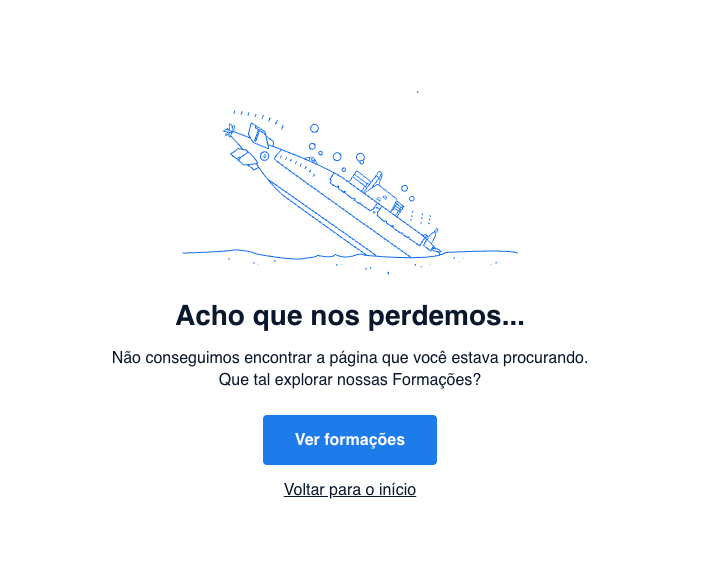

# Curso Alura - React: construindo SPAs com React router

## Aula 1 - Configurando o Roteamento

### Aula 1 - Apresentação - Vídeo 1

Transcrição  
Olá! Sejam bem-vindos a mais este curso de React, desta vez focado no React Router. Vamos entender o que é essa biblioteca, como ela funciona e aprender a implementar o roteamento usando o React Router. Além disso, vamos compreender o que é uma Single Page Application (Aplicação de Página Única), qual é a motivação por trás da existência de uma SPA, como chegamos até aqui e se isso ainda é relevante ou não.

Se desejarmos aprender como definir um roteamento declarativo utilizando o React Router, estamos no lugar certo. A única coisa que precisamos saber é o próprio React. Se já dominamos componentes React, JSX, State, Effects e outros conceitos, vamos juntos nessa jornada.

Apresentando o instrutor

Meu nome é Vinicios Neves.

Audiodescrição: Vinicios é uma pessoa careca, com barba, e está associada à Alura.

Espero que estejamos tão animados quanto eu para entender como podemos construir uma SPA (Aplicação de Página Única) com as tecnologias disponíveis atualmente. Nos encontramos no próximo vídeo. Vamos lá!

### Aula 1 - Preparando o ambiente: introdução ao ambiente React

Agora que você já deu seus primeiros passos em uma das ferramentas mais utilizada em aplicações web, bora seguir com um mergulho mais profundo e aprender ainda mais funcionalidades.

Mas antes de mergulharmos de cabeça, temos dois passos importantes para preparar nosso ambiente:

1. Se acostumar (ainda mais) com o terminal do nosso sistema operacional.
2. Baixar o projeto base.

E claro, eu, o careca barbudo mais bacana que você conhece, vou te ajudar nessa missão!

Então, bora começar?

Projeto base

O projeto inicial está [disponível aqui no github](https://github.com/viniciosneves/4869--react-router-code-connect), onde você consegue acessar as branchs do projeto. Temos uma branch pra cada aula e um commit por vídeo, assim você consegue usar como base de consulta sempre que precisar.

Você pode baixar o projeto lá pelo github ou [clicando aqui](https://github.com/viniciosneves/4869--react-router-code-connect/archive/refs/heads/main.zip).

Depois de baixar e extrair o conteúdo do arquivo zip, hora de ir pro terminal. Navegue até a pasta onde se encontra o projeto e execute o seguinte comando para instalar as dependências:

> npm install

Pode abrir o projeto no VSCode (ou seu editor favorito) pra ir se acostumando com ele e, na sequência, basta levantar o projeto que usa o Vite por debaixo dos panos:

> npm run dev  

E pronto, agora é só acessar http://localhost:5173 e começar a estudar!

Figma

O layout da aplicação que vamos utilizar está [disponível aqui no Figma](https://www.figma.com/community/file/1532859456666611154).

Agora sim, tudo no lugar. Bora começar?

### Aula 1 - Entendendo o que é uma SPA - Vídeo 2

Transcrição  
Vamos discutir sobre o React Router e entender o que acontece nos bastidores. O React Router é uma biblioteca de roteamento que utiliza URLs para determinar qual componente será exibido. Com poucos passos, seguindo a documentação, conseguimos fazer com que, dada uma URL, um componente específico seja exibido. Por exemplo, se quisermos exibir a página de cadastro e acessarmos codeconnect.com/cadastro, o componente de cadastro será exibido. O mesmo ocorre para login e feed.

Ao utilizar o React Router de forma declarativa, estamos construindo uma SPA (Single Page Application, ou Aplicação de Página Única). Isso significa que temos nossa aplicação React publicada em algum lugar, ou no próprio ambiente de desenvolvimento do Vite. Quando o cliente, no sentido de client-side (a pessoa que está usando o navegador), acessa a URL codeconnect.com/cadastro, a requisição é processada e algo é entregue. Esse algo é composto por HTML, CSS e JavaScript, mas o HTML está vazio inicialmente. Somente após o carregamento no navegador é que ele saberá o que fazer, renderizando a página de login ou qualquer outra página com a qual o usuário interaja.

Explicando o processo de renderização em SPAs

Após o login, por exemplo, o usuário é encaminhado para a página inicial. Isso já está implementado pelo React Router. O ponto é que, quando fazemos essa requisição, o HTML não existe previamente. Quem cria o HTML é o próprio React. Na primeira requisição, a URL, o HTML, as imagens e os formulários não existem. Eles só passam a existir depois que o navegador solicita o HTML, que é carregado junto com o JavaScript. O JavaScript, contendo o React, inicia e renderiza tudo. Esse processo é conhecido como client-side.

Em uma Single Page Application, solicitamos ao servidor uma vez e, depois disso, não precisamos mais fazer novas requisições para renderizar a página inteira novamente. Podemos trocar informações, solicitar dados ou outros elementos, mas a página não é renderizada completamente de novo.

Contextualizando a criação das SPAs

Agora, vamos contextualizar historicamente por que as SPAs (Single Page Applications) foram criadas. Quando começamos a trabalhar com esse tipo de aplicação, entre 2013 e 2015, dependendo do framework, a ideia era criar páginas extremamente dinâmicas e interativas para a pessoa usuária, sem a necessidade de ir ao servidor, carregar e passar por ciclos de carregamento e renderização completos. Resumidamente, buscávamos mais dinamismo para as aplicações.

Atualmente, temos um ambiente híbrido. Algumas aplicações ainda utilizam SPA, enquanto outras voltaram a depender mais do servidor, pois as transições hoje são muito mais atualizadas e aprimoradas do que eram há 8, 9 ou 10 anos. Apesar disso, as single page applications continuam relevantes. Por quê? Primeiro, ainda faz sentido construir uma aplicação nessa arquitetura em muitos casos. Diversos fatores podem influenciar a decisão de construir ou não uma aplicação dessa forma. E isso se aplica a novas aplicações. Quando analisamos uma base de código já existente, o que chamamos de software "legado", encontramos muitas coisas já construídas com React Router. Portanto, ainda é relevante e precisamos conhecê-lo.

Comparando as versões 5 e 6 do React Router

Com o React Router, da versão 5 para a 6, muitas mudanças ocorreram. Vamos ver um exemplo de código de como funcionava na versão 5:

```JSX
// App.js com RRD v5
<Router>
    <Switch>
        <Route path="/sobre" component={Sobre} />
        <Route path="/" component={Home} />
    </Switch>
</Router>
```

Na versão 5, utilizávamos Router e Switch para definir as rotas. Agora, vejamos como isso mudou na versão 6:

```JSX
// App.js com RRD v6
<BrowserRouter>
    <Routes>
        <Route path="/" element={<Home />} />
        <Route path="/sobre" element={<Sobre />} />
    </Routes>
</BrowserRouter>
```

Na versão 6, passamos a usar BrowserRouter, Routes e Route, o que simplifica e moderniza a forma como definimos as rotas.

Resumindo o papel do React Router em SPAs

Para resumir, uma SPA entrega um HTML uma vez e múltiplas views (visões), ou seja, múltiplas páginas, mas tudo via JavaScript, sem solicitar nada do servidor, sem pedir HTML ou CSS em lugar algum. O JavaScript, com o React, cuida disso para nós. Além disso, o React Router DOM, ou React Router, gerencia a navegação. A versão 6, que estamos utilizando agora, é bem diferente da versão 5. Portanto, ao trabalhar em um projeto, verifique o package.json para entender qual versão do React Router está sendo usada e o que pode ou não ser utilizado.

Agora que já discutimos bastante, é hora de explorar ainda mais as possibilidades do React Router dentro do projeto CodeConnect, que já começamos a desenvolver. Esse foi o tema da nossa conversa. Nos vemos na sequência. Até mais!

### Aula 1 - Conhecendo o projeto - Vídeo 3

Transcrição  
Vamos entender o nosso cenário atual, como está o projeto e qual é o problema que precisamos resolver. Para isso, no ambiente de preparação, já há um link para o repositório para baixar o projeto inicial. Já fiz isso na minha máquina, e ele está no meu desktop.

Vamos abrir o terminal e navegar até o desktop com o comando:

> cd Desktop/

Explorando o projeto CodeConnect

Ao executar ls, podemos ver que o projeto CodeConnect, com o qual trabalharemos durante este curso, está lá. Vamos entrar nessa pasta:

> cd CodeConnect/

E abri-la no VS Code com o comando:

> code .

Enquanto deixamos o VS Code aberto, vamos limpar o terminal e executar o comando npm run dev. Este projeto utiliza o Vite e levantará o servidor web para nós.

> npm run dev

Ao abrir no Chrome, ele carrega uma página de login. O projeto base está funcionando.

Analisando o código inicial

Agora, vamos dar uma olhada no código. Vamos maximizar o VS Code e abrir o arquivo main.js. Este arquivo está exibindo a página de login. Inicialmente, o código está configurado para renderizar a página de login:

```JSX
createRoot(document.getElementById('root')).render(
  <StrictMode>
    <Login />
    {/* <Register /> */}
    {/* <Feed /> */}
    {/* <BlogPost /> */}
  </StrictMode>,
)
```

Temos outras páginas disponíveis, como Register para cadastro, Feed, que será a lista de blog posts do CodeConnect, e o post em si. Vamos examinar esses componentes. Vamos comentar o login e descomentar o Register para exibir a página de cadastro:

```JSX
createRoot(document.getElementById('root')).render(
  <StrictMode>
    {/* <Login /> */}
    <Register />
    {/* <Feed /> */}
    {/* <BlogPost /> */}
  </StrictMode>,
)
```

Explorando as páginas do projeto

Ao voltar para o Chrome, ele exibe a página de cadastro. Já temos duas páginas funcionando.

Agora, vamos olhar para o Feed. Ele traz uma barra lateral e o feed com todos os posts do blog. Para isso, descomente o Feed:

```JSX
createRoot(document.getElementById('root')).render(
  <StrictMode>
    {/* <Login /> */}
    {/* <Register /> */}
    <Feed />
    {/* <BlogPost /> */}
  </StrictMode>,
)
```

Por fim, vamos descomentar o blog post. Ele exibe os detalhes de um post, incluindo texto, exemplo de código e comentários:

```JSX
createRoot(document.getElementById('root')).render(
  <StrictMode>
    {/* <Login /> */}
    {/* <Register /> */}
    {/* <Feed /> */}
    <BlogPost />
  </StrictMode>,
)
```

Está tudo funcionando corretamente.

Planejando o roteamento condicional

Nosso objetivo é exibir essas páginas condicionalmente, ou seja, queremos interagir com a URL que a pessoa está acessando. Por exemplo, se acessar /auth/login, exibiremos a página de login. Se acessar /auth/register, exibiremos a página de cadastro. É isso que vamos implementar.

Antes de colocarmos a mão na massa, vamos entender como este projeto está organizado em termos de código.

Estrutura do projeto e organização de código

A primeira pasta que vamos mostrar é a pasta "pages". Esta pasta contém todas as páginas e componentes que acabamos de ver: blog post, feed, login e register. Um detalhe importante é que cada página utiliza um layout específico. Por exemplo, as páginas de login e register usam o AltLayout, enquanto a página de feed e o blog post utilizam o AppLayout. Assim, extraímos o código comum a todas essas páginas, e podemos analisá-las também.

Ao abrir o layout/app/index, encontramos o AppLayout, que exibe a barra de navegação lateral. No caso do AltLayout, de autenticação, temos um container, um card e o conteúdo principal da página, que é o que muda. No caso do login e logout, o que muda é o formulário. Se olharmos nas páginas, no index.js dentro de login, encontramos um AltFormContainer com todo o formulário, e o mesmo ocorre com o register, utilizando o AltLayout com AltFormContainer.

Explorando componentes e layouts

O projeto está bem organizado. A última pasta que vamos ver é a de "components". Nela, encontramos o Side, SideLink, o próprio AltFormContainer, Alt, Avatar, Button, CardPost, CheckBox, entre outros. Ou seja, todos os nossos componentes visuais estão dentro da pasta "components", todos os nossos layouts estão na pasta "layouts" e todas as nossas páginas estão na pasta "pages".

É isso que vamos trabalhar. Se desejar, entre este vídeo e o próximo, você pode explorar o projeto para ver como ele foi feito. Ele foi construído usando CSS modules, e já temos um curso específico sobre isso. Você pode conferir se quiser entender como ele foi construído.

Concluindo a preparação para o roteamento

Com o projeto apresentado, o CodeConnect já deve estar rodando na sua máquina, assim como está na nossa. Estamos prontos para começar a entender como faremos o roteamento e exibiremos componentes condicionalmente, de acordo com a rota ou URL acessada no momento.

Nos vemos na próxima aula. Até lá!

### Aula 1 - Para saber mais: modos do react router

O [React Router](https://reactrouter.com/6.30.1/start/overview) é uma ferramenta poderosa que nos ajuda a criar aplicações com navegação entre páginas. Conforme você avança no uso dele, vai perceber que existem diferentes modos de usar o React Router, cada um com suas características e nível de complexidade.

Vamos conhecer os três modos disponíveis:

- Declarative Mode (modo declarativo)
- Data Mode (modo de dados)
- Framework Mode (modo framework)

No curso, vamos focar apenas no Declarative Mode, que é o mais simples e ideal para quem está começando. Mas é importante conhecer os outros dois, para entender as possibilidades.

1. Declarative Mode

Esse é o modo mais direto e comum. Ideal para quem quer fazer uma SPA (Single Page Application).
No modo declarativo, usamos o componente `<BrowserRouter>` e criamos as rotas dentro da renderização dos componentes React.

Exemplo:

```JSX
import { BrowserRouter, Routes, Route } from "react-router-dom"; 
import Home from "./Home"; 
import About from "./About"; 

function App() { 
return ( 
<BrowserRouter> 
<Routes> 
<Route path="/" element={<Home />} /> 
<Route path="/about" element={<About />} /> 
</Routes> 
</BrowserRouter> 
); 
} 
```

Principais recursos:

- Navegação com `<Link>`;
- Controle de URL com useNavigate e useLocation;
- Renderização baseada no caminho da URL.

Quando usar?

- Quando você quer começar simples;
- Quando já usa Create React App ou Vite com React;
- Quando você tem uma arquitetura de dados separada.

2. Data Mode

Esse modo traz mais funcionalidades. Ele separa a configuração das rotas da renderização React e permite carregar dados antes de mostrar a página. Ideal para apps mais complexos.

Exemplo:

```JSX
import { 
createBrowserRouter, 
RouterProvider, 
} from "react-router-dom"; 

const router = createBrowserRouter([ 
{ 
path: "/", 
Component: Home, 
loader: () => fetch("/api/home-data"), 
}, 
]); 

ReactDOM.createRoot(document.getElementById("root")).render( 
<RouterProvider router={router} /> 
); 
```

Principais recursos:

- loader: carrega dados antes de renderizar a página;
- action: trata formulários e eventos;
- useFetcher: controle mais fino de requisições e estados pendentes

Quando usar?

- Quando você quer mais controle sobre os dados carregados;
- Quando sua aplicação tem muitas interações com API;
- Quando quer mostrar estados de carregamento (loading).

3. Framework Mode

Esse é o modo mais avançado. Usa um plugin do Vite para transformar as rotas em módulos e trazer recursos prontos como:

- Tipagem automática de rotas;
- Divisão inteligente de código (code splitting);
- Suporte nativo a SSR (Server-side rendering) e SSG (Static site generation).

Exemplo:

```JSX
// routes.js 
import { index, route } from "@react-router/dev/routes"; 

export default [ 
  index("./pages/home.tsx"), 
  route("products/:id", "./pages/product.tsx"), 
]; 
```

loader do lado do módulo:

```JSX
import { Route } from "+./types/product.tsx"; 

export async function loader({ params }: Route.LoaderArgs) { 
  const product = await fetchProduct(params.id); 
  return { product }; 
} 

export default function Product({ loaderData }: Route.ComponentProps) { 
  return <h1>{loaderData.product.name}</h1>; 
} 
```

Quando usar?

- Quando você quer o máximo de produtividade com integração de tudo;
- Quando quer comparar com frameworks como Next.js ou Remix;
- Quando precisa de SSR ou SSG prontos.

Como escolher o modo certo?

A documentação do React Router recomenda escolher o modo baseado na quantidade de ajuda que você quer:

| Modo       | Controle | Funcionalidades  | Ideal para                          |
| ---------- | -------: | ---------------- | ----------------------------------- |
| Declarative| Alto     | Básicas          | Quem está começando                 |
| Data       | Médio    | Intermediárias   | Apps com interação com API          |
| Framework  | Baixo    | Avançadas        | Projetos grandes e completos        |

No nosso curso, vamos usar o Declarative Mode porque ele é mais simples e ideal para começar. Com ele você já consegue criar uma SPA funcional e entender como a navegação funciona no React.

Mais pra frente, quando você tiver mais confiança, vale a pena explorar os outros modos e ver o que melhor se encaixa com os seus projetos.

Vida longa e próspera o/

### Aula 1 - Criando a primeira rota - Vídeo 4

Transcrição  
Para realizar o roteamento, utilizaremos uma biblioteca bastante conhecida no mundo do React, chamada React Router. Vamos acessar a internet e buscar por React Router no Google. O primeiro resultado que aparece é a documentação oficial, então clicamos em reactrouter.com, depois em "Docs" e, no menu à esquerda, em "Instalação". Por padrão, a opção de instalação com framework está selecionada, mas não é isso que queremos. Vamos trabalhar com o modo declarativo do React Router. No menu à esquerda, na parte inferior, encontramos "Declarative Mode, Instalação", que é o que precisamos.

Quais são os passos para instalar o React Router? O primeiro passo é criar o projeto, mas podemos pular essa etapa, pois o CodeConnect já foi criado utilizando o Vite. Em seguida, instalamos a biblioteca. No terminal, paramos o projeto que estava rodando com npm run dev e colamos o comando npm i react-router-dom, que copiamos do navegador.

> npm i react-router-dom

Após a instalação, executamos npm run dev novamente para reiniciar o projeto.

> npm run dev

Configurando o BrowserRouter

No CodeConnect, abrimos o console com o inspecionador de elementos e recarregamos a página para garantir que a instalação da biblioteca não causou problemas. É um hábito verificar se está tudo funcionando corretamente após a instalação de uma biblioteca.

Com a instalação concluída, a documentação indica que devemos renderizar um BrowserRouter na camada superior da aplicação. Copiamos a linha que importa o BrowserRouter e, no VS Code, colamos no arquivo main.

> import { BrowserRouter } from "react-router-dom";

Na linha 8, inserimos o BrowserRouter e renderizamos tudo dentro dele.

```JSX
createRoot(document.getElementById('root')).render(
  <StrictMode>
    <BrowserRouter>
      {/* <Login /> */}
      {/* <Register /> */}
      {/* <Feed /> */}
      <BlogPost />
    </BrowserRouter>
  </StrictMode>,
)
```

Existem várias coisas comentadas, mas podemos deixá-las assim por enquanto, pois estamos seguindo a orientação da documentação. Após recarregar, verificamos que a aplicação continua funcionando, exibindo o autoregistro discutido na última aula. Ao trocar, comentamos o do blog post e exibimos o do registro, e tudo continua funcionando corretamente. O React Router está instalado.

Definindo as Rotas

Voltamos à documentação, onde, no canto inferior esquerdo, encontramos a parte sobre roteamento, que é o que desejamos. Vamos para o nosso routing. Definimos as rotas utilizando o BrowserRouter e um componente chamado Routes no plural, que conterá todas as rotas.

```JSX
<BrowserRouter>
  <Routes>
    
  </Routes>
</BrowserRouter>
```

Cada elemento Routes no plural pode possuir várias Route no singular. Na linha 11 da documentação, é mencionado que temos um Path, ou seja, um caminho e um elemento. Isso se refere ao Path que utilizamos, dado uma URL, como o LoginRegister, que exibirá o componente específico.

Podemos agora ir para o código e começar a implementar. No VS Code, dentro do BrowserRouter, criamos o Routes no plural. Todas as nossas rotas ficarão dentro dele. Em seguida, criamos uma Route no singular.

```JSX
<Routes>
  <Route />
</Routes>
```

O VS Code já importou automaticamente tanto o Routes no plural quanto o Route no singular. Vamos prosseguir com a implementação.

Definição de Rotas no Componente

No nosso componente de rota, precisamos definir o path (caminho). Vamos usar o exemplo /auth/register. Além disso, precisamos definir o elemento que será renderizado, que é o nosso componente Register.

```JSX
<Route path='/auth/register' element={<Register />} />
```

É importante notar que estamos utilizando o componente na forma de JSX, e não como uma função, pois o React Router não aceita dessa forma.

Já temos a rota /auth/register e podemos adicionar /auth/login.

```JSX
<Route path='/auth/register' element={<Register />} />
<Route path='/auth/login' element={<Login />} />
```

Estamos utilizando o prefixo /auth para agrupar por contexto, já que estamos lidando com autenticação, como cadastrar um novo usuário e fazer login.

Podemos também definir a rota inicial. Quando alguém acessar /, exibiremos o feed de postagens.

```JSX
<Route path='/auth/register' element={<Register />} />
<Route path='/auth/login' element={<Login />} />
<Route path='/' element={<Feed />} />
```

Se alguém acessar uma rota específica, exibiremos um blog-post, que será o elemento BlogPost.

```JSX
<Route path='/auth/register' element={<Register />} />
<Route path='/auth/login' element={<Login />} />
<Route path='/' element={<Feed />} />
<Route path='/blog-post' element={<BlogPost />} />
```

Vamos remover os componentes soltos e deixar apenas as rotas organizadas. Ficamos com o StrictMode do lado de fora, o BrowserRouter, e dentro dele, as rotas. Temos quatro rotas conhecidas: cadastrar um usuário, fazer login, feed de blog e o post em si, o BlogPost.

```JSX
createRoot(document.getElementById('root')).render(
  <StrictMode>
    <BrowserRouter>
      <Routes>
        <Route path='/auth/register' element={<Register />} />
        <Route path='/auth/login' element={<Login />} />
        <Route path='/' element={<Feed />} />
        <Route path='/blog-post' element={<BlogPost />} />
      </Routes>
    </BrowserRouter>
  </StrictMode>,
)
```

Testando as Rotas

Após salvar, verificamos se tudo funciona. No navegador, ao recarregar a página, por padrão, o feed é carregado, que era o esperado. Ao acessar /auth/register, a página de cadastro é exibida. Em /auth/login, a página de login aparece. E ao acessar /blog-post, o BlogPost é carregado.

Implementação do Roteamento

O roteamento está implementado. Precisamos de um BrowserRouter, rotas e uma rota. Essa é a organização mínima para um React Router declarativo. Resumidamente, implementamos o roteamento e estamos reagindo à troca de rota. Usar essa biblioteca é mais interessante do que manualmente monitorar o objeto window, location e pathname.

Considerações Finais

Embora o roteamento esteja parcialmente implementado, precisamos entender o que está acontecendo. É importante compreender a arquitetura por trás da solução e prestar atenção aos detalhes ao usar o React Router. Vamos explorar mais a fundo no próximo vídeo.

### Aula 1 - Para saber mais: client side vs server side

Quando começamos a aprender sobre desenvolvimento web, principalmente com React e o conceito de SPA (Single Page Application), alguns termos começam a aparecer com mais frequência. Dois deles são Client-side e Server-side.

Talvez você tenha ouvido essas palavras pela primeira vez agora. Sem problema! Vamos com calma e explicar tudo do zero.

O que são "Client" e "Server"?

Antes de falar sobre "side" (lado), precisamos entender quem são os personagens dessa história:

- Client (cliente) é o navegador da pessoa usuária. Pode ser o Chrome, Firefox, Safari, etc. Ele é quem faz o pedido (request) para acessar um site.
- Server (servidor) é o computador (ou serviço na nuvem) que envia os arquivos do site ou da aplicação quando o client faz um pedido.

Imagine assim:

"Quando você digita www.alura.com.br no navegador e aperta Enter, o navegador (client) envia um pedido para o servidor. O servidor responde com os arquivos (html, css, js, imagens, etc) que formam a página."

Agora sim, vamos para os "lados" dessa conversa.

Server-side

Server-side é quando o servidor é o responsável por montar a página antes de enviá-la ao navegador.

Vamos imaginar que você quer acessar um perfil de usuário:

- O navegador faz uma requisição para https://cursos.alura.com.br/user/viniciosneves;
- O servidor recebe esse pedido, busca os dados do usuário "viniciosneves" no banco de dados, monta uma página HTML completa com essas informações e envia essa página prontinha para o navegador;
- O navegador exibe o que recebeu.

Esse modelo é usado desde os primórdios da web. É simples, direto, mas pode ser um pouco lento, porque cada vez que o usuário clica em algo, o navegador precisa pedir tudo de novo para o servidor.

Client-side

Client-side é quando o servidor envia um arquivo básico (geralmente um HTML vazio ou quase vazio), e quem monta a página é o próprio navegador, usando JavaScript.

- O navegador faz uma requisição para https://cursos.alura.com.br/;
- O servidor responde com um HTML que carrega os scripts do React;

Esses scripts são baixados e executados no navegador, e é o React (no lado do client) que vai buscar os dados, montar os componentes e exibir a interface.

Essa é a base do que chamamos de SPA. O aplicativo só carrega uma vez, e depois disso, as mudanças de tela (as "rotas") são tratadas pelo próprio navegador, sem precisar pedir uma nova página inteira para o servidor.

Por que isso importa no frontend?

Porque afeta como a nossa aplicação funciona, como ela é carregada, e como o usuário interage com ela.

Com React, normalmente usamos o client-side para criar aplicações mais rápidas e fluidas. A troca de telas é imediata, os componentes são reaproveitados, e você tem mais controle sobre a experiência da pessoa usuária.

Mas isso também traz desafios, como:

- Como garantir que o Google entenda o conteúdo da página? (SEO)
- Como mostrar algo rápido enquanto os dados estão sendo carregados?

E é por isso que existem técnicas como Server-side Rendering ou Hydration, mas isso fica para outro momento :)

Por agora, o mais importante é entender:

- Server-side: o servidor monta a página e envia pronta.
- Client-side: o navegador monta a página com JavaScript (por exemplo, com React).

Ambos são importantes, e a escolha depende do tipo de aplicação que você quer criar.

Vida longa e próspera o/

### Aula 1 - O que aprendemos?

Nesta aula, aprendemos:

- Como iniciar um projeto web com Vite e abrir no VSCode.
- A importância do roteamento condicional e organização estrutural em projetos.
- O uso de layouts para reutilizar estruturas comuns nas páginas.
- Como instalar e configurar o React Router para gerenciamento de rotas em React.
- A diferença entre componentes Routes e Route para estruturar rotas.
- O conceito e funcionamento das Single Page Applications (SPAs).
- Comparar manipulação de URLs usando React Router versus métodos manuais.
- A importância de verificar a versão do React Router em uso para compatibilidade.

## Aula 2 - Protegendo e agrupando Rotas

### Aula 2 - Agrupando rotas - Nested routes - Vídeo 1

Transcrição  
Vamos continuar desenvolvendo o nosso CodeConnect. Já temos o React Router instalado e configurado, com o roteador funcionando. Agora, precisamos manter a organização do projeto. A estrutura já está bem definida, então devemos, no mínimo, manter essa organização.

A fonte de verdade e consulta para o código que vamos desenvolver é a documentação. Tudo que faremos aqui pode ser encontrado diretamente lá. Vamos aplicar um projeto específico, discutindo nossas decisões ao longo do processo.

Focando nas rotas no VS Code

Vamos focar nas nossas rotas no VS Code. Elas já estão funcionando. Por exemplo, se alterarmos a URL de /auth/register para a barra, que é a página inicial, o sistema já responde como deveria. No entanto, temos dois cenários distintos. Vou separar esses dois cenários para melhor visualização.

O primeiro cenário é focado em autenticação, com um prefixo auth para indicar que estão relacionados de alguma forma. Eles utilizam o mesmo layout. A parte inferior é a aplicação em si, com a página inicial e a página de um post. Em situações como essa, é comum agrupar por contexto.

Definindo e agrupando rotas básicas

Para começar, vamos definir nossas rotas básicas:

```JSX
<Routes>
    <Route path='/auth/register' element={<Register />} />
    <Route path='/auth/login' element={<Login />} />
    <Route path='/' element={<Feed />} />
    <Route path='/blog-post' element={<BlogPost />} />
</Routes>
```

Como agrupamos? Normalmente, quando usamos um prefixo e temos mais de uma rota com o mesmo prefixo, isso pode indicar que faz sentido agrupar. Não é uma regra, mas pode ser o caso. Para agrupar rotas usando as ferramentas do React Router, criamos um elemento de rota no singular. Dentro desse elemento, colocamos as rotas que queremos. Assim, estamos criando uma rota alinhada.

Agrupando rotas de autenticação
Vamos começar a agrupar as rotas de autenticação:

```JSX
<Routes>
    <Route path='/auth'>
        <Route path='register' element={<Register />} />
        <Route path='login' element={<Login />} />
    </Route>
    <Route path='/'>
        <Route path='' element={<Feed />} />
        <Route path='blog-post' element={<BlogPost />} />
    </Route>
</Routes>
```

Criamos uma rota e a agrupamos. Agora, temos dois elementos de rota. Removemos as linhas em branco e, dentro, temos o caminho. Se salvarmos e recarregarmos a página, tudo continuará funcionando. Ao acessar /auth/login ou /auth/register, o funcionamento permanece o mesmo. Já está agrupado e nada mudou.

Trabalhando com segmentos de rota

O que conseguimos fazer é trabalhar com o segmento que estamos repetindo, /auth, na rota mais externa. Colocamos o path como /auth. Dentro de /auth, temos os dois elementos desejados: register, sem a barra no início, e login.

```JSX
<Routes>
    <Route path='/auth'>
        <Route path='register' element={<Register />} />
        <Route path='login' element={<Login />} />
    </Route>
    <Route path='/'>
        <Route path='' element={<Feed />} />
        <Route path='blog-post' element={<BlogPost />} />
    </Route>
</Routes>
```

No caso abaixo, o path padrão que colocamos é a raiz, a página inicial. Podemos remover essa barra de dentro e também do blog-post. No caso de /auth, não há mais duplicação desse prefixo, e no caso abaixo, estamos agrupando semanticamente as rotas de aplicação e as rotas de autenticação.

Verificando o funcionamento das rotas agrupadas

Ao recarregar no Chrome, tudo continua funcionando. Se acessarmos /auth/login, funciona; /auth/register, funciona; /, funciona; e /blog-post, também funciona. Agora, está agrupado de forma semântica. No código, estamos agrupando semanticamente conjuntos de rotas. Isso nos ajuda a organizar e preparar o terreno para futuras modificações.

Ao criar rotas, devemos sempre pensar se elas fazem parte de algum grupo e se queremos segmentá-las dessa forma. A missão deste encontro foi organizar nosso roteamento, removendo o /auth repetido, e agora estamos no caminho para continuar evoluindo o CodeConnect. Esse era o objetivo deste encontro. Nos vemos na sequência.

### Aula 2 - Implementando Linking - Vídeo 2

Transcrição  
Nosso objetivo agora é implementar a navegação sem precisar alterar manualmente a URL. Atualmente, estamos trocando as páginas manualmente, utilizando caminhos como /blog, /post, /out, /register. Precisamos oferecer uma forma para que as pessoas possam navegar entre essas páginas de maneira mais intuitiva.

Vamos começar consultando a documentação. Estamos na seção de roteamento, onde configuramos as rotas. Em seguida, temos a parte de navegação, que é dividida em três blocos principais:

NavLink: A ideia do NavLink é renderizar ou aplicar estilos com base na ativação da rota. Por exemplo, se a rota está ativa, podemos passar uma função para o className para tomar decisões estilísticas.

Link Direto: Permite a navegação sem a necessidade de controlar o estado de ativação da rota.

useNavigate: Utilizado para navegação via JavaScript, útil quando queremos navegar em resposta a eventos.

Para o momento, vamos focar no Link, pois temos dois cenários no projeto que precisam ser ajustados. Vamos fechar tudo que está aberto e começar.

Ajustando o AsideLink

A primeira modificação é no AsideLink. Ele não pode mais ser uma tag <a>, mas sim um componente do React Router. Caso contrário, não teremos o comportamento de Single Page Application.

Para começar, precisamos importar o Link do React Router:

```JSX
import { Link } from "react-router-dom";
```

Agora, vamos substituir a tag `<a>` por um componente Link. O Link não utiliza href, mas sim to, indicando o destino da navegação. Dessa forma, utilizamos o Link do React Router sem alterar o contrato do AsideLink, que continua recebendo um href.

```JSX
return (<Link to={href} className={styles.asideLink}>
    {children}
</Link>)
```

Além do AsideLink, temos um componente chamado link que também exporta uma tag <a>. Precisamos alterar ambos os cenários para usar o componente Link do React Router.

Implementando ajustes no componente Link

Nosso objetivo é substituir o que temos pelo comportamento do React Router sem quebrar a API existente. Ou seja, sem precisar fazer substituições manuais de find e replace.

Importação do Link: No arquivo index.js do componente link, importamos o Link do React Router. Aqui, enfrentamos um conflito de nomes, pois nosso componente já se chama link. Para resolver isso, podemos importar o Link do React Router com um apelido, por exemplo, RouterLink.

```JSX
import { Link as RouterLink } from "react-router-dom";
```

Ajustes no Componente Link: Vamos definir o componente Link para utilizar o RouterLink:

```JSX
export const Link = ({ children, href, ...props }) => {
    return (
        <RouterLink to={href} {...props} className={`${styles.link} ${className}`}>
            {children}
        </RouterLink>
    );
}
```

Manutenção da Estratégia: Como as pessoas estão utilizando o componente como se fosse uma tag <a>, podemos receber o href e passá-lo para o to do RouterLink. Assim, mantemos a mesma estratégia de navegação.
Com essas alterações, garantimos uma navegação mais fluida e integrada ao React Router, sem comprometer a estrutura existente do projeto.

Realizando ajustes específicos

Primeiramente, no componente sideindex.jsx, a logo do CodeConnect não levará mais para trás, mas sim para a página inicial:

```JSX
<Link to="/" alt="Logo da CodeConnect">
    
</Link>
```

O link de publicar pode ser mantido, pois está fora do nosso escopo. O feed também deve ser alterado para a barra inicial:

```JSX
<AsideLink href="/">
    <IconFeed />
    Feed
</AsideLink>
```

No caso do login, temos uma página específica para isso, que é barra-auth-login, e já está configurado corretamente:

```JSX
<AsideLink href="/auth/login">
    <IconLogin />
    Login
</AsideLink>
```

Precisamos fazer mais ajustes. Vamos olhar a página de login. O caminho é src-páginas-login-index.jsx. No rodapé, há um link que diz "Ainda não tem conta? Crie seu cadastro." Queremos que esse link aponte para barra-auth-register:

```JSX
<Link to="/auth/register">
    <Typography variant="body" color="--highlight-green">
        Crie seu cadastro!
    </Typography>
    <IconAssignement color="#81FE88" />
</Link>
```

No registro, temos um cenário inverso: "Já tem uma conta? Faça login." Vamos trocar o href para login:

```JSX
<Link to="/auth/login">
    <Typography variant="body" color="--highlight-green">
        Faça seu login!
    </Typography>
    <IconLogin color="#81FE88" />
</Link>
```

Testando a navegação implementada

Resumindo, incorporamos o componente de link dentro do nosso aside-link e do link do nosso projeto. Agora, deveríamos ver essa navegação funcionando. Vamos testar. No Chrome, ao acessar o CodeConnect e recarregar a página, vemos "Já tem uma conta? Faça login." Ao clicar, somos direcionados para a página de login. "Ainda não tem conta? Crie seu cadastro." Ao clicar, somos direcionados para a página de cadastro. Está funcionando corretamente.

Agora, vamos manualmente para a página inicial. Dentro do card post, há um link para ver detalhes, mas ele ainda não leva a lugar algum. Vamos ajustar para ter a navegação para a última página que falta: Blog post.

Vamos fechar tudo que está aberto para não nos confundirmos com os componentes. Temos um componente chamado card post em src-componentes-card-post-index.jsx. Há um "ver detalhes" que está com a tag a, com âncora direta. Não queremos a tag âncora, mas sim o componente link do react-router. Vamos importar o link do react-router e substituir href por to, apontando para barra-blog-post.

```JSX
import { Link } from "react-router-dom";
<p>
    <Link to="/blog-post">Ver detalhes</Link>
</p>
```

Isso deveria renderizar a página de detalhes. Vamos testar. Recarregamos a página, clicamos em "ver detalhes" e fomos direcionados corretamente.

O ponto de atenção é que já temos o fluxo funcionando. Conseguimos entrar no login, voltar, entrar no detalhe de um post, e tudo isso sem recarregar a página inteira. Quando usamos nosso SPA, toda a troca de páginas é feita dentro do navegador, totalmente via JavaScript, sem ir ao servidor.

Com a navegação implementada, podemos continuar desenvolvendo o restante, sempre utilizando o React Router. Até a próxima!

### Aula 2 - Para saber mais: manter contrato da api na migração do link

Contextualizando a Estratégia

Em muitos projetos, sobretudo os com evolução contínua, é comum precisarmos atualizar componentes para aproveitar melhores práticas ou novas ferramentas sem causar impactos inesperados em partes já consolidadas do sistema. Um exemplo é a migração de uma tag de âncora () para o componente de navegação do React Router. Ao mesmo tempo, a API do componente – ou seja, as propriedades que ele recebe – deve se manter para não forçar mudanças em todas as áreas que já o utilizam.

O Mecanismo de Wrapper

A estratégia consiste em criar um componente que envolva o componente nativo do React Router, fazendo a ponte entre a API antiga e a nova. Em outras palavras, o componente wrapper aceita, por exemplo, a propriedade href e a converte internamente para to, que é a propriedade esperada pelo componente do React Router. Dessa forma, módulos que utilizam o componente não necessitam de alterações mesmo quando a implementação interna muda.

Um exemplo de como isso pode ser realizado é:

```JSX
import { Link as RouterLink } from 'react-router-dom';

function LinkWrapper({ href, ...props }) {
  return <RouterLink to={href} {...props} />;
}

export default LinkWrapper;
```

Nesse exemplo, o componente LinkWrapper continua a expor a propriedade href, mantendo o contrato original, enquanto, por baixo dos panos, converte o dado para to para compatibilizar com o React Router.

Racional e Benefícios da Abordagem

Ao adotar essa técnica, garantimos que a evolução da aplicação ocorra de forma segura e modular. A manutenção de uma API consistente permite:

- Reduzir a necessidade de grandes refatorações em pontos do código que consomem o componente;
- Facilitar a integração entre equipes, assegurando que as mudanças internas não afetem diretamente a forma como o componente é utilizado;
- Minimizar riscos de erros inesperados e a propagação de bugs em funcionalidades já consolidadas.

Considerações Finais

Embora seja uma solução que agregue robustez ao projeto, é interessante documentar bem o comportamento do wrapper. Isso evitará dúvidas futuras, principalmente em times com diversos colaboradores, e garantirá o alinhamento sobre quando e como os wrappers devem ser implementados em outros contextos. A clareza na definição da interface é essencial para uma manutenção efetiva e contínua da aplicação.

### Aula 2 - Implementando rotas protegias - Vídeo 3

Transcrição  
Vamos seguir com a implementação, agora focando em proteger determinadas rotas. O que significa proteger? Por exemplo, ao acessar manualmente a raiz do nosso projeto no Chrome, queremos garantir que tanto a página inicial quanto a página de blog post sejam exibidas apenas se a pessoa estiver logada. Não queremos exibir o feed nem a página de detalhes se a pessoa não estiver autenticada na nossa aplicação.

Vamos pensar em uma estratégia para definir isso. No arquivo main.jsx, podemos implementar uma das possíveis estratégias. Podemos envolver tanto o feed quanto o blog post em um componente que chamaremos de ProtectedRoute. Assim, queremos proteger esses elementos. Vamos formatar o código adequadamente.

Criando o componente ProtectedRoute

Inicialmente, temos a rota do feed configurada assim:

```JSX
<Route path='' element={<Feed />} />
```

Temos essa estratégia: uma rota protegida que envolve uma página. Nesse componente de rota protegida, implementaremos a lógica de redirecionamento. Vamos criar esse componente na pasta "components", em um novo arquivo ProtectedRoute/index.jsx. Utilizaremos JSX normal e exportaremos a constante ProtectedRoute, que receberá uma arrow function.

Primeiro, vamos definir a estrutura básica do componente ProtectedRoute:

```JSX
export const ProtectedRoute = () => {

}
```

Agora, vamos modificar a rota do feed para usar o ProtectedRoute:

```JSX
<Route path='' element={
    <ProtectedRoute>
    </ProtectedRoute>
} />
```

Passando componentes como children

Em seguida, vamos passar o componente Feed como children para o ProtectedRoute:

```JSX
<Route path='' element={
    <ProtectedRoute>
        <Feed />
    </ProtectedRoute>
} />
```

E faremos o mesmo para a rota do blog post:

```JSX
<Route path='blog-post' element={
    <ProtectedRoute>
        <BlogPost />
    </ProtectedRoute>
} />
```

Agora, vamos expandir o componente ProtectedRoute para aceitar children e retornar esses children por padrão:

```JSX
export const ProtectedRoute = ({children}) => {
    return children
}
```

Vamos importar o ProtectedRoute no nosso projeto:

```JSX
import { ProtectedRoute } from './components/ProtectedRoute/index.jsx'
```

Implementando lógica de autenticação

Agora, o que falta é implementar a lógica de autenticação na rota protegida. Já temos um hook no projeto chamado useAuth, localizado em src/hooks/useAuth. Esse hook já possui toda a lógica de registro de usuário, login, logout e estado de autenticação, utilizando local storage. Como isso está fora do nosso escopo atual, focaremos no comportamento do React Router e das rotas. O hook já está pronto desde o início.

Vamos utilizá-lo para obter o estado do usuário e verificar se está carregando ou não. No componente de rota protegida, utilizaremos o useAuth. O VS Code já importou para nós. Queremos guardar o isAuthenticated e o isLoading:

```JSX
const { isAuthenticated, isLoading } = useAuth()
```

Se estiver carregando, precisamos esperar. Vamos começar com nossas condições: se isLoading, podemos exibir o componente de spinner que temos no projeto, localizado em src/components. Podemos retornar esse componente spinner:

```JSX
if (isLoading) {
    return <Spinner />
}
```

Redirecionando usuários não autenticados

Se está carregando, já eliminamos um estado. O que mais precisamos fazer? Vamos criar mais um cenário. Se não estamos autenticados, não queremos retornar nada, queremos retornar nulo e redirecionar:

```JSX
if (!isAuthenticated) {
    return null
}
```

O que mais precisamos fazer agora? Precisamos utilizar o useEffect, ou seja, precisamos de um efeito para isso. Vamos gerar esse efeito:

```JSX
useEffect(() => {

}, [isAuthenticated, isLoading])
```

Vamos passar a lista de dependências, que será composta por isAuthenticated e isLoading. Basicamente, o que faremos é: se não está carregando e não estamos autenticados (isAuthenticated), precisamos fazer um redirecionamento para /auth/login:

```JSX
useEffect(() => {
    if(!isLoading && !isAuthenticated) {
        // redirect /auth/login
    }
}, [isAuthenticated, isLoading])
```

Utilizando useNavigate para redirecionamento

Como fazemos para realizar esse redirecionamento usando o React Router? Já vimos isso em um vídeo anterior. Repare que, ao recarregar a página, ele não está renderizando nada, pois o usuário não está autenticado. Na documentação do React Router, temos a navegação via hook para fazer essa navegação de forma programática, via JavaScript. Vamos implementar isso.

Vamos importar o useNavigate e obter o navigate a partir desse hook:

```JSX
import { useNavigate } from "react-router-dom";
const navigate = useNavigate();
```

Se não está carregando e não está autenticado, navegamos para /auth/login. A lista de dependências também deve incluir o navigate:

```JSX
useEffect(() => {
    if(!isLoading && !isAuthenticated) {
        navigate('/auth/login')
    }
}, [isAuthenticated, isLoading, navigate])
```

Verificando o funcionamento do roteamento protegido

Após salvar, vamos verificar se está funcionando. No Chrome, ao voltar para o CodeConnect, ele carregou o login. Se clicarmos em "crie seu cadastro", a página de cadastro é exibida corretamente. Se tentarmos acessar a raiz, ele faz o redirecionamento. Se tentarmos acessar /blog-post e pressionarmos "Enter", ele também faz o redirecionamento. Não conseguimos mais acessar aquelas rotas protegidas.

Nosso roteamento protegido está funcionando, mas ainda não temos a rotina de login, logout e cadastro de usuário. O hook está lá, é do React Hook, não do hook da Marvel. Precisamos agora integrá-lo tanto na página de login quanto na página de cadastro. Essas são nossas próximas missões, pois nossa rota já está protegida e removemos uma funcionalidade. Vamos devolvê-la para que tudo funcione corretamente. Podemos acessar aquelas rotas especialmente se estivermos autenticados. Nos vemos na próxima etapa.

### Aula 2 - Para saber mais: padrões de URLs

Quando estamos criando uma aplicação web, a organização das URLs faz toda a diferença para manter o código limpo, previsível e fácil de entender. Assim como pastas ajudam a manter seus arquivos organizados, os prefixos de rota ajudam a organizar as páginas da sua aplicação.

Vamos entender como fazer isso na prática com o React Router.

O que é uma URL e uma rota?

Uma URL é o endereço que aparece no navegador, como:

```JSX
https://codeconnect.com/auth/login 
```

A rota é a parte da URL que seu código React Router reconhece para decidir qual componente mostrar. Exemplo:

```JSX
<Route path="/auth/login" element={<Login />} /> 
```

Por que usar prefixos nas rotas?

Imagine que você tem duas páginas:

Uma para login;

Outra para cadastro.

Ao invés de criar rotas separadas como /login e /register, podemos organizar assim:

```JSX
/auth/login 
/auth/register 
```

Isso deixa claro que ambas fazem parte de uma mesma "sessão" da aplicação: autenticação.

Na prática: organizando com prefixos

Com o React Router, podemos agrupar rotas com o mesmo prefixo:

```JSX
<Route path="/auth"> 
  <Route path="login" element={<Login />} /> 
  <Route path="register" element={<Register />} /> 
</Route> 
```

Isso significa:

- Quando a URL for /auth/login, renderiza o componente Login;
- Quando for /auth/register, renderiza o Register.

O que mudou no projeto?

Antes:

```JSX
<Route path="/auth/login" element={<Login />} /> 
<Route path="/auth/register" element={<Register />} /> 
```

Depois:

```JSX
<Route path="/auth"> 
  <Route path="login" element={<Login />} /> 
  <Route path="register" element={<Register />} /> 
</Route> 
```

O comportamento final é o mesmo, mas a segunda forma deixa o código mais organizado, principalmente quando temos muitos grupos de rotas (ex: /blog, /admin, /user, etc).

### Aula 2 - Sincronização segura de contatos na Indexa - Exercício

A Indexa, uma plataforma que organiza e gerencia contatos pessoais e profissionais de forma inteligente, está enfrentando um desafio com a sincronização automática de contatos. Você precisa garantir que apenas usuários autenticados possam realizar a sincronização de seus contatos, evitando que dados pessoais sejam expostos indevidamente. Atualmente, a sincronização pode ser iniciada por qualquer pessoa, o que compromete a segurança dos dados.

Qual estratégia você adotaria para garantir que apenas usuários autenticados possam iniciar a sincronização de contatos?

Alternativa correta  
Implementar uma verificação de autenticação antes de permitir a execução da funcionalidade de sincronização, utilizando um hook de autenticação como o use-auth, para garantir que apenas usuários autenticados possam iniciar o processo.

> Correta, pois essa abordagem assegura que apenas usuários autorizados possam acessar e sincronizar seus contatos, protegendo os dados pessoais de acessos não autorizados.

### Aula 2 - O que aprendemos?

Nesta aula, aprendemos:

- A importância de manter uma estrutura organizada em projetos utilizando prefixos.
- Como agrupar rotas utilizando componentes de rota no React Router.
- A estruturar rotas de forma alinhada e encapsular conjuntos de rotas relacionadas.
- A usar o componente Link do React Router para navegação em SPA.
- Como resolver conflitos de nome ao importar componentes com aliases.
- A implementar o componente Link e a usar NavLink para estilos de rotas ativas.
- A proteger rotas com um componente de rota protegida (ProtectedRoute).
- A usar o useNavigate para redirecionamento de usuários não autenticados.

## Aula 3 - Trabalhando com autentificação

### Aula 3 - Projeto da aula anterior

Você pode ir acompanhando o passo a passo do desenvolvimento do nosso projeto e, caso deseje, você pode [acessar o projeto da aula anterior](https://github.com/alura-cursos/4869--react-router-code-connect/tree/aula-2).

Bons estudos!

### Aula 3 - Cadastrando usuários - Vídeo 1

Transcrição  
Vamos seguir com a implementação da nossa rotina de cadastro de usuário. Continuaremos utilizando o hook useAuth como fonte de verdade para a autenticação do usuário. Nosso objetivo é utilizar o método register, que recebe name, email e password. Este método realiza toda a lógica necessária, incluindo o armazenamento no localStorage.

Para começar, precisamos importar e utilizar o useAuth. Vamos fazer isso agora:

```JSX
import { useAuth } from "../../hooks/useAuth";
```

Precisamos observar o retorno desse método, que pode ser success: true ou success: false com uma mensagem de erro. Vamos implementar essa lógica.

Extraindo e utilizando o método register

Primeiramente, chamaremos o useAuth e armazenaremos o resultado em uma constante. Queremos extrair o register dessa constante. Note que, por convenção, primeiro colocamos o hook e depois fazemos o destructuring. Isso é útil para termos o autocomplete no VS Code, que reconhece tudo o que o useAuth retorna, como useAuthenticator, desload, login, logout, entre outros.

```JSX
const { register } = useAuth();
```

Agora que temos o register, vamos criar uma função para cadastrar o usuário: const onSubmit, que será o submit do formulário. Esta será uma arrow function. Quando utilizamos a action do formulário, temos acesso ao formData, então já vamos extrair o que precisamos.

```JSX
const onSubmit = (formData) => {
    const name = formData.get('name');
    const email = formData.get('email');
    const password = formData.get('password');
    
    const response = register(name, email, password);

    if (response.success) {
        // Lógica para sucesso
    } else {
        console.error(response.error);
    }
};
```

Ajustando inputs e lidando com respostas

Temos os inputs definidos abaixo, e ajustaremos para que estejam todos em inglês: name, email e password. Vamos extrair esses valores do formData:

```JSX
const name = formData.get('name');
const email = formData.get('email');
const password = formData.get('password');
```

Com name, email e password extraídos do formData, podemos chamar o register, passando esses valores. Vamos armazenar o resultado em uma constante chamada response.

Existem dois cenários possíveis: se response.success for verdadeiro, significa que o cadastro foi bem-sucedido. Caso contrário, se houver um erro, faremos um console.error para response.error. Isso é importante para capturar erros, como a tentativa de cadastrar mais de um usuário com o mesmo email, que resultará em um erro.

Redirecionando após cadastro bem-sucedido

Se tudo ocorrer bem, podemos redirecionar para a página de login. Para isso, utilizaremos a constante navigate:

```JSX
import { useNavigate } from "react-router-dom";
const navigate = useNavigate();
```

Dessa forma, concluímos a implementação da lógica de cadastro de usuário. Se o cadastro for bem-sucedido, utilizaremos o navigate para redirecionar para a página de login:

```JSX
if (response.success) {
    navigate('/auth/login');
} else {
    console.error(response.error);
}
```

Lembramos do hook que chamamos para obter o navigate: é o useNavigate. Se tudo estiver correto, o que queremos fazer é utilizar o navigate para a página de login. Após o registro, queremos realizar o login. Portanto, direcionamos para a rota /auth/login.

Vinculando onSubmit ao formulário e testando

O que está faltando agora é o onSubmit. Precisamos vinculá-lo à action do formulário, na linha 45. A action do formulário será esse onSubmit. O que o onSubmit faz? Ele coleta os dados do formData, tenta cadastrar o usuário e, se for bem-sucedido, redireciona para a página de login. Caso contrário, exibe o erro no console.

```JSX
<Form action={onSubmit}>
```

Vamos testar o código. Deixaremos o console em evidência para visualizar qualquer erro que ocorra. No cadastro, inserimos o nome "Vinicios", o e-mail "vinicios@alura.com.br" e a senha "123". Ao tentar cadastrar, o sistema reclamou que o campo "lembrar-me" está como obrigatório. Vamos remover essa obrigatoriedade. O campo "lembrar-me" está no checkbox e não deve ser obrigatório.

```JSX
<Checkbox label="Lembrar-me" />
```

Validando o cadastro e corrigindo erros

Após ajustar, inserimos novamente o nome "Vinicios", o e-mail "vinicios@alura.com.br" e a senha "123". Ao clicar em cadastrar, o sistema informou que já existe um usuário com esse e-mail. Vamos limpar o localStorage no application e testar novamente. A validação está funcionando, provavelmente devido a tentativas anteriores de cadastro.

Repetimos o processo: nome "Vinicios", e-mail "vinicios@alura.com.br", senha "123". O login foi bem-sucedido. No entanto, o texto estava incorreto, ajustamos para "cadastrar". Agora, testamos novamente para validar se o sistema não permitirá um novo cadastro com o mesmo e-mail. Ao tentar cadastrar novamente, o sistema confirmou que o usuário já existe, o que é esperado.

Testamos com um e-mail diferente: nome "Vinicios", e-mail "vinicios@gmail.com", senha "123". O cadastro foi bem-sucedido. A validação está funcionando corretamente, e o redirecionamento para a página de login também.

Concluindo e preparando para o próximo passo

Nosso próximo passo é efetuar o login com o usuário recém-cadastrado, utilizando a função register do useAuth, em conjunto com o navigating do React Router. Se tudo correr bem, o fluxo de navegação seguirá corretamente.

Era isso. Nos vemos no próximo vídeo. Até lá.

### Aula 3 - Efetuando login - Vídeo 2

Transcrição  
Seguindo com nossa implementação, o próximo passo é realizar o login do usuário. O useAuth, que é o hook de autenticação, já possui um método para efetuar o login, que recebe o e-mail e a senha. Ele retorna success como verdadeiro quando o login é bem-sucedido e success como falso se algo deu errado.

Vamos ao nosso formulário de login no arquivo src/pages/login/index.jsx e criar a lógica necessária. Primeiro, vamos importar o useAuth e armazená-lo em uma constante. Do useAuth, queremos extrair o método login.

```JSX
import useAuth from "../../hooks/useAuth"
```

Configurando o formulário de login

Agora, vamos armazenar o useAuth em uma constante.

```JSX
const auth = useAuth()
```

Do auth, extraímos o método login.

```JSX
const { login } = auth
```

Para realizar o login, criaremos uma função onSubmit, que será uma arrow function. Essa função receberá o formData e poderá ser conectada à ação do formulário através do atributo onSubmit.

```JSX
const onSubmit = (formData) => {

}
```

No formulário, temos os campos name para e-mail e name para senha, que serão extraídos do formData. Assim, ao obter o formData, utilizamos:

```JSX
const email = formData.get('email')
const password = formData.get('password')
```

Executando o login e redirecionando o usuário

Agora, chamaremos o método login, que espera receber um e-mail e uma senha. Podemos armazenar a resposta em uma constante response.

```JSX
const response = login(email, password)
```

Verificamos se essa operação é assíncrona, e como não é, não precisamos de await ou qualquer tratamento adicional. Por fim, assim como fizemos no registro, verificamos a resposta com:

```JSX
if (response.success) {
    
}
```

Se tudo ocorrer conforme o esperado, queremos redirecionar para a página de feed, que é a nossa página raiz. Para isso, a constante navigate recebe o useNavigate do React Router.

```JSX
import { useNavigate } from "react-router-dom";
const navigate = useNavigate()
```

Assim, se tudo der certo, utilizamos navigate para redirecionar à raiz, feed. Caso contrário, podemos usar console.error para exibir response.error.

```JSX
if (response.success) {
    navigate('/')
} else {
    console.error(response.error)
}
```

Testando e ajustando o formulário de login

Agora, vamos verificar isso no Chrome. Vou recarregar a página. O e-mail email@vinicius.com.br não existe, é apenas email.com. Vamos ver se recebemos uma mensagem de erro. Senha: 1, 2, 3, login. O sistema está informando que o campo "lembrar-me" é obrigatório. Vamos remover essa obrigatoriedade. No VS Code, vamos localizar e remover a linha referente a "lembrar-me".

```JSX
<Checkbox label="Lembrar-me" />
```

Agora, vamos testar o login novamente. Ótimo, o sistema indicou que o e-mail e a senha estão incorretos. Vamos testar agora com as credenciais corretas: vinicius@com.br, senha: 1, 2, 3, login. Perfeito! O redirecionamento para a página de feed foi realizado com sucesso. Vamos verificar se o login está persistente. Recarreguei a página e continuo logado. Isso significa que, ao recarregar a aplicação, como tudo está no local storage, conseguimos manter a sessão ativa sem precisar fazer login novamente.

Portanto, o registro está funcionando, o login está funcionando. Tudo está fluindo conforme planejado. Nos vemos na próxima etapa.

### Aula 3 - Implementando o logout - Vídeo 3

Transcrição  
Para implementar o logout, vamos seguir os passos descritos na transcrição e adicionar os snippets de código conforme necessário.

Primeiro, no nosso aside, temos um link para logout que só será exibido se a pessoa estiver logada. Vamos adicionar esse link:

```JSX
<AsideLink href="/auth/logout">
```

Criando a página de logout

Agora, vamos criar uma rota /auth/logout. Para isso, vamos criar uma página de logout em logout/index.jsx. Começamos definindo a constante Logout como uma arrow function:

```JSX
const Logout = () => {

}
```

Como queremos que essa página apenas realize o logout, inicialmente ela não precisa retornar nada:

```JSX
const Logout = () => {
    return null
}
```

Utilizando o hook useAuth

Precisamos utilizar o useAuth para acessar o método de logout. Vamos importar o useAuth:

```JSX
import { useAuth } from "../../../hooks/useAuth"
```

Agora, vamos utilizar o useAuth dentro do nosso componente:

```JSX
const { logout } = useAuth()
```

Implementando o useEffect para logout

Para garantir que o logout seja chamado apenas uma vez quando a página for acessada, utilizamos o useEffect:

```JSX
import { useEffect } from "react"
import { useAuth } from "../../../hooks/useAuth"

const Logout = () => {
    const { logout } = useAuth()
    useEffect(() => {
        logout()
    }, [logout])
    return null
}
```

Com isso, o método de logout será chamado assim que a página for acessada. Agora, precisamos exportar essa rota:

```JSX
export const Logout = () => {
    const { logout } = useAuth()
    useEffect(() => {
        logout()
    }, [logout])
    return null
}
```

Adicionando a rota de logout
Em seguida, vamos adicionar a rota no nosso sistema de rotas:

```JSX
<Route path='logout' element={<Logout />} />
```

Redirecionando após logout

Após realizar o logout, queremos redirecionar o usuário para a página de login. Para isso, utilizamos o useNavigate:

```JSX
import { useNavigate } from "react-router-dom"
```

Dentro do nosso componente, configuramos o navigate:

```JSX
const navigate = useNavigate()
```

E então, ajustamos o useEffect para redirecionar após o logout:

```JSX
useEffect(() => {
    logout()
    navigate('/auth/login')
}, [logout, navigate])
```

Testando a implementação do logout

Com isso, ao acessar a página de logout, o usuário será deslogado e redirecionado para a página de login. Testando a aplicação, tudo deve funcionar corretamente, permitindo login, acesso ao feed, e logout com redirecionamento. Assim, completamos a implementação do logout seguindo a estratégia de rotas.

### Aula 3 - Para saber mais: porque criar uma rota para logout?

Você deve ter se perguntado:

"Mas por que o Vinny não chamou direto o método logout() quando a pessoa clica em logouy?"

Essa é uma ótima pergunta! E a resposta ajuda a entender como pensar melhor em arquitetura e comportamento previsível no front-end.

O jeito "mais direto"

Sim, seria possível fazer algo assim:

```JSX
<button onClick={logout}>Sair</button> 
```

E pronto. Quando a pessoa clica, chamamos a função logout() e redirecionamos com navigate('/auth/login'). Super simples, super direto.

Mas aí vem a pergunta: onde isso vai ficar?

Será que a lógica de logout vai ficar dentro de um onClick no componente de menu?

Ou espalhada por vários lugares, dependendo de onde colocamos um botão de logout?

Isso pode rapidamente virar uma bagunça:

- Códigos duplicados;
- Difícil testar;
- Difícil reaproveitar;
- Difícil aplicar mudanças no futuro (ex: mostrar um alerta antes de sair).

A vantagem de usar uma rota para logout

Ao criar uma rota /auth/logout, conseguimos:

- Separar a lógica do logout em um lugar só;
- Reaproveitar essa lógica onde quisermos (menu, botão de sair, etc);
- Garantir que a experiência será sempre igual;
- Deixar mais fácil de testar, entender e manter;
- Tratar como uma página especial, que faz algo assim que a pessoa chega nela.

Veja o que essa rota faz:

```JSX
// src/pages/Logout/index.jsx 
useEffect(() => { 
  logout() 
  navigate('/auth/login') 
}, [logout, navigate]) 
```

A pessoa acessa /auth/logout, e:

- Sai da conta;
- É redirecionada para a tela de logi;
- E na navegação?

No lugar de fazer um botão com lógica embutida, agora fazemos:

```JSX
<AsideLink href="/auth/logout"> 
  <IconLogin /> Logout 
</AsideLink> 
```

Simples, direto, previsível. E funciona com ou sem JavaScript (progressive enhancement).

Isso é comum?

Muito! Inclusive, frameworks como Remix, Next.js e outros também tratam logout como rota em muitos exemplos e projetos reais.
O legal é que esse padrão ajuda a deixar a aplicação mais coesa: se login, cadastro e feed são rotas... por que o logout não seria.

Conclusão  
Criar uma rota para logout pode parecer exagero num primeiro momento, mas ajuda demais a manter o projeto organizado, testável e fácil de crescer.

Na prática:

- Melhor separar a lógica do que espalhar ela em cliques
- Fica mais semântico, previsível e escalável
- E se um dia a gente quiser mostrar um alerta do tipo "tem certeza que quer sair?" — já temos um lugar central pra isso.

### Aula 3 - O que aprendemos?

Nesta aula, aprendemos:

- A implementar a função de cadastro de usuário com useAuth.
- A criar e gerenciar envio de formulários com onSubmit.
- A utilizar useNavigate para redirecionamento pós-registro ou login.
- A realizar testes de validação para evitar duplicidade de e-mails no cadastro.
- A implementar a lógica de login utilizando useAuth.
- A confirmar a persistência da autenticação com armazenamento no local storage.
- A desenvolver a funcionalidade de logout com React e React Router.
- A estruturar a lógica de logout como uma rota separada para melhor organização do código.

## Aula 4 - Utilizando URLs dinâmicas

### Aula 4 - Projeto da aula anterior

Você pode ir acompanhando o passo a passo do desenvolvimento do nosso projeto e, caso deseje, você pode [acessar o projeto da aula anterior](https://github.com/alura-cursos/4869--react-router-code-connect/tree/aula-3).

Bons estudos!

### Aula 4 - Criando segmentos dinâmicos da URL - Vídeo 1

Transcrição  
Agora vamos começar a adicionar os toques finais ao nosso projeto. Com ele ainda em execução no terminal, na localhost 5173, vamos efetuar login com a conta criada: vinicius.alura.com.br, senha senha123.

Quando estamos dentro do feed e clicamos em "ver detalhes", sempre somos direcionados para o mesmo post. No entanto, isso não deveria acontecer; deveríamos ser direcionados para o post específico. Por exemplo, se clicarmos em "Introdução ao React", deveríamos ir para esse post. Se clicarmos em "CSS Grid na prática", deveríamos ir para esse post, e não para "Introdução ao React". Portanto, a parte de "ver detalhes" deveria ser dinâmica. Deveríamos ter alguma identificação na URL que identifique esse post de forma única.

Verificando a implementação atual

Vamos verificar como isso está implementado. Com o VS Code aberto, vamos olhar nossa página em src/pages/feed. Vamos entrar no index. O index obtém os posts de um arquivo chamado data.js e mapeia todos eles. Vamos abrir esse arquivo, data.js.

Os posts possuem um id. Aqui estamos olhando para os autores: Ana, Bruno, Carla, Diego, entre outros. Temos uma função para marcar comentários e outra para gerar likes aleatórios. Aqui está o que procuramos: export const posts. Temos a imagem que será exibida, o título e o slug. O slug é o título sem espaços, sem caracteres especiais. Esse slug será usado para capturar e identificar de forma única o nosso blog post.

Ajustando o link para posts específicos

Como faremos isso? No nosso componente BlogPost, especificamente no CardPost, temos um link para BlogPost. Inicialmente, o link estava assim:

```JSX
<Link to="/blog-post">Ver detalhes</Link>
```

Queremos concatenar o valor do slug aqui. Vamos transformar isso em JavaScript, chamando uma função e fazendo uma interpolação de string. Primeiro, ajustamos o link para:

```JSX
<Link to={`/blog-post`}>Ver detalhes</Link>
```

E, finalmente, concatenamos o slug:

```JSX
<Link to={`/blog-post/${post.slug}`}>Ver detalhes</Link>
```

Assim, queremos pegar esse slug e colocá-lo na URL do navegador.

Verificando a funcionalidade no navegador

Voltando ao Chrome, vamos verificar se funciona. Ao clicar em "Dicas de acessibilidade na web" e em "detalhes", a URL se torna /blog-post/dicas-de-acessibilidade-na-web. Ele está adicionando o slug na URL.

No entanto, no nosso arquivo de rotas, main.js, no BlogPost, não temos esse segmento identificado. Para indicar que queremos pegar esse valor de forma dinâmica, faremos assim:

```JSX
<Route path='blog-post/:slug' element={
    <ProtectedRoute>
        <BlogPost />
    </ProtectedRoute>
} />
```

Ou seja, esse segmento é o slug.

Capturando o slug no componente

Podíamos nomear o segmento como quiséssemos. Poderia ser ID, ou qualquer outra coisa. No nosso caso, é slug. Agora, estamos informando ao React Router que será blog-post, seguido de um segmento dinâmico. Nesse cenário, queremos renderizar o blog post. Vamos verificar se funciona. Recarregamos a página, e ela ainda está exibindo o mesmo post, mas já foi renderizado. Ou seja, a rota foi correspondida. Se voltarmos e acessarmos outro post, como "Otimização de performance no React", a URL muda. O que falta agora é ajustar o post, e podemos ver isso na página.

Na página de blog-post, no arquivo index.jsx, o post está sendo obtido na posição zero, ou seja, sempre o primeiro:

```JSX
const post = posts[0]
```

Em vez disso, precisamos obtê-lo usando o slug. Como faremos para capturar esse slug? O React Router já identificou que é dinâmico. Para capturar esse valor dentro do nosso componente, utilizaremos um hook chamado useParams, que vem do React Router. Primeiro, precisamos importá-lo:

```JSX
import { useParams } from "react-router-dom"
```

Implementando a lógica de busca pelo slug

Vamos armazenar isso em uma constante. Queremos capturar o nome que definimos como slug:

```JSX
const { slug } = useParams()
```

Agora, utilizaremos post.find para procurar um post cujo slug seja igual ao slug que recebemos:

```JSX
const post = posts.find(p => p.slug === slug)
```

Assim, não pegaremos mais o primeiro, mas encontraremos um baseado no slug. Vamos verificar se isso funciona. No Chrome, já está renderizando um post diferente, como "Otimização de performance no React". Ao clicar em outro, como "Introdução ao TypeScript", ele exibe "Introdução ao TypeScript". A lógica de capturar o post relacionado ao slug está funcionando, não pegando mais sempre o primeiro.

Resumindo e organizando o projeto

Resumindo, no main.js, criamos um segmento de rota dinâmico e o capturamos no componente. Isso faz com que nosso aplicativo funcione corretamente. Agora, quero trazer um ponto sobre organização. Nosso main.js está crescendo, com muitas rotas, e é o ponto de entrada da aplicação. Vamos pensar em uma forma de manter todos os comportamentos organizados. Com isso em mente, encerramos nosso encontro de agora. Estou esperando vocês no próximo vídeo.

### Aula 4 - Organizando as rotas - Vídeo 2

Transcrição  
Já verificamos que o sistema está funcionando, mas agora é hora de analisarmos o código. O fato de estar funcionando não significa que está da melhor forma possível. O que vamos modificar? No arquivo main.jsx, temos várias linhas de código relacionadas ao roteamento da nossa aplicação, embora estejamos no arquivo main.jsx. O nome main.jsx não é muito descritivo; a ideia do main aqui é ser o ponto de entrada. Portanto, ele deveria ser mais sucinto e enxuto.

Para organizar o roteamento da nossa aplicação, vamos colapsar tudo que está expandido e, dentro da pasta "src", criar um novo arquivo chamado router. Dentro de router, criaremos um index.jsx. Agora, faremos o export de uma constante que chamaremos de router. No entanto, ao nomearmos essa constante de router, podemos, sem querer, conflitar com o conceito de router do React Router. Assim, podemos chamá-la de AppRouter, que é o roteador do nosso aplicativo.

Definindo a função AppRouter

Primeiro, vamos definir a constante AppRouter como uma função. Inicialmente, ela será uma função vazia:

```JSX
export const AppRouter = () => {

}
```

Agora, vamos definir uma arrow function para AppRouter, e não precisamos de children desta vez. Corrigindo um erro, não é uma interrogação, mas sim um sinal de maior. Queremos retornar um conjunto de jsx, que é justamente o nosso BrowserRouter. Vamos começar a estruturar o retorno da função:

```JSX
export const AppRouter = () => {
    return(
        
    )
}
```

Estruturando as rotas da aplicação
Dentro do retorno, vamos adicionar o BrowserRouter e as rotas da aplicação. Isso inclui as rotas de autenticação, o feed e o blog post:

```JSX
<BrowserRouter>
    <Routes>
        <Route path="/auth">
            <Route path='register' element={<Register />} />
            <Route path='login' element={<Login />} />
            <Route path='logout' element={<Logout />} />
        </Route>
        <Route path='/' element={
            <ProtectedRoute>
                <Feed />
            </ProtectedRoute>
        } />
        <Route path='blog-post/:slug' element={
            <ProtectedRoute>
                <BlogPost />
            </ProtectedRoute>
        } />
    </Routes>
</BrowserRouter>
```

Importando componentes necessários

Agora, precisamos fazer os imports necessários para que o código funcione corretamente. Vamos importar o BrowserRouter, Routes, e Route do React Router:

```JSX
import { BrowserRouter, Route, Routes } from "react-router-dom"
```

Além disso, precisamos importar as páginas e componentes que utilizamos nas rotas:

```JSX
import { Register } from "../pages/Register"
import { Login } from "../pages/Login"
import { Logout } from "../pages/Logout"
import { ProtectedRoute } from "../components/ProtectedRoute"
import { Feed } from "../pages/Feed"
import { BlogPost } from "../pages/BlogPost"
```

Integrando o AppRouter no main.jsx

Agora, temos todas as nossas rotas configuradas dentro de um AppRouter, e não mais no main.jsx.

No main.jsx, importamos o AppRouter que acabamos de criar. Podemos remover todos os imports que estavam lá anteriormente. O main.jsx agora está mais organizado e limpo. Vamos verificar se essa alteração causou algum problema. No Chrome, recarregamos a página e tudo parece estar funcionando. Testamos o feed, o CSS Grid na prática, e tudo está funcionando corretamente. Podemos testar o logout também.

Finalizando a configuração do main.jsx

Para finalizar, vamos garantir que o main.jsx está configurado corretamente para utilizar o AppRouter:

```JSX
import './index.css'
import { StrictMode } from 'react'
import { createRoot } from 'react-dom/client'
import { AppRouter } from './router/index.jsx'

createRoot(document.getElementById('root')).render(
  <StrictMode>
    <AppRouter />
  </StrictMode>,
)
```

Se acessarmos o cadastro e tentarmos fazer login, por exemplo, com o e-mail vinicius@alura.com.br e a senha 123, tudo continua funcionando, mas agora de forma mais organizada. O main.jsx agora apenas chama a função de renderização, passando o nosso AppRouter. O AppRouter é responsável por toda a lógica e roteamento das nossas rotas.

Considerações finais sobre a organização do roteador

Se a aplicação for muito grande, podemos dividir o roteador em blocos menores, criando roteadores específicos para o feed, autenticação, post, entre outros. Existem várias maneiras de organizar o nosso roteador. Essa era a estratégia que queríamos compartilhar. Ainda temos mais para explorar, então continuaremos na próxima parte.

### Aula 4 - Para saber mais: segmentos opcionais e splats

Agora que criamos nossa primeira rota dinâmica, usando algo como :slug na URL, você já deu mais um passo importante para criar uma SPA completa com React Router.

A rota ficou mais ou menos assim:

```JSX
<Route path="/blog-post/:slug" element={<BlogPost />} /> 
```

Isso significa que se a pessoa acessar /blog-post/react-router, o componente BlogPost será exibido, e você pode usar o valor react-router dentro dele.

Dentro do componente, usamos:

```JSX
import { useParams } from "react-router-dom"; 
 
const { slug } = useParams(); 
```

Mas e se o projeto for diferente?

A verdade é que nenhum curso consegue prever 100% como será o seu projeto real.

Por isso, além de mostrar o caminho mais comum (como fizemos em aula), é importante conhecer algumas possibilidades que o React Router oferece para tratar URLs mais complexas.

Vamos ver duas funcionalidades muito úteis: optional segments e splats.

1. Optional Segments (segmentos opcionais)

Às vezes, uma parte da URL pode existir… ou não. E tudo bem!

Com o React Router, podemos marcar um trecho como opcional usando ? no final do segmento.

Exemplo 1: parâmetro opcional

```JSX
<Route path=":lang?/categories" element={<Categories />} /> 
```

Essa rota aceita:

- /categories;
- /en/categories;
- /pt/categories.

Ou seja, o :lang pode estar presente ou não. Útil para sites multilíngues, por exemplo.

Exemplo 2: trecho fixo opcional

```JSX
<Route path="users/:userId/edit?" element={<User />} /> 
```

Aqui, a rota aceita:

- /users/123
- /users/123/edit

Isso é útil quando a mesma página renderiza o modo de visualização e o modo de edição, dependendo da URL.

2. Splats (catch-all / resto da URL)

Às vezes, você não sabe quantos níveis a URL pode ter. Ou quer capturar tudo que vem depois de um caminho fixo.
É aí que entra o *, também conhecido como splat:

```JSX
<Route path="files/*" element={<File />} /> 
```

Essa rota aceita:

- /files/documento.pdf;
- /files/pasta/documento.pdf;
- /files/a/b/c/d.txt.

No componente, você pega o restante assim:

```JSX
let params = useParams(); 
let filePath = params["*"]; 
```

Ou com destructuring:

```JSX
let { "*": splat } = useParams(); 
```

Isso é muito comum em:

- Gerenciadores de arquivos ;
- URLs que apontam para caminhos flexíveis;
- CMSs, ou builders de sites estáticos (tipo Gatsby, Astro, etc.);

Quando usar cada um?

| Situação                                      | Usar             |
| --------------------------------------------- | ---------------- |
| Parte da URL pode ou não existir              | Optional Segment |
| Mesma página com ou sem /edit                 | Optional Segment |
| Precisa capturar o "resto" da URL             | Splat (*)        |
| Caminhos com profundidade variável            | Splat (*)        |

Um conselho de ouro

Aprender rotas dinâmicas já é um baita avanço. Mas lembre-se: cada projeto tem suas peculiaridades. Às vezes você vai precisar:

- Tratar parâmetros opcionais;
- Lidar com múltiplas línguas;
- Capturar caminhos arbitrários;

Fazer redirecionamentos baseados em regras.

E isso não dá pra emular completamente num curso. Então aqui vai a dica:

Use o que aprendeu como base. Mas explore a documentação oficial do React Router sempre que pintar um desafio novo.

Você vai perceber que ela tem muitos recursos que só fazem sentido quando você está enfrentando um problema real. E quando isso acontecer… você vai estar pronto ;)

### Aula 4 - Para saber mais: geração de slugs amigáveis

Entendendo a Transformação do Título

Quando criamos uma URL mais legível, normalmente convertemos o título de um conteúdo em um "slug". Essa transformação envolve retirar espaços, caracteres especiais e acentuações, padronizando tudo para minúsculas e, muitas vezes, substituindo espaços por hífens. Essa abordagem gera URLs mais claras e amigáveis para o usuário, além de melhorar a indexação em mecanismos de busca.

Por que Priorizar Slugs Amigáveis?

Utilizar-slugs amigáveis não só melhora a usabilidade do sistema, mas também contribui para a experiência do usuário e para a otimização de mecanismos de busca (SEO). Uma URL limpa, que represente o conteúdo da página, facilita o compartilhamento e aumenta a confiabilidade, já que o usuário pode prever qual conteúdo será exibido ao clicar no link.

Como Funciona a Geração de um Slug

A lógica para gerar um slug envolve algumas etapas importantes:

- Converter todo o texto para letras minúsculas, garantindo uniformidade.
- Remover ou substituir caracteres especiais e acentuações, que poderiam causar incompatibilidades em URLs.
- Substituir espaços e outros separadores por um padrão, geralmente hífens, para manter as palavras separadas de forma legível.
- Eliminar qualquer outro caractere que não seja alfanumérico ou o hífen, a fim de assegurar que a URL seja segura e consistente.

Exemplo Prático

Imagine a seguinte função em JavaScript para transformar um título em slug:

```JSX
function gerarSlug(titulo) {
  return titulo
    .toLowerCase()
    .normalize('NFD').replace(/\p{Diacritic}/gu, '') // Remove acentuação
    .replace(/[^a-z0-9\s-]/g, '') // Remove caracteres especiais
    .trim() // Remove espaços do início e fim
    .replace(/\s+/g, '-'); // Troca espaços por hífens
}

// Exemplo de uso:
const titulo = 'Introdução ao React: fundamentos e práticas!';
const slug = gerarSlug(titulo);
console.log(slug); // saída: introducao-ao-react-fundamentos-e-praticas
```

Essa função exemplifica a importância de se padronizar os títulos para criar slugs consistentes, permitindo que a aplicação use esses valores para construir URLs dinâmicas com mais previsibilidade e segurança.

Considerações Finais

Optar por gerar slugs amigáveis é uma prática fundamental em desenvolvimento web, pois impacta não apenas a organização interna do projeto, mas também a forma como os usuários interagem com as URLs. Essa abordagem torna o processo de mapeamento das rotas dinâmicas mais intuitivo e robusto, possibilitando a criação de uma navegação clara e eficiente.

### Aula 4 - O que aprendemos?

Nesta aula, aprendemos:

- Implementar rota dinâmica utilizando slugs no React Router para acessar posts individualmente.
- Concatenar slugs nas URLs usando interpolação de strings no JavaScript.
- Utilizar o hook useParams para capturar segmentos dinâmicos da URL.
- Aplicar o método find em arrays para buscar posts pelo slug capturado.
- Manter o arquivo main.js organizado e separar a lógica de roteamento.
- Criar um arquivo index.jsx para centralizar o roteamento na pasta router.
- Exportar uma constante appRouter para encapsular o roteamento com BrowserRouter.
- Reestruturar main.js para usar appRouter apenas como ponto de entrada.

## Aula 5 - Implementando layout e página 404

### Aula 5 - Layouts por rotas - Vídeo 1

Transcrição  
A experiência do usuário já está satisfatória, então é hora de focarmos na experiência da pessoa desenvolvedora. Estamos fazendo algo do nosso jeito, mas podemos melhorar utilizando as funcionalidades do próprio React Router. Temos uma boa organização ao separar a parte de layout compartilhado de uma página. No caso da autenticação, temos um card centralizado, que está separado em um layout. No layout do aplicativo, temos o aside do lado e o corpo da página renderizado à direita. Isso já está implementado.

Precisamos agora verificar se há uma maneira de fazer isso usando o React Router, pois essa é uma prática comum. Queremos ter um layout para várias páginas específicas, com apenas o conteúdo central mudando. A resposta é sim, há uma maneira de fazer isso com o React Router.

Implementando layouts com React Router

Ao invés de configurarmos diretamente no roteador, quando agrupamos uma rota baseada em um conceito, como o /auth, podemos trazer um layout comum para essas rotas. Por exemplo, no caso do /auth, temos o AuthLayout. Vamos trazê-lo como elemento da rota externa que agrupa o elemento, que será o AuthLayout. Lembrando que deve ser como JSX e não como função.

Para começar, vamos definir a rota para o /auth com o AuthLayout:

```JSX
import { AuthLayout } from "../layouts/Auth"

<Route path="/auth" element={<AuthLayout />} />
```

Para o outro grupo, onde temos apenas o /, não utilizamos o AuthLayout, mas sim o AppLayout. Vamos importá-lo e utilizá-lo:

```JSX
import { AppLayout } from "../layouts/App"

<Route path="/" element={<AppLayout />} />
```

Removendo layouts duplicados

Agora que estamos usando esse layout, podemos ir às páginas e, página por página, remover o AppLayout que estávamos usando antes. Vamos remover e formatar o código.

A responsabilidade de lembrar de colocar o layout envolvendo uma página não é mais da pessoa desenvolvedora, pois o React Router cuida disso. Já removemos o AppLayout do feed e do blog post. Agora falta removê-lo do login.

Onde está o login? O login está aqui. Vamos remover o AuthLayout, formatar o código e retirar o import. Agora, falta apenas o registro, pois o logout não possui layout. Onde está nosso layout? Onde está o AuthLayout? Vamos removê-lo. Removemos o AuthLayout. Formatamos o documento e retiramos o import. Pronto, removemos o import.

Ajustando layouts com o componente Outlet

Observe que removemos essa camada duplicada. À medida que a aplicação cresce e mais rotas são adicionadas à nossa rota principal, não precisamos mais nos preocupar em passar esse layout. Certo? Agora, precisamos testar. Vamos abrir o Chrome. Note que está funcionando em partes. O aside está aqui, mas falta o conteúdo principal. Nosso feed também está funcionando, mas falta o conteúdo principal. Por que falta o conteúdo principal? Vamos focar no nosso layout. Vou fechar tudo o que está aberto e abrir o AppLayout e o AuthLayout.

Nesse cenário, estamos renderizando children. Esse era o conceito do JSX que estávamos usando. Quando utilizamos o layout do React Router, não é children que queremos renderizar. Precisamos indicar ao React Router onde queremos renderizar o corpo daquele layout. Fazemos isso não usando children, que já removemos do AuthLayout, mas utilizando um componente do próprio React Router chamado Outlet.

Vamos ajustar o AuthLayout para usar o Outlet:

```JSX
import { Outlet } from 'react-router'

export const AuthLayout = () => {
    return (
        <div className={styles.card}>
            <Outlet />
        </div>
    );
}
```

E agora, vamos fazer o mesmo ajuste no AppLayout:

```JSX
import { Outlet } from 'react-router'

export const AppLayout = () => {
    return (
        <div className={styles.content}>
            <Outlet />
        </div>
    );
}
```

Testando a aplicação após ajustes

Se olharmos agora no Chrome, tudo está funcionando perfeitamente. O feed está funcionando, o detalhe está funcionando. Se fizermos o logout, o login está funcionando. E o cadastro também está funcionando. Graças ao Outlet, não é mais children, é o Outlet que gerencia o layout para nós.

Ainda falta um último detalhe, mas é isso. Estaremos esperando por você no último vídeo da sequência. Até lá.

### Aula 5 - Acessando URLs inexistentes - Vídeo 2

Transcrição  
Devemos começar a prestar atenção na experiência da pessoa usuária do nosso CodeConnect. Por exemplo, se tentarmos acessar um slug que não existe. No meu caso, estou em um blog post chamado "Vue.js para iniciante". Vou mudar de Vue.js para Next.js para iniciante. Essa página não existe. O resultado é uma tela em branco e preta, considerando que nosso fundo é escuro. Não há nenhum feedback para a pessoa usuária. No console, aparece uma mensagem indicando que estamos tentando ler a propriedade cover de algo que não existe.

Na nossa página de blog post, podemos tratar essa situação. Se não houver um post, podemos retornar nulo. Vamos começar implementando essa lógica básica:

```JSX
if (!post) {
    return null;
}
```

Implementando feedback para URLs inexistentes

No entanto, ainda falta um feedback. Isso ocorre quando tentamos acessar um post inexistente. Se tentarmos uma URL totalmente inexistente, o layout não aparece, nem mesmo o aside. No console, há um aviso indicando que não há uma rota correspondente para esse endereço.

Precisamos lidar com dois cenários. No primeiro, sabemos que o post não existe, então podemos fornecer um feedback. Podemos implementar algo dentro desse if. No segundo cenário, não sabemos o que pode acontecer quando uma URL inexistente é digitada. Para isso, podemos criar uma página chamada NotFound dentro de "pages". No arquivo index.jsx, podemos exportar uma função NotFound que retorna uma mensagem de erro.

Criando o componente NotFound

Vamos começar criando o componente NotFound:

```JSX
export const NotFound = () => {
    return (
        <main>
            <h1 style={{ color: 'white' }}>Ops, estamos perdidos</h1>
        </main>
    );
}
```

Podemos fazer um return com um elemento main e um h1 com a mensagem "Ops, estamos perdidos". Adicionamos um estilo em linha para que o texto apareça em branco, já que o fundo é escuro. Assim, quando cairmos nesse cenário, exibiremos a mensagem de erro.

Navegando para a página NotFound

No blog post, se não houver post, podemos usar o navigate do react-router-dom. Importamos o useNavigate e, em vez de retornar apenas null, navegamos para /not-found. Precisamos definir essa lógica no nosso roteador. Adicionamos uma nova rota para o elemento NotFound que criamos.

```JSX
Primeiro, vamos importar o useNavigate:

import { useNavigate, useParams } from "react-router-dom";
```

E então, utilizamos o navigate dentro de um useEffect:

```JSX
import { useEffect } from "react";

const navigate = useNavigate();

useEffect(() => {
    if (!post) {
        navigate('/not-found');
    }
}, [navigate, post]);
```

Testando a funcionalidade de redirecionamento

Nesta rota, o path será not-found. Vamos tentar acessar um post que não existe. O sistema está indicando que deveríamos chamar o navigate dentro de um useEffect quando o componente ainda não foi renderizado. Vamos implementar isso.

Voltando ao navegador, ao recarregar a página, vemos a mensagem "Ops, estamos perdidos", indicando o not-found. Se acessarmos o feed e um post existente, ele será exibido corretamente. Caso alteremos de react para view, o sistema redireciona para "Ops, estamos perdidos". Isso demonstra que a funcionalidade está operando corretamente.

Adicionando uma rota curinga para URLs não mapeadas

No entanto, se acessarmos um link quebrado, como "algo-alguma-coisa", nenhuma rota fará match. Nesse cenário, queremos que, em último caso, se nenhuma das rotas definidas fizer match, o componente NotFound seja renderizado. Em vez de trazer o NotFound de forma fixa, utilizaremos um curinga, um asterisco. Isso significa que, para qualquer outra rota não mapeada, exibiremos o NotFound.

Vamos adicionar a rota curinga:

```JSX
<Route path='*' element={<NotFound />} />
```

Concluindo a implementação e sugerindo melhorias

Ao testar novamente, ao acessar "algo", o componente NotFound é renderizado. Ao carregar a página, o console.log não exibe nenhuma rota encontrada. Se acessarmos o feed, ele funciona. Se acessarmos um post existente, ele funciona. Se acessarmos um post inexistente, a mensagem "Ops, estamos perdidos" é exibida, graças à rota curinga NotFound.

Essa funcionalidade é útil para fornecer feedback ao usuário quando ele acessa uma URL inexistente ou que não existe mais. A rota curinga deve sempre ser a última definida, pois, se estiver no topo, todas as requisições cairão nela.

Como desafio, sugerimos criar uma página personalizada de 404. Pode ser divertida ou mais séria, mas é uma oportunidade de incrementar sua página 404. No contexto do CodeConnect, que é voltado para pessoas desenvolvedoras, o código 404 indica que a página buscada não foi encontrada.

Era isso. Nos vemos na próxima aula. Até mais!

### Aula 5 - Para saber mais: feedback para urls não encontradas

Quando se trata de interfaces web, especialmente em Single Page Applications, oferecer um feedback visual imediato quando algo não sai como o esperado é essencial para manter a experiência da pessoa usuária fluida e intuitiva. Em situações onde uma URL não corresponde a nenhum recurso existente, deixar a tela em branco ou com mensagens de erro genéricas pode criar frustração e confusão. Portanto, exibir uma mensagem personalizada, como um "Ops, estamos perdidos", ajuda a comunicar de forma clara que o sistema reconheceu a irregularidade, mesmo que o conteúdo desejado não esteja disponível.

Estratégias de comunicação visual

A implementação de páginas de erro bem pensadas vai além da simples mensagem textual. É importante que o design da página de erro esteja alinhado com a identidade visual da aplicação, utilizando cores, tipografia e elementos gráficos que reforcem a marca e, ao mesmo tempo, tranquilizem a pessoa usuária. Por exemplo, em um cenário de fundo escuro, a escolha de textos em cores claras ou mesmo a inclusão de ícones ilustrativos informa de maneira sutil a origem do problema, sem causar choque visual.

Além disso, pensar em alternativas de navegação na página de erro pode facilitar a recuperação da jornada, como a inclusão de botões que redirecionem para a página inicial ou para a seção de ajuda da aplicação. Essa abordagem transforma um possível ponto negativo em uma oportunidade de manter a pessoa usuária engajada.

Considerações de acessibilidade

Outra dimensão importante é garantir que a mensagem de erro seja acessível a todas as pessoas, independentemente das limitações que possam ter. Isso envolve utilizar contrastes adequados entre o texto e o fundo, incluir descrições claras e, quando possível, oferecer feedback via alertas para tecnologias assistivas. Dessa forma, a página de erro não só cumpre seu papel informativo, mas também reforça uma prática de desenvolvimento inclusivo.

Impacto na experiência geral da aplicação

Ao investir em um feedback robusto e esteticamente agradável para URLs não encontradas, o desenvolvedor demonstra atenção aos detalhes e um cuidado real com a experiência da pessoa usuária. Essa estratégia pode diminuir a taxa de abandono e incentivar a exploração de outras áreas da aplicação. Em resumo, a forma como lidamos com erros de navegação reflete o compromisso com a qualidade e a usabilidade do sistema, aspectos fundamentais para o sucesso de qualquer projeto digital.

### Aula 5 - Desafio: crie sua própria página 404

Parabéns por chegar até aqui! Agora que você já domina o funcionamento do React Router, entende como organizar layouts reutilizáveis e configurar rotas para diferentes contextos da aplicação, que tal colocar um toque pessoal no projeto?

Imagine que alguém tenta acessar uma URL que não existe no seu CodeConnect… Em vez de cair em uma tela preta sem sentido, que tal receber um aviso simpático, criativo ou até divertido?

Seu desafio é criar uma página 404 personalizada!

Essa é uma ótima oportunidade para treinar:

- A criação de componentes funcionais em React;
- A aplicação de estilos com CSS Modules;
- O cuidado com a experiência da pessoa usuária.

Dicas para te ajudar a começar:

Dê personalidade à sua página!

Pode ser divertida (“Perdido no código?”), minimalista (“404 – Página não encontrada”) ou até temática (que tal algo inspirado em devs, bugs ou internet retrô?).

Inclua um botão ou link de retorno para o feed ou a home:

Isso ajuda a pessoa usuária a se localizar e continuar navegando.

Capriche nos estilos:

Use animações, imagens, emojis ou ilustrações. Faça algo que você se orgulharia de colocar no seu portfólio!

Quer ir além?

Redirecione automaticamente após alguns segundos
Mostre uma sugestão de conteúdo
Adicione um botão “reportar erro” (mesmo que não funcione ainda, é um bom placeholder!)

Exemplo:



Opinião do instrutor

Esse desafio não tem uma resposta certa.

O objetivo é você colocar a mão no código, se divertir e mostrar sua criatividade como pessoa desenvolvedora. Uma boa página 404 diz muito sobre o cuidado que você tem com quem usa sua aplicação.

Qualquer dúvida, nos procura no fórum.

Bons estudos!

### Aula 5 - Para saber mais: comunicação com o backend

Quero aproveitar esse último momento pra compartilhar contigo algumas coisas que só percebemos mesmo depois de um tempo na área.

A primeira é: entender o que está por trás dos frameworks é uma das melhores coisas que você pode fazer por você mesmo. Saber o que é uma SPA, o que é client-side, o que é server-side… isso tudo vai muito além do React Router. Serve pra qualquer ferramenta ou framework que você for usar depois.

A segunda coisa é: organização faz diferença. Separar rotas, usar prefixos como /auth ou /blog-post, proteger certas telas com lógica centralizada — isso tudo parece pequeno, mas no dia a dia evita dor de cabeça.

Outra coisa que costumo dizer é: você não vai decorar tudo agora, nem precisa. O que importa é saber que existe. Saber que existe useParams, saber que dá pra usar rotas dinâmicas, saber que o React Router permite isso. Depois, quando o problema surgir, você volta na documentação e busca o que precisa.

E por fim, lembre-se: a maior parte do seu trabalho vai estar em entender a regra de negócio, conversar com o time, dar manutenção em código que já existe, e fazer escolhas que ajudam o projeto a crescer sem virar um caos. E isso você começa a treinar agora, com pequenos projetos.

E sobre o useAuth que usamos?

Durante esse curso, usamos um projeto base com uma lógica de useAuth() que simula o comportamento de autenticação totalmente no front-end. Foi uma escolha intencional, pra gente poder focar no que realmente importava aqui: o React Router.

Mas na vida real, as coisas funcionam diferente.

Geralmente, quem diz se a pessoa está logada ou não é um servidor, e não o navegador. Isso significa:

- Validar token de autenticação
- Buscar dados de usuários em APIs
- Fazer login/senha contra um banco de dados real

Próximo passo: ter um backend de verdade

No próximo curso, a gente vai:

- Rodar um backend localmente (com e sem Docker);
- Entender como conectar o frontend com um backend real;
- Aprender boas práticas de consumo de APIs;
- Ler documentação técnica de forma produtiva;
- E construir uma base sólida pro Code Connect ser uma app de verdade.

Por enquanto…

Continue explorando. Recrie o que fizemos. Tente modificar.

Experimente:

- Criar novas páginas;
- Adicionar outras rotas protegidas;
- Simular novos parâmetros dinâmicos;
- Fazer refactors no useAuth.

Você vai ver que a mágica está em botar a mão no código e experimentar.

A gente se vê na próxima etapa dessa jornada.

### Aula 5 - Gerenciamento de rotas - Exercício

A plataforma Checklist, uma plataforma de gestão de tarefas e checklists para equipes, está expandindo suas funcionalidades e, com isso, o número de páginas e rotas está aumentando significativamente. A equipe de desenvolvimento que você faz parte está preocupada com a complexidade crescente do gerenciamento de rotas e a possibilidade de erros ao adicionar novas páginas.

Como você utilizaria o React Router para simplificar o gerenciamento de rotas e garantir que novas páginas possam ser adicionadas de forma eficiente e sem erros?

Resposta:  
Estruturar as rotas de forma hierárquica e modular, criando grupos de rotas para diferentes seções da aplicação, como "Tarefas" e "Checklists", e definir layouts compartilhados para cada grupo. Utilizar o componente Outlet para renderizar o conteúdo específico de cada rota dentro do layout apropriado.

> Correta, pois essa abordagem permite que novas páginas sejam adicionadas facilmente ao grupo correspondente, sem a necessidade de redefinir o layout ou a estrutura de navegação, reduzindo a possibilidade de erros e facilitando a manutenção do código.

### Aula 5 - Projeto final do curso

Você pode baixar a [versão final do projeto neste link](https://github.com/alura-cursos/4869--react-router-code-connect/tree/aula-5)

Terminei o curso, e agora?

Sério, parabéns mesmo. Chegar até o fim de um projeto completo já mostra o quanto você está comprometido com a sua evolução — e, só de olhar o projeto funcionando aí na sua máquina, já dá pra ver que valeu a pena cada linha de código.

Nesse curso, você não ficou só na teoria: colocou a mão na massa pra evoluir um app, refatorou, quebrou a cabeça com bugs, e, no caminho, aprendeu conceitos super importantes do React Router.

Continue praticando!

Agora é hora de dar o próximo passo! Algumas sugestões:

Publica o projeto na Vercel ou Netlify e compartilha com a galera!
Faz um post contando como foi o desafio e me marca nas redes: LinkedIn ou Instagram. Vou curtir demais ver sua evolução!

Lembra: aprender programação é uma maratona. Você já completou mais uma etapa importante — segue testando, explorando, refatorando e, principalmente, se divertindo no processo.
Tô sempre disponível pelo Discord, LinkedIn ou Instagram se quiser trocar ideia, tirar dúvida ou pedir dica dos próximos passos.

Vida longa e próspera no mundo React!

Abraço do careca barbudo o/

### Aula 5 - O que aprendemos?

Nesta aula, aprendemos:

- Como aplicar layouts automaticamente a grupos de rotas usando React Router.
- A utilização do componente Outlet do React Router para injetar conteúdo específico em layouts.
- A substituição de children por Outlet para integrar o roteamento e estrutura de layout.
- Implementar redirecionamentos dinâmicos para URLs inexistentes com React Router.
- Criar e exibir uma página 404 para rotas não encontradas.
- Utilizar useEffect para gerenciar redirecionamentos no ciclo de vida do componente.
- Adotar uma rota coringa para capturar URLs não mapeadas.
- Estruturar roteamento garantindo que a rota coringa seja a última.

### Aula 5 - Conclusão - Vídeo

Transcrição  
Missão dada, missão cumprida. Estamos muito felizes por termos chegado ao final de mais este curso, desta vez focado no React Router. Passamos por uma experiência dentro do CodeConnect, aplicando técnicas e boas práticas relacionadas ao roteamento de aplicações React de forma declarativa.

Não apenas focamos em como o React Router funciona declarativamente, mas também entendemos o que é uma SPA (Single Page Application - Aplicação de Página Única), a renderização do lado do cliente, como as informações trafegam e os cuidados necessários com a aplicação.

Trabalhando no projeto e explorando funcionalidades

Neste curso, trabalhamos em um projeto já existente, mantendo a padronização dos estilos, a organização e a forma de estruturar o código. Foram muitos conceitos envolvidos para que, ao final, o roteamento estivesse funcionando exatamente como deveria.

Se nós olharmos para a aplicação uma última vez, conseguimos navegar para os detalhes de um post, acessar um feed, fazer logout, login e cadastrar usuário. Ou seja, foram muitos conceitos até chegarmos à versão final do CodeConnect.

Incentivando a interação e feedback dos alunos

Não se esqueçam, se vocês criaram a sua versão da página 404, postem nas redes sociais e nos marquem. Ficaremos muito felizes em acompanhar o resultado e ver o progresso de vocês.

Uma última coisa que gostaríamos de pedir é que deixem a sua avaliação. O que vocês gostaram neste curso? O que acham que poderia ser melhor ou diferente? Deixem um comentário, prometemos que lemos todos sem exceção.

Disponibilizando suporte e encerrando o curso

Se restou alguma dúvida, o fórum e o Discord estão sempre disponíveis. Postem por lá, e nós procuramos ficar ativos também. Quem sabe, se vocês postarem algo, podemos responder.

Era isso que tínhamos para compartilhar desta vez. Nos vemos na próxima. Até mais!
